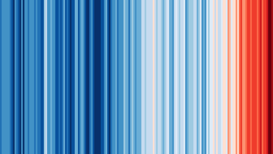

# Exercises {#exercises}

```{r, include=FALSE}
options(digits = 3)
knitr::opts_knit$set(cache = TRUE,
                     tidy = TRUE,
                     tidy.opts = list(blank = FALSE, width.cutoff = 60))
```


## Introduction

These exercises are meant to provide practice of the course material presented in this eBook. There is no single good solution for them, but some are better than others. A good practice is also to try to solve the same exercise in several different ways.

Most of the ***_datasets_** referred to from within the exercises can be found in the Github repository with the URL `https://github.com/MichielNoback/datasets`. [This](https://github.com/MichielNoback/datasets) is a direct link. You can download individual datasets from this page, or download the entire repository at once. To download, use the "clone or download" pull down button (green button). If you want to be a pro, use git to clone it...

The solutions to the exercises are in the next chapter of this eBook.

## `ggplot2`

### Global temperature

Maybe you have seen this picture of the world temperature over the past 120 years:



The global temperature data are located in folder `global_temperature` (see the [Data Repo](https://github.com/MichielNoback/datasets/tree/master/global_temperature)).
There are two data series in file [https://raw.githubusercontent.com/MichielNoback/datasets/master/global_temperature/annual.csv](https://raw.githubusercontent.com/MichielNoback/datasets/master/global_temperature/annual.csv). 
Study the readme file in the same folder to find out their nature.

#### Create a scatter-and-line-plot

Create a scattter-and-line graph of both series in a single plot. Annotate well with labels and title.
Optionally, add a smoother without error boundaries.

#### Re-create the heatmap

You should try to reproduce the above picture by using the `geom_tile()` function. Hint: use `scale_fill_gradient2(low = "blue", mid = "white", high = "red")` and pass `1` as value for `y` in the mapping function..

#### Extra practice

As extra practice, you could try to answer these questions as well:  

- what is the warmest year?
- what is the warmest year that both timelines agree upon?
- which was the coldest decade?
- what is the 30-year moving average of the temperature?

The is also a monthly temperature file. Many explorations can be carried out on that one as well.

### Epilepsy drug trial

The `epilepsy` folder (see the [Data Repo](https://github.com/MichielNoback/datasets/tree/master/epilepsy)) contains two files, one of which -`epilepsy.csv`- is the actual datafile. The `readme.md` file describes the dataset and the columns. Read it carefully before proceeding.


#### Load the data

Load the data and be sure to check the correctness of data types in the columns. The `period` should be a factor. You can use a downloaded copy, but a direct link to the data file can also be used as argument to `read.table()`:
[https://raw.githubusercontent.com/MichielNoback/datasets/master/epilepsy/epilepsy.csv](https://raw.githubusercontent.com/MichielNoback/datasets/master/epilepsy/epilepsy.csv)

#### Reorganize the data

Reorganize the data so that the dependent variable comes last and the useless `entry` variable is omitted. This order of variables is required:
`"subject", "age", "base", "treatment", "period", "seizure.rate"`
For better readability you should convert the dataframe into a `tibble` using `as_tibble()` (tibbles are dealt with in a later chapter: dplyr).

#### Create plots of seizure rates

First, create a **boxplot** of the seizure rates of both groups, split over both the `period` and the `treatment`. To support both of these data dimensions you will either have to use the `color` aesthetic, or the `facet_wrap()` function, like this `+ facet_wrap(. ~ treatment)`. I suggest you try them both.  

Next, create the same basic plot as a **jitter plot**. You can use the `facet_wrap()`. Compare them and write down some pros and cons of both.  
Investigate whether an **overlay** may improve the story this visualization tells, or can you come up with an even better graph?

#### A boxplot after correction

The `base` column is the base seizure rate of the subject in an 8-week window prior to the actual trial. To compare before and after you should create a new dataframe where the `seizure.rate` is summed for the 4 periods. Next, create a final boxplot of these corrected values.


#### Test for statistical significance

In the previous exercise you have determined the corrected seizure rates.
Can you figure out a statistical test to see if the difference is significant?

#### Investigate age-dependency

Investigate whether there is an age-dependent effect in either the base seizure rate or the effect of the treatment.

### The dinos

This exercise represents a review of many of basic R operations as well, besides ggplot2.

The `dinos` folder contains an Excel file called `jgs2018049_si_001.xlsx`. It contains supplementary data to a scientific publication with the title "The Carnian Pluvial Episode and the origin of dinosaurs" [Benton et al., Journal of the Geological Society 175(6) 2018].  

One of the figures accompanying the paper is this one:


_**Figure 2**.Proportions of early dinosaurs through the Triassic, showing the rapid rise in the late Carnian and early to middle Norian. Two metrics are shown, numbers of specimens and numbers of genera in 12 sampled faunas, in proportion to all tetrapods; the linking line is a moving average. Specimen counts perhaps exaggerate the trend when compared with generic counts, or at least both show different aspects of the same rise in ecological impact of the dinosaurs in the Late Triassic. (Based on data in supplementary material Table S1.)_

You have to agree this is terrible! They even omitted the legend for CPE which is descried in the paper "Carnian Pluvial Episode (CPE), dated at 232 MYa". And what the heck is a "moving average"?

Let's explore and improve.

#### Export to csv

We'll begin by exporting all three tabs to a textual format.

Open the excel file and select the tab "Contents". You can see it is a "codebook" - it contains column names and descriptions for the two other tabs in the excel file. In the _File_ menu, select _Save As..._. Next, give as name `codebook.csv` and for _File Format_, select _CSV UTF-8 (Comma-delimited) (.csv)_. You'll get a warning -read it!- but select _OK_. 

Next, select tab "Skeletons" and repeat to generate `skeletons.csv` and "Footprints" to generate `footprints.csv`.

Close the Excel file without saving changes to it. We'll continue with the csv files.

Note: R has packages providing functionality to read from Excel, but this is outside the scope of this course, and installing them is often a hassle. 

#### Clean up and load `codebook.csv`

Have a look at the contents of `codebook.csv` in the editor. It is not yet suitable for loading into R. Write down the number of lines describing column headers for the skeletons and the number for footprints. Next, delete the lines that ar not really codebook entries.  

1. Load the resulting file -as character data only!- and assign it to variable `codebook`.  
2. Give the dataframe column names: `variable` and `description`.
3. Remove the leading space of the second column 
4. Add a column called `dataset`: a factor with the value `skeleton` or `footprint`, depending on the file that is referred to.

#### Write a utility function

Write a utility function that returns a text label to be used in plotting when given a dataset name and a column name. The label should come from the codebook `description` variable of course. The `dataset` parameter should default to `skeleton`. For example, these calls:

```{r eval = FALSE}
get_description('Dinosaur_gen', 'skeleton') 
##same as
get_description('Dinosaur_gen') 
```

should both return `Number of genera of Dinosauria`.  
As extra challenge you could implement some error checking to make the function more robust.

#### Load skeleton data

Load the data in the `skeletons.csv` file and assign it to variable `skeleton`. Make sure your data columns have the right type and that you did not overlook NA value or decimal encodings.

#### Plot species versus time

As a first exploration of the data, create a scatterplot of `Total_spec` as a function of `Midpoint` (the midpoint of the archaeological epoch) and have the points colored by `Epoch`. You should use ggplot2 of course.
There is an outlier flattening the picture quite a lot. Can you think of a strategy to make the picture clearer?
Another problem is that the x-axis scale is from recent to ancient and this should be reversed.

Finally, add a smoother (loess regression) for the entire dataset (not split over the Epochs!) and annotate the plot with nice axis labels, preferably using your previously created utility function. 
NB: it may be a good idea to tweek the descriptions in the codebook a little bit.

Note that for "Million Years Ago" you can use the abbreviations "MYA" or "Ma" (Mega annum).

#### Reproducing the publication figure

Reproduce the figure from the introduction of this section, but using ggplot2 instead of base R. This requires some preprocessing steps, especially with the use of `pivot_longer()`.   

**Part 1**  
You will have to calculate the proportions of Dinosauria (`Dinosaur_gen`) relative to the total of all "tetrapod" groups (including `Archosauromorph_gen`, `Dinosaur_gen`, `Synapsid_gen`, `Parareptile_gen`, `Temnospondyl_gen`). You need this for Specimens (`_spec`) as well as Genera (`_gen`).  

**Part 2**  
Next, you should extract a single proportion for all Formations represented in a single `Midpoint`. I realise that this is not an entirely valid operation. Do you know why? Can you figure out how it was done for the erxisting publication plot?  
I suggest you use the `aggregate()` function. You will need the Epoch and Stage of these as well for later aspects of plotting. 

**Part 3**  
Now you need to "flatten" the data using `spread()` or -preferably- `pivot_longer()`.

**Part 4**  
Finally you have the data to generate the plot itself, without the moving average. 

**Part 5 [challenge]**
Add the moving average. A **_simple moving average_** (SMA) is the unweighted mean of the previous _n_ data.  
The paper does not say anythong about the "window" (`n`) used in the moving average, but looking at the original figure it is less that 10 MY wide. Actually, to be honest, I cannot identify the used algorithm by looking at the plot. Can you?
Just give it a shot and see how far you get.

#### Make a better figure

Next, try to make a plot that uses an alternative to the _moving average_ used in the publication. Also, use background coloring (rectangles) to highlight the Epochs within the plot.


#### Use the size aesthetic 

The "size" aesthetic can be used for indicating the absolute number of specimens/genera, repsectively. This adds an extra dimension of information to the plot.


## `tidyr` and `dplyr`

### Population numbers


### Rubella and Measles

The `rubella_measles_cases` folder of the `datasets` repo contains 
