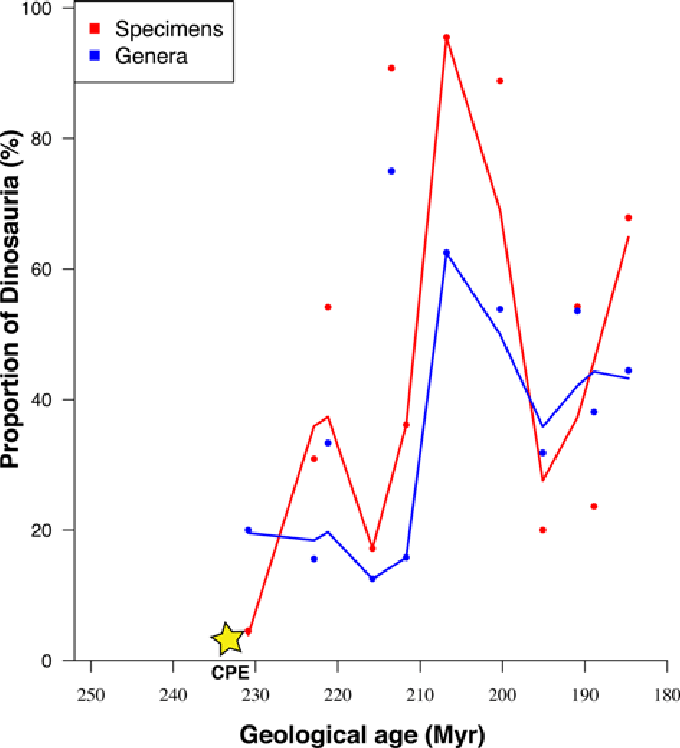

# Exercises {#exercises}

```{r, include=FALSE}
options(digits = 3)
knitr::opts_knit$set(cache = TRUE,
                     tidy = TRUE,
                     tidy.opts = list(blank = FALSE, width.cutoff = 60))
```


## Introduction

These exercises are meant to provide practice of the course material presented in this eBook. There is no single good solution for them, but some are better than others. A good practice is also to try to solve the same exercise in several different ways.

Most of the ***_datasets_** referred to from within the exercises can be found in the Github repository with the URL `https://github.com/MichielNoback/datasets`. [This](https://github.com/MichielNoback/datasets) is a direct link. You can download individual datasets from this page, or download the entire repository at once. To download, use the "clone or download" pull down button (green button). If you want to be a pro, use git to clone it...

The solutions to the exercises are in the next chapter of this eBook.

## `ggplot2`

### The dinos

The `dinos` folder contains an Excel file called `jgs2018049_si_001.xlsx`. It contains supplementary data to a scientific publication with the title "The Carnian Pluvial Episode and the origin of dinosaurs" [Benton et al., Journal of the Geological Society 175(6) 2018].  

One of the figures accompanying the paper is this one:



_**Figure 2**.Proportions of early dinosaurs through the Triassic, showing the rapid rise in the late Carnian and early to middle Norian. Two metrics are shown, numbers of specimens and numbers of genera in 12 sampled faunas, in proportion to all tetrapods; the linking line is a moving average. Specimen counts perhaps exaggerate the trend when compared with generic counts, or at least both show different aspects of the same rise in ecological impact of the dinosaurs in the Late Triassic. (Based on data in supplementary material Table S1.)_

You have to agree this is terrible! They even omitted the legend for CPE which is descried in the paper "Carnian Pluvial Episode (CPE), dated at 232 MYa". And what the heck is a "moving average"?

Let's explore and improve.

#### Export to csv

We'll begin by exporting all three tabs to a textual format.

Open the excel file and select the tab "Contents". You can see it is a "codebook" - it contains column names and descriptions for the two other tabs in the excel file. In the _File_ menu, select _Save As..._. Next, give as name `codebook.csv` and for _File Format_, select _CSV UTF-8 (Comma-delimited) (.csv)_. You'll get a warning -read it!- but select _OK_. 

Next, select tab "Skeletons" and repeat to generate `skeletons.csv` and "Footprints" to generate `footprints.csv`.

Close the Excel file without saving changes to it. We'll continue with the csv files.

Note: R has packages providing functionality to read from Excel, but this is outside the scope of this course, and installing them is often a hassle. 

#### Clean up and load `codebook.csv`

Have a look at the contents of `codebook.csv` in the editor. It is not yet suitable for loading into R. Write down the number of lines describing column headers for the skeletons and the number for footprints. Next, delete the lines that ar not really codebook entries.  

1. Load the resulting file -as character data only!- and assign it to variable `codebook`.  
2. Give the dataframe column names: `variable` and `description`.
3. Remove the leading space of the second column 
4. Add a column called `dataset`: a factor with the value `skeleton` or `footprint`, depending on the file that is referred to.

#### Write a utility function

Write a utility function that returns a text label to be used in plotting when given a dataset name and a column name. The label should come from the codebook `description` variable of course. The `dataset` parameter should default to `skeleton`. For example, these calls:

```{r eval = FALSE}
get_description('Dinosaur_gen', 'skeleton') 
##same as
get_description('Dinosaur_gen') 
```

should both return `Number of genera of Dinosauria`.  
As extra challenge you could implement some error checking to make the function more robust.

#### Load skeleton data

Load the data in the `skeletons.csv` file and assign it to variable `skeleton`. Make sure your data columns have the right type and that you did not overlook NA value or decimal encodings.

#### A first plot


