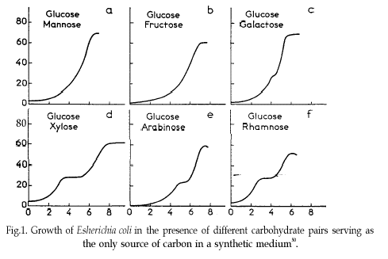

# Exercises {#exercises}

```{r, include=FALSE}
options(digits = 3)
knitr::opts_knit$set(cache = TRUE,
                     tidy = TRUE,
                     tidy.opts = list(blank = FALSE, width.cutoff = 60))
```


## Introduction

These exercises are meant to provide practice of the course material presented in this eBook. There is no single good solution for them, but some are better than others. A good practice is also to try to solve the same exercise in several different ways.

The exercises have been marked with a difficulty level, from 1 to five "stars" (&#10059; to &#10059;&#10059;&#10059;&#10059;&#10059;). Since I am a big fan of intellectual challenge I have included quite some exercises that transcend the mastery level required at the final assessment. For your peace of mind; if you are able to solve three-star exercises you are really good to go!

Most of the **_datasets_** referred to from within the exercises can be found in the Github repository with the URL `https://github.com/MichielNoback/datasets`. [This](https://github.com/MichielNoback/datasets) is a direct link. You can download individual datasets from this page, or download the entire repository at once. To download, use the "clone or download" pull down button (green button). If you want to be a pro, use git to clone it...

The solutions to the exercises are in the next chapter of this eBook.

For all plotting exercises: take care of the details: axis labels, figure title or caption clear names of separating variables.

## The `ggplot2` and `tidyr` packages

### Trees 

The `datasets` package that is shipped with R has a dataset called `trees`.  

**A [&#10059;]**  

Create a scatter plot for Heigth as a function of Girth, with blue plotting symbols . 

**B [&#10059;&#10059;]**  

Add a single line representing the linear model of this relationship, without shaded confidence interval. 

**C [&#10059;&#10059;]**  

Have the Volume variable reflected in the size of the plot symbol and change their transparency level to 0.6.

### Insect Sprays 

The `datasets` package that is shipped with R has a dataset called `?`. Type `?InsectSprays` to get information on it. 

**A [&#10059;]**  

Create a boxplot, splitting on the spray type.

**B [&#10059;&#10059;]**  

Create a jitter plot, splitting on the spray type. Have zero jittering on the y-axis and as little as possible on the x-axis. use the `alpha` parameter and try to find a nice plot symbol.
[Extra: Give each spray a different plot color]


### Diauxic growth 

In 1941, Jacques Monod discovered the phenomenon of **_diauxic growth_** in bacteria (e.g. _E. coli_), resulting from the preference for some carbon substrate over others, causing catabolite repression of pathways of less preferred substrates. See [The Wikipedia page](https://en.wikipedia.org/wiki/Diauxie) for details.



Some of the data used to generate the figure in that original publication are in this course's data repository (https://github.com/MichielNoback/datasets/diauxic_growth). A direct link to the data file is [https://raw.githubusercontent.com/MichielNoback/datasets/master/diauxic_growth/monod_diauxic_growth.csv](https://raw.githubusercontent.com/MichielNoback/datasets/master/diauxic_growth/monod_diauxic_growth.csv). 

**A [&#10059;&#10059;]**  

Download the file, load it and attach to variable `diauxic`. Next, tidy this data into long format so you have three columns left: `Time`, `Substrate` and `OD`.

**B [&#10059;]**  

Convert the newly created `Substrate` variable into a factor with nicer labels, i.e. better suited for human reading

**C [&#10059;&#10059;]**  

Create a line plot with all four growth curves within a single panel. use `stat_smooth()` and its `span =` parameter to have a line-and-point visualization.

**D [&#10059;&#10059;&#10059;]**  

Create a multi-panel plot like the one from the original publication.


### Virginia Death Rates

The `datasets` package that is shipped with R has a dataset (a `matrix`) called `VADeaths`. Type `?VADeaths` to get information on it. First you should convert this matrix into a tibble (a kind of data frame) and the rownames into a real variable using the chunk below (study it so you understand what happens here):

```{r VADeaths-prep, message = FALSE}
library(dplyr)
## %>% is used to pipe results from one operation to the other, just like '|' in Linux.
virginia_death_rates <- as_tibble(VADeaths)
virginia_death_rates <- virginia_death_rates %>% 
    mutate("Age Group" = factor(rownames(virginia_death_rates), ordered = TRUE)) %>% 
    select(`Age Group`, everything()) #reorder the columns
```

**A [&#10059;&#10059;&#10059;]**  

Pivot this table to long (tidy) format. This should generate a dataframe with four columns: `Age Group`, `Habitat`, `Gender` and `DeathRate`.

**B [&#10059;&#10059;]**  

Create a bar chart with the age groups on the x-axis and Rural/Urban and Male/Female using side-by-side bars. 


### Investigate new visualization <sup><font size="3em">[&#10059;&#10059;&#10059;]</font></sup>

Go to the [R graph Gallery](https://www.r-graph-gallery.com/) and browse the different sections. Then select one visualization to study in-depth (excluding the ones already demonstrated in this eBook).   Work out an example with one of the datasets from either the built-in datasets of R or the [Datasets Repo](https://github.com/MichielNoback/datasets) of this course. You can also choose another dataset. For instance, Kaggle (https://www.kaggle.com/) and the UCI Machine Learning Repository  (https://archive.ics.uci.edu/ml/) have very interesting datasets.

Present this visualization in class, addressing these topics:  

1. What is this visualization named?
2. What is its purpose; when is it appropriate to use?
3. Why does it appeal to you?
4. Show an example with the R code, explain difficulties and point out caveats.


### ToothGrowth <sup><font size="3em">[&#10059;&#10059;]</font></sup>

The `datasets` package that is shipped with R has a dataset called `ToothGrowth`. Create a visualization distinguishing the tooth growth between both supplement and dose.


### Puromycin <sup><font size="3em">[&#10059;&#10059;&#10059;]</font></sup>

Create a scatter plot visualization of the `Puromycin` dataset. Color by `state` and add a loess model smoother without error margin. Use the `formula = ` parameter in `geom_smooth()` for getting a better-fitting regression line.


### Global temperature

Maybe you have seen this picture of the world temperature over the past 120 years in the media:


We are going to work with this data as well.  
The global temperature data are located in folder `global_temperature` (see the [Data Repo](https://github.com/MichielNoback/datasets/tree/master/global_temperature)).
There are two data series in file [https://raw.githubusercontent.com/MichielNoback/datasets/master/global_temperature/annual.csv](https://raw.githubusercontent.com/MichielNoback/datasets/master/global_temperature/annual.csv). 
Study the readme file in the same folder to find out more about these datasets.  

#### Create a scatter-and-line-plot <sup><font size="2em">[&#10059;&#10059;]</font></sup>

Create a scatter-and-line graph of both series in a single plot. Annotate well with labels and title.
Optionally, add a smoother without error boundaries.

#### Re-create the heatmap <sup><font size="2em">[&#10059;&#10059;&#10059;&#10059;]</font></sup>

You should try to reproduce the above picture by using the `geom_tile()` function. Hint: use `scale_fill_gradient2(low = "blue", mid = "white", high = "red")` and pass `1` as value for `y` in the mapping function. The `theme()` function with `element_blank()` can be used for extra tweaking.

#### Extra practice <sup><font size="2em">[&#10059;&#10059;]</font></sup>

As extra practice, you could try to answer these questions as well:  

- what is the warmest year?
- what is the warmest year that both timelines agree upon?
- which was the coldest decade?
- what is the 30-year moving average of the temperature?

The is also a monthly temperature file. Many explorations can be carried out on that one as well.


### Epilepsy drug trial

The `epilepsy` folder (see the [Data Repo](https://github.com/MichielNoback/datasets/tree/master/epilepsy)) contains two files, one of which -`epilepsy.csv`- is the actual data file. The `readme.md` file describes the dataset and the columns. Read it carefully before proceeding.

#### Load the data <sup><font size="2em">[&#10059;]</font></sup>

Load the data and be sure to check the correctness of data types in the columns. The `period` should be a factor. You can use a downloaded copy, but a direct link to the data file can also be used as argument to `read.table()`:
[https://raw.githubusercontent.com/MichielNoback/datasets/master/epilepsy/epilepsy.csv](https://raw.githubusercontent.com/MichielNoback/datasets/master/epilepsy/epilepsy.csv)

#### Reorganize the data  <sup><font size="2em">[&#10059;&#10059;]</font></sup>

Reorganize the data so that the dependent variable comes last and the useless `entry` variable is omitted. This order of variables is required:
`"subject", "age", "base", "treatment", "period", "seizure.rate"`
For better readability you should convert the dataframe into a `tibble` using `as_tibble()` (tibbles are dealt with in a later chapter: dplyr).

#### Create plots of seizure rates 

**A [&#10059;&#10059;]**   

First, create a **boxplot** of the seizure rates of both groups, split over both the `period` and the `treatment`. To support both of these data dimensions you will either have to use the `color` aesthetic, or the `facet_wrap()` function, like this `+ facet_wrap(. ~ treatment)`. I suggest you try them both.  

**B [&#10059;&#10059;&#10059;]**   

Next, create the same basic plot as a **jitter plot**. You can use the `facet_wrap()`. Compare them and write down some pros and cons of both.  

**C [&#10059;&#10059;&#10059;]**   

Investigate whether an **overlay** may improve the story this visualization tells, or can you come up with an even better graph?

#### A boxplot after correction <sup><font size="2em">[&#10059;&#10059;&#10059;]</font></sup>

The `base` column is the base seizure rate of the subject in an 8-week window prior to the actual trial. To compare before and after you should create a new dataframe where the `seizure.rate` is summed for the 4 periods. Next, create a final boxplot of these corrected values.


#### Test for statistical significance <sup><font size="2em">[&#10059;&#10059;&#10059;]</font></sup>

In the previous exercise you have determined the corrected seizure rates.
Can you figure out a statistical test to see if the difference is significant?

#### Investigate age-dependency <sup><font size="2em">[&#10059;&#10059;&#10059;]</font></sup>

Investigate whether there is an age-dependent effect in either the base seizure rate or the effect of the treatment.


### Bacterial growth curves with Varioscan 

Chapter 10, \@ref(parsing-complex-data ), ended with a file being saved, `data/varioscan/2020-01-30_wide.csv`. This file is also present in the `varioscan` folder of the datasets repo.

#### Load, preprocess and tidy <sup><font size="2em">[&#10059;&#10059;&#10059;&#10059;]</font></sup>

First load the data; this is straightforward.
Next, correct OD values of the "triplicate" experiments using the background signal data from samples without bacteria.

Thus, the `Red` values should be corrected using the `Red_w_o` values of the same dilution; the `White` columns using `White_w_o` and `Elution` using `Eluiton_w_o`.

This can be done when you apply a trick: transpose the dataframe using `t()` before carrying out the corrections. After transpose, you should loop the columns and correct using the periodicity of 8 (number of dilutions)

You can use this as a start, assuming you loaded the file into `growth_data`:

```{r eval = FALSE}
## Add rownames to get a hold of them after transpose
rownames(growth_data) <- paste0(growth_data$Content, '.', 
                                growth_data$.copy, '.', 
                                rep(LETTERS[1:8], times = 12))
## transpose
tmp <- t(growth_data)

## build a new dataframe/tibble
growth_data_corr <- tibble(column_names = rownames(tmp))

## continue here
```


After these steps, the data should be tidied.

#### Create a growth curve visualization <sup><font size="2em">[&#10059;&#10059;&#10059;&#10059;]</font></sup>

Create a line plot visualizing the entire experiment. 
The challenge here is to present a clear picture with tons of dataseries on top of each other. You should realise there are 96 time series that could be plotted. 

I suggest you also use a custom color pallette reflecting the sample groups in the experiment.

The main sample set (the red tulip) should be emphasized. The least interesting controls, columns 4, 8 and 12, should be made less present visually.


### The dinos

This exercise represents a review of many of basic R operations as well, besides ggplot2.

The `dinos` folder contains an Excel file called `jgs2018049_si_001.xlsx`. It contains supplementary data to a scientific publication with the title "The Carnian Pluvial Episode and the origin of dinosaurs" [Benton et al., Journal of the Geological Society 175(6) 2018].  

One of the figures accompanying the paper is this one:


_**Figure 2**.Proportions of early dinosaurs through the Triassic, showing the rapid rise in the late Carnian and early to middle Norian. Two metrics are shown, numbers of specimens and numbers of genera in 12 sampled faunas, in proportion to all tetrapods; the linking line is a moving average. Specimen counts perhaps exaggerate the trend when compared with generic counts, or at least both show different aspects of the same rise in ecological impact of the dinosaurs in the Late Triassic. (Based on data in supplementary material Table S1.)_

You have to agree this is terrible! They even omitted the legend for CPE which is descried in the paper "Carnian Pluvial Episode (CPE), dated at 232 M Ya". And what the heck is a "moving average"?

Let's explore and improve.

#### Export to csv

We'll begin by exporting all three tabs to a textual format.

Open the excel file and select the tab "Contents". You can see it is a "codebook" - it contains column names and descriptions for the two other tabs in the excel file. In the _File_ menu, select _Save As..._. Next, give as name `codebook.csv` and for _File Format_, select _CSV UTF-8 (Comma-delimited) (.csv)_. You'll get a warning -read it!- but select _OK_. 

Next, select tab "Skeletons" and repeat to generate `skeletons.csv` and "Footprints" to generate `footprints.csv`.

Close the Excel file without saving changes to it. We'll continue with the csv files.

Note: R has packages providing functionality to read from Excel, but this is outside the scope of this course, and installing them is often a hassle. 

#### Clean up and load `codebook.csv`

Have a look at the contents of `codebook.csv` in the editor. It is not yet suitable for loading into R. Write down the number of lines describing column headers for the skeletons and the number for footprints. Next, delete the lines that are not really codebook entries.  

**A [&#10059;]**  

Load the resulting file -as character data only!- and assign it to variable `codebook`.  

**B [&#10059;&#10059;]**  

Give the dataframe column names: `variable` and `description`.

**C [&#10059;&#10059;]**  

Remove the leading space of the second column

**D [&#10059;&#10059;]**  

Add a column called `dataset`: a factor with the value `skeleton` or `footprint`, depending on the file that is referred to.

#### Write a utility function <sup><font size="2em">[&#10059;&#10059;&#10059;]</font></sup>

Write a utility function that returns a text label to be used in plotting when given a dataset name and a column name. The label should come from the codebook `description` variable of course. The `dataset` parameter should default to `skeleton`. For example, these calls:

```{r eval = FALSE}
get_description('Dinosaur_gen', 'skeleton') 
##same as
get_description('Dinosaur_gen') 
```

should both return `Number of genera of Dinosauria`.  
As extra challenge you could implement some error checking to make the function more robust.

#### Load skeleton data <sup><font size="2em">[&#10059;]</font></sup>

Load the data in the `skeletons.csv` file and assign it to variable `skeleton`. Make sure your data columns have the right type and that you did not overlook NA value or decimal encodings.

#### Plot species versus time <sup><font size="2em">[&#10059;&#10059;&#10059;]</font></sup>

As a first exploration of the data, create a scatterplot of `Total_spec` as a function of `Midpoint` (the midpoint of the archaeological epoch) and have the points colored by `Epoch`. You should use ggplot2 of course.
There is an outlier flattening the picture quite a lot. Can you think of a strategy to make the picture clearer?
Another problem is that the x-axis scale is from recent to ancient and this should be reversed.

Finally, add a smoother (loess regression) for the entire dataset (not split over the Epochs!) and annotate the plot with nice axis labels, preferably using your previously created utility function. 
NB: it may be a good idea to tweak the descriptions in the codebook a little bit.

Note that for "Million Years Ago" you can use the abbreviations "MYA" or "Ma" (Mega annum).

#### Reproducing the publication figure

Reproduce the figure from the introduction of this section, but using ggplot2 instead of base R as they used. This requires some preprocessing steps, especially with the use of `pivot_longer()`.   

**A [&#10059;&#10059;]**  
You will have to calculate the proportions of Dinosauria (`Dinosaur_gen`) relative to the total of all "tetrapod" groups (including `Archosauromorph_gen`, `Dinosaur_gen`, `Synapsid_gen`, `Parareptile_gen`, `Temnospondyl_gen`). You need this for Specimens (`_spec`) as well as Genera (`_gen`).  

**B [&#10059;&#10059;&#10059;]**  
Next, you should extract a single proportion for all Formations represented in a single `Midpoint`. I realize that this is not an entirely valid operation. Do you know why? Can you figure out how it was done for the existing publication plot?  
I suggest you use the `aggregate()` function. You will need the Epoch and Stage of these as well for later aspects of plotting. 

**C [&#10059;&#10059;&#10059;]**   
Now you need to tidy the data.

**D [&#10059;&#10059;&#10059;&#10059;]**   
Finally you have the data to generate the plot itself, without the moving average. 

**E [&#10059;&#10059;&#10059;&#10059;&#10059;]**   
Add the moving average. A **_simple moving average_** (SMA) is the unweighted mean of the previous _n_ data.  
The paper does not say anything about the "window" (`n`) used in the moving average, but looking at the original figure it is less that 10 MY wide. Actually, to be honest, I cannot identify the used algorithm by looking at the plot. Can you?
Just give it a shot and see how far you get.

#### Make a better figure <sup><font size="2em">[&#10059;&#10059;&#10059;]</font></sup>

Next, try to make a plot that uses an alternative to the _moving average_ used in the publication. Also, use background coloring (rectangles) to highlight the Epochs within the plot.

#### Use the size aesthetic <sup><font size="2em">[&#10059;&#10059;&#10059;&#10059;&#10059;]</font></sup>

The "size" aesthetic can be used for indicating the absolute number of specimens/genera, respectively. This adds an extra dimension of information to the plot.


## The `tidyr` and `dplyr` packages

### Global temperature revisited

Reload the `global_temp` data if it is not in memory anymore.

**A [&#10059;&#10059;]**  

Which years before 1970 had an anomaly of more than +0.1 degree according to the GCAG model? And according to the GISTEMP model? Notice anything strange?

**B [&#10059;&#10059;]**  

Which has (have) been the coldest year(s) after 1945? Do both models agree on that?

**C [&#10059;&#10059;&#10059;]**  

Which were the warmest five years? Select the warmest five for both models. Do they agree on that?
To select the top _n_ values after grouping, use `filter(row_number() %in% 1:5)`


**D [&#10059;&#10059;&#10059;]**  

Select the years from 1970 and split up the dataset in decades and report the per-decade average temperature for both models.

Extra exercise: create a bar plot from this result.

### ChickWeight

You have seen how to determine the weight gain of the chickens between measurements in the `ChickWeight` dataset. Here, we look at this dataset again.

1. **Starting weight [&#10059;&#10059;]**.  
Which chick had the highest starting weight? List this chick, together with its diet as follows: <Chick> <Diet> <weight>.

2. **Total weight gain [&#10059;&#10059;&#10059;]**.  
Determine the total weight gain for each chick and list all chickens together with their diet and number of weight measurements. Order from high to low weight gain.

3. **Average weight gain per diet [&#10059;&#10059;&#10059;&#10059;]**. Determine the average weight gain for each diet.
Report the Diet, number of chickens on the diet and the average weight gain.


### Population numbers

The `population` folder of the `datasets` repo contains two files. One of them, `EDU_DEM.....csv` contains population data for all countries of the world (where data is available). We're going to mangle and explore this data a bit.  
Besides the following exercises there are many, _many_ other questions you could ask yourself about this dataset, and visualizations to be created. For instance, how about countries and age groups, years with maximum growth, etc. Explore and practice!


#### Load the data <sup><font size="2em">[&#10059;]</font></sup>

Start by loading the data into a dataframe called `population`.
Since it is a bit large, I suggest you first download it to a local location.

#### Clean up <sup><font size="2em">[&#10059;&#10059;]</font></sup>

There are quite some uninformative variables - variables with only one value or with only NA.
Find out which variables are uninformative and remove these from the dataframe.

#### Create a "wide" yearly report of population totals <sup><font size="2em">[&#10059;&#10059;&#10059;]</font></sup>

With the dataframe you now have, create a report in wide format for the total population numbers over the available years. So, the years now get their own column and each country has a single row.  

#### Create a "wide" yearly report of population change <sup><font size="2em">[&#10059;&#10059;&#10059;&#10059;]</font></sup>

Next, present the same format (wide), but now with the "population change" instead of the total population.

#### Create a bar plot split on gender <sup><font size="2em">[&#10059;&#10059;&#10059;]</font></sup>

Create a bar plot of the population numbers of the countries of Western Europe across the available years, split by gender.

#### Highest growth rate <sup><font size="2em">[&#10059;&#10059;&#10059;]</font></sup>

Which three countries have shown the fastest relative growth rate, measured as percentage change over the the whole of the available time period (2005-2017) relative to its start, over the entire population, for both sexes combined?

Extra practice: Do the same for the different age groups.


### Rubella and Measles

The `rubella_measles_cases` folder of the `datasets` repo contains historic data for both measles and rubella. This serves as extra training material (no solutions provided). Try to report, both visually and in tables:  

- cases per per continent
- cases over time per continent

You can also combine with the population data from a previous exercise (folder `population`) and report measles and rubella per 10000 inhabitants, per country or per continent.
Other data are available for exploring relations as well in the population data: age groups, sex, and diseases.

## The `lubridate` package

These exercises can of course only be completed if you also apply your knowledge of the `tidyr` and `dplyr` packages.

### Female births

The `datasets` repo contains a folder `female_births`. Its content is fairly simple: it holds the number of daily female births in California in 1959. We'll have a look at it now.

#### Load the data

Load the data using the `lubridate` package.

#### Check for missing rows

Check if there is really not a single day missing in this reported year.

#### Report 

Report the number of births per month (Jan - Dec) and per weekday (Mon - Sun), as barplots.
Is there a month or day that seems to be anomalous, or do you see seasonal trends? Try a statistical test!


### Diabetes


## The `stringr` package


