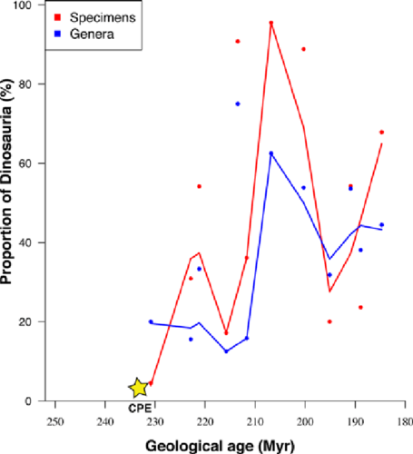

--- 
title: "Data Analysis and Visualization using R (2)"
author: "Michiel Noback"
date: "`r Sys.Date()`"
site: bookdown::bookdown_site
output: bookdown::gitbook
documentclass: book
bibliography: [book.bib, packages.bib]
biblio-style: apalike
link-citations: yes
github-repo: rstudio/bookdown-demo
description: "This is the ebook accompanying the course Data Analysis and Visualization using R 2 (DAVuR2)."
---

# Preface {-}

This is the ebook accompanying the course Data Analysis and Visualization using R 2 (DAVuR2). The book will be available during the final test. These packages and subjects will be covered:

- ggplot2
- tidyr
- dplyr
- exploratory data analysis (EDA)
- working with Timeseries and Dates and times
- programming R: functions, scripts, packages and dockumentation

Note that this entire ebook was written in Markdown, using a RMarkdown extension called bookdown [@bookdown]. This is (sort of) a "gitbook" layer on top of the RMarkdown processing package knitr [@knitr].


```{r include=FALSE}
# automatically create a bib database for R packages
knitr::write_bib(c(
  .packages(), 'bookdown', 'knitr', 'rmarkdown'
), 'packages.bib')
```

<!--chapter:end:index.Rmd-->

# The `ggplot2` package {#ggplot2}

```{r, include=FALSE}
options(digits = 3)
## Utility functions: show_palette()
source("scripts/utils.R")
knitr::opts_knit$set(cache = TRUE,
                     tidy = TRUE,
                     tidy.opts = list(blank = FALSE, width.cutoff = 60))
```

## Introduction

In this chapter, we'll explore the package `ggplot2`. Package ggplot2 is one of the most popular packages of R, and a de facto standard for creating publishable visualizations.

Whole books have been written about ggplot2 (e.g. [INSERT REF]); these will not be repeated here. Instead, I have selected the minimal amount of information and examples to get you going in your own research visualization endeavors in biomedical research. For that reason, this chapter only deals with the base `ggplot()` function and its most important usage scenarios.  
In my opinion, you are best prepared when first learning the ggplot "language" structure, not the complete listing of possibilities. You can check these out later on your own. If you are interested in what the package has to offer, type `help(package="ggplot2")` on the console.

### Keep the goal in mind {-}

You should always remember the purpose with which you create a plot:

1. **_Communicate results in a visual way_**. The _audience_ consists of other professionals: fellow scientists, students, project managers, CEO's. The _scope_ is in reports, publications, presentations etc. Your plots should be immaculately annotated - have a title and/or caption, axis labels with physical quantities (e.g. Temperature) and measurement units (e.g. Celsius), and a legend (if relevant).
2. **_Create a representation of data for visual inspection_**. The _audience_ is yourself. This is especially important in Exploratory Data Analysis (EDA). You visualize your data in order to discover patterns, trends, outliers and to generate new questions and hypotheses. The biggest challenge is to select the correct, most appropriate visualization that keeps you moving on your research track.  

Besides this, you should of course choose a relevant visualization for your data. For instance, generating a boxplot representing only a few data points is a poor choice, as will a scatterplot for millions of data points almost always be.

To help your imagination and see what is possible you should really browse through [The R Graph Gallery](https://www.r-graph-gallery.com/). It has code for all the charts in the gallery.

## Getting started

Install the packages `ggplot2` and `tidyr` first, if not already installed. The package ggplot2 is the topic of this chapter of course. Package tidyr is the topic of a later chapter, but we'll see a use case of it here already.

```{r install-ggplot2, eval=F}
install.packages("ggplot2")
install.packages("tidyr")
```

After installing, you'll need to load the packages.

```{r load-libs, warning=FALSE}
library(ggplot2)
library(tidyr)
```


### A first plot {-}

Let's dive right in and create a first plot, and walk through the different parts of this code.

```{r first-plot, fig.asp=.75, out.width='80%', fig.align='center', fig.cap="A scatter plot visualizing Ozone as a function of Temperature"}
ggplot(data = airquality, mapping = aes(x = Temp, y = Ozone)) + 
  geom_point()
```

There are two **_chained function calls_**: `ggplot()` and `geom_point()`. They are chained using the `+` operator. The first function, `ggplot()`, creates the base layer of the plot It receives the data and defines how it maps to the two axes. By itself, `ggplot()`, will not display anything of your data. It creates an empty plot where the axes are defined and have the correct scale:

```{r empty-plot, fig.asp=.75, out.width='80%', fig.align='center', fig.cap="An empty plot pane"}
ggplot(data = airquality, mapping = aes(x = Temp, y = Ozone))
```

The next function, `geom_point()`, builds on the base layer it receives via the `+` operator and adds a new layer to the plot, a data representation using points.

The `geom_point()` function encounters rows with missing data and issues a warning (`Warning: Removed 37 rows...`) but proceeds anyway. There are two ways to prevent this annoying warning message. The first is to put a `warning=FALSE` statement in the RMarkdown chunk header. This is usually **not** a good idea because you should be explicit about problem handling when implementing a data analysis workflow because it hinders the reproducibility of your work. Therefore, removing the missing values explicitly is a better solution:

```{r plot-warnings-prevented, eval=FALSE}
airquality <- na.omit(airquality)
ggplot(data = airquality, mapping = aes(x = Temp, y = Ozone)) +
  geom_point()
```

Note that this overwrites the build-in dataset `airquality` for the duration of this R session.  

To obtain a similar plot as created above with "base" R, you would have done something like this:

```{r first-plot-baseR, fig.asp=0.75, out.width='80%', fig.align='center', fig.cap='The same visualization with base R'}
with(airquality, plot(x = Temp, y = Ozone))
```

You can immediately see why ggplot2 has become so popular. When creating more complex plots it becomes more obvious still, as shown below.

### Adding a dimension using color {-}

This plot shows the power of ggplot2: building complex visualizations with minimal code.

```{r first-plot-w-color1, fig.asp=.75, out.width='80%', fig.align='center', warning=FALSE, fig.cap='Ozone as function of Temp with plot symbols colored by Month'}
airquality$Month <- as.factor(airquality$Month)
airquality$TempFac <- cut(airquality$Temp, breaks = c(50, 75, 100), labels = c("low", "high"), ordered_result = T)
ggplot(data = airquality, mapping = aes(x = Temp, y = Ozone, color=Month)) +
  geom_point() 
```


### Inspecting and tuning the figure  {-}

What can you tell about the data and its measurements when looking at this plot? 

Looking at the above plot, you should notice that  

(a) the temperature measurement is probably in degrees Fahrenheit. This should be apparent from the plot. The measurement unit for Ozone is missing. You should look both up; the `datasets` package doc says it is in Parts Per Billion (ppb).  
(b) temperature is lowest in the fifth month -probably May but once again you should make certain- and highest in months 8 and 9.
(c) ozone levels seem positively correlated with temperature (or Month), but not in an obvious linear way
(d) a detail: temperature is measured in whole degrees only. This will give plotting artifacts: discrete vertical lines of data points.  

The plot below fixes and addresses the above issues to create a publication-ready figure. We'll get to the details of this code as we proceed in this chapter. For now the message is **_be meticulous in constructing your plot_**.

```{r first-plot-w-color2, fig.asp=.75, out.width='80%', fig.align='center', warning=FALSE, fig.cap='Ozone level dependency on Temperature. Grey area: Loess smoother with 95% confidence interval. Source: R dataset \"Daily air quality measurements in New York, May to September 1973.\"'}
airquality$Month <- factor(airquality$Month, levels=1:12, labels=month.abb)
ggplot(data = airquality, mapping=aes(x=Temp, y=Ozone)) +
  geom_point(mapping=aes(color=Month)) + 
  geom_smooth(method="loess") +
  xlab(expression("Temperature " (degree~F))) +
  ylab("Ozone (ppb)") +
  labs(color="Month")
```


## ggplot2 and the theory of graphics

### Philosophy of ggplot2 {-}

The author of ggplot2, Hadley Wickham, had a very clear goal in mind when he embarked on the development of this package:

_"The emphasis in ggplot2 is reducing the amount of thinking time by making it easier to go from the plot in your brain to the plot on the page." (Wickham, 2012)_

The way this is achieved is through "**_The grammar of graphics_**"

### The grammar of graphics {-}

The grammar of graphics tells us that a statistical graphic is a mapping from data to geometric objects (points, lines, bars) with aesthetic attributes (color, shape, size).

The plot may also contain statistical transformations of the data and is drawn on a specific coordinate system. Faceting -grid layout- can be used to generate the same plot for different subsets of the dataset.
(Wickham, 2010)


## Building plots with ggplot2

### The layered plot architecture {-}

A graph in ggplot2 is built using a few "layers", or building blocks. 

```{r ggplot2-building-blocks-1, fig.asp=.75, out.width='80%', fig.align='center', echo=FALSE}
blocks <- read.table("data/ggplot2_elements.txt",
                     sep=";",
                     header = T,
                     as.is = 1:2)
knitr::kable(blocks[1:3,],
             caption = 'The three core ggplot2 layers')
```

First, there is the **_data_** layer - the input data that you want to visualize:


Next, using the `aes()` function, the data is **_mapped_** to a coordinate system. This encompasses not only the xy-coordinates but also possible extra plot dimensions such as color and shape.


As a third step, the data is **_visually represented_** in some way, using a **_geometry_** (dealt with by one of the many `geom_....()` functions). Examples of geometries are **_point_** for scatterplots, **_boxplot_**, **_line_** etc.


At a minimum, these three layers are used in every plot you create. 

Besides these fundamental aspects there are other elements you may wish to add or modify: axis labels, legend, titles, etc. These constitute additional, optional layers:


Except for Statistics and Coordinates, each of these layers will be discussed in detail in subsequent paragraphs.

### "Tidy" the data {-}

This is a very important aspect of plotting using ggplot2: getting the data in a way that ggplot2 can deal with it. Sometimes it may be a bit challenging to get the data in such a format: some form of data mangling is often required. This is the topic of a next chapter, but here you'll already see a little preview.

The ggplot2 function expects its data to come in a **_tidy_** format. A dataset is considered **_tidy_** when it is formed according to these rules:

1. Each variable has its own column.
2. Each observation has its own row.
3. Each value has its own cell.

Want to know more about tidy data? Read the paper by Hadley Wickham: [@tidy-data].

Here is an example dataset that requires some mangling, or **_tidying_**, to adhere to these rules.

```{r read-dose-response, echo=FALSE}
dose_response <- read.table("data/dose_response2.txt",
                            header = T,
                            sep=";",
                            colClasses=c("character", "factor", "integer", "integer"))
knitr::kable(head(dose_response, n=5))
```

This dataset is not tidy because there is an independent variable -the dose- that should have its own column; its value is now buried inside two column headers (`dose10mg` and `dose10mg`). Also, there is actually a single variable -the response- that is now split into two columns. Thus, a row now contains two observations. 

Suppose you want to plot the response as a function of the dose. That is not quite possible right now in ggplot2. This is because you want to do something like

```{r does-not-work1, eval=FALSE}
ggplot(data=dose_response,
       mapping = aes(x = "<I want to get the dose levels here>",
                     y = "<I want to get the response here>")) +
    geom_boxplot()
```

The problem is you cannot **_specify the mapping in a straightforward manner_**.
Note that in base R you would probably do this:

```{r plot-with-untidy-data, fig.asp=.75, out.width='80%', fig.align='center', fig.cap='Selecting untidy data'}
boxplot(dose_response$dose10mg, dose_response$dose100mg)
```

So, we need to tidy this dataframe since the `dose_10_response` and `dose_100_response` columns actually describe the same variable (measurement) but with different _conditions_. As an exercise, I tried it using base R. Here is my solution. 

```{r}
tidy_my_df <- function(df) {
    create_tidy_columns <- function(x) {
        data.frame(patient = rep(x[1], 2),
                   sex = rep(x[2], 2),
                   dose = c(10, 100),
                   response = c(x[3], x[4]))
    }
    
    tmp <- Reduce(function(x, y) merge(x, y, all=TRUE), 
           apply(X = df, MARGIN = 1, FUN = create_tidy_columns))
    tmp[order(tmp$dose), ]
}
knitr::kable(head(tidy_my_df(dose_response), n=10))
```

Luckily, there is a very nice package that makes this quite easy: `tidyr`.

#### Tidying data using `tidyr::gather()` {-}

```{r tidy-it1}
## tidy
dose_response_tidy <- gather(data=dose_response, 
                             key=dose, 
                             value=response, 
                             "dose10mg", "dose100mg")
## transform dose column to nice factor
dose_response_tidy$dose <- factor(ifelse(
    dose_response_tidy$dose == "dose10mg", 10, 100), 
  ordered = T)
knitr::kable(head(dose_response_tidy, n=10))
```

The data is tidy now, and ready for use within ggplot2.

We'll explore the `gather()` function in detail in a next chapter. 

Now, creating the plot in ggplot2 is a breeze

```{r plot-tidy-basic, fig.asp=.75, out.width='80%', fig.align='center'}
dr_plot <- ggplot(dose_response_tidy, aes(x = dose, y = response))
dr_plot + 
    geom_boxplot()
```

Would you proceed with this hypothetical drug?

## Aesthetics

After you obtain a tidy dataset and pass it to ggplot you must decide what the aesthetics are. This defines the way the data are represented in your plot. Very roughly speaking, you could correlate the aesthetics to the **_dimensions_** of the data you want to visualize. For instance, given this chapters' first example of the airquality dataset, the aesthetics were defined in three "dimensions":  

- dimension "X" for temperature, 
- dimension "Y" for Ozone 
- dimension "color" for the month. 

Although color is used most often to represent an extra dimension in the data, other aesthetics you may consider are shape, size, line width and line type.

### Colors {-}

Colors can be defined in a variety of ways:

- color name
- existing color palette
- custom color palette

Below is a panel displaying all named colors you can use in R

```{r color-names, fig.asp=3, echo=FALSE, out.width='100%'}
d <- data.frame(c = colors(), 
                y = seq(0, length(colors())-1)%%66, 
                x = seq(0, length(colors())-1)%/%66)
ggplot() +
scale_x_continuous(name="", breaks=NULL, expand=c(0, 0)) +
scale_y_continuous(name="", breaks=NULL, expand=c(0, 0)) +
scale_fill_identity() +
geom_rect(data=d, mapping=aes(xmin=x, xmax=x+1, ymin=y, ymax=y+1), fill="white") +
geom_rect(data=d, mapping=aes(xmin=x+0.05, xmax=x+0.95, ymin=y+0.5, ymax=y+1, fill=c)) +
geom_text(data=d, mapping=aes(x=x+0.5, y=y+0.5, label=c, size = 6), 
          colour="black", hjust=0.5, vjust=1, size=3)
```


When you provide a literal (character) for the color aesthetic it will simply be that color. If you want to map a property (e.g. "Month") to a range of colors, you should use a color palette. Since ggplot has build-in color palettes, you can simply use `color=<my-third-dimension-variable>`. This variable mapping to color can be either a factor (discrete scale) or numeric (continuous scale). 
The ggplot function will map the variable the default color palette.

Here are some ways to work with color palettes

#### The default palette {-}

```{r color-palette-default, fig.asp=.75, out.width='80%', fig.align='center'}
sp <- ggplot(iris, aes(Sepal.Length, Sepal.Width)) + geom_point(aes(color = Species))
sp
```


#### Manual palettes {-}

You can specify your own colors using `scale_color_manual()` for scatter plots or `scale_fill_manual()` for boxplots and bar plots.

```{r color-palette-manual, fig.asp=.75, out.width='80%', fig.align='center'}
sp + scale_color_manual(values = c("#00AFBB", "#E7B800", "#FC4E07"))
```


Here is a nice set of colors:

```{r custom-palette1, fig.asp=0.3, out.width='80%', fig.align='center'}
custom_col <- c("#FFDB6D", "#C4961A", "#F4EDCA", 
                "#D16103", "#C3D7A4", "#52854C", "#4E84C4", "#293352")
show_palette(custom_col, cols=length(custom_col))
```

Here is a colorblind-friendly palette:

```{r custom-palette2, fig.asp=0.3, out.width='80%', fig.align='center'}
# The palette with grey:
cbp1 <- c("#999999", "#E69F00", "#56B4E9", "#009E73",
          "#F0E442", "#0072B2", "#D55E00", "#CC79A7")

show_palette(cbp1, cols=length(cbp1))
```

When you pass a palette that is longer than the number of levels in your factor, R will only use as many as required:

```{r color-palette-manual2, fig.asp=.75, out.width='80%', fig.align='center'}
sp + scale_color_manual(values = cbp1)
```

#### RColorBrewer palettes {-}

R provides the "RColorBrewer" package. The `brewer.pal` function has several palettes for various applications at your disposal. Have a look at `brewer.pal.info`, which lists all:

```{r}
library(RColorBrewer)
knitr::kable(brewer.pal.info)
```

For instance, here is `Pastel2`:

```{r rcolorbrewer-pastel, fig.asp=0.3, out.width='80%', fig.align='center'}
show_palette(brewer.pal(8, "Pastel2"), cols = 8)
```

Here, an RColorBrewer palette is used with the Iris data. 

```{r rcolorbrewer-palette, fig.asp=.75, out.width='80%', fig.align='center'}
ggplot(iris, aes(Sepal.Length, Sepal.Width)) + 
  geom_point(aes(color = Species)) +
  scale_colour_manual(values=brewer.pal(6, "Dark2")) #only 3 required
```


### Shapes {-}

These are the shapes available in ggplot2 (and base R as well).

```{r shapes-overview,, fig.asp=.75, out.width='80%', fig.align='center'}
shapes <- data.frame(
  shape = c(0:19, 22, 21, 24, 23, 20),
  x = 0:24 %/% 5,
  y = -(0:24 %% 5)
)
ggplot(shapes, aes(x, y)) + 
  geom_point(aes(shape = shape), size = 5, fill = "red") +
  geom_text(aes(label = shape), hjust = 0, nudge_x = 0.15) +
  scale_shape_identity() +
  expand_limits(x = 4.1) +
  theme_void()
```


Warning: do not clutter your plot with too many dimensions/aesthetics!

### Lines {-}

Geoms that draw lines have a "linetype" parameter.

Legal values are the strings "blank", "solid", "dashed", "dotted", "dotdash", "longdash", and "twodash". Alternatively, the numbers 0 to 6 can be used (0 for "blank", 1 for "solid", ...).

You can set line type to a constant value. For this you use the linetype geom parameter. For instance, `geom_line(data=d, mapping=aes(x=x, y=y), linetype=3)` sets the line type of all lines in that layer to 3, which corresponds to a dotted line), but you can also use it dynamically.

```{r create-deatchs-df, include=FALSE}
deaths <- data.frame(
    month = rep(1:72, times=2), 
    sex=rep(factor(c("m", "f")), each=72),
    deaths = c(mdeaths, fdeaths))
head(deaths)
```

Here is an example where the female and male deaths in the UK for 72 successive months are plotted.

```{r linecolor-dim, fig.asp=.75, out.width='80%', fig.align='center'}
ggplot(data = deaths, mapping = aes(x = month, y = deaths, linetype=sex)) +
    geom_line()
```


### Size {-}

The size of the plotting symbol can also be used as an extra "dimension" in your visualization. Here is an example showing the solar radiation of the airquality data as third dimension.

```{r sizes-demo, fig.asp=.75, out.width='80%', fig.align='center'}
ggplot(data = na.omit(airquality), 
       mapping = aes(x = Wind, y = Ozone, size=Solar.R)) +
    geom_point(color="red", alpha=0.5)
```


## Geometries

### What are geometries {-}

Geometries are the ways data can be visually represented. Boxplot, scatterplot and histogram are a few examples. There are **_many_** geoms available in ggplot2; type `geom_` in the console and you will get a listing. Even more are available outside the ggplot2 package. Here we'll only explore a few. 

### Boxplot {-}

Boxplot is one of the most-used data visualizations. It displays the 5-number summary containing from bottom to top: minimum, first quartile, median (= second quartile), third quartile, maximum. Outliers, usually defined as more than `1.5 * IQR` from the median, are displayed as separate points. Some color was added in the example below.

```{r plot_geom_boxplot, fig.width=6, fig.height=3.5}
dr_plot <- ggplot(dose_response_tidy, aes(x = dose, y = response))
dr_plot + geom_boxplot(fill='#E69F00')
```

### Jitter {-}

Jitter is a good alternative to boxplot when you have small sample sizes, or discrete measurements with many exact copies, resulting in much overlap. Use the width and height attributes to adjust the jittering.

```{r plot_geom_jitter, fig.width=6, fig.height=3.5}
dr_plot + geom_jitter(width = 0.1, height = 0)
```

Here, a split over the sexes is added. Suddenly, a dramatic dosage effect becomes apparent that was smoothed out when the two sexes were combined.

```{r plot_tidy_color, fig.width=7, fig.height=4}
dr_plot + geom_jitter(width = 0.1, height = 0, aes(colour = sex))
```

Alternatively, use a grid of plots
 
```{r plot_tidy_facet, fig.width=7, fig.height=4}
dr_plot + 
    geom_jitter(width = 0.1, height = 0, aes(colour = sex)) + 
    facet_wrap( . ~ sex)
```

### Plot overlays: boxplot + jitter {-}

This example shows how you can overlay plots on top of each other as much as you like.

```{r plot-overlays, fig.asp=.75, out.width='80%', fig.align='center'}
dr_plot <- ggplot(dose_response_tidy, aes(x = dose, y = response))
dr_plot + 
    geom_boxplot(fill='#E69F00') +
    geom_jitter(width = 0.1, height = 0, size = 2, alpha = 0.6)
```


### Scatterplot: Points {-}

The `geom_point()` function is used to create the good old scatterplot of which we have seen several examples already.


### Line plots {-}

When points can be logically connected it may be a good idea to use a line to visualize trends, as we have seen in the `deaths` plot in section \@ref(Aesthetics) 

### Histograms {-}

A histogram is a means to visualize a distribution.

Here we look at the eruption intervals of the "faithful" geyser. A `binwidth` argument is used to adjust the number of bins. Alternative use the `bins` argument.

```{r histogram1, fig.asp=.75, out.width='80%', fig.align='center'}
ggplot(data=faithful, mapping = aes(x = waiting)) + 
    geom_histogram(binwidth = 3)
```

There are some statistics available to adjust what is shown on the y axis. The default that is used by `geom_histogram` is `stat(count)`, so if you don't specify anything this will be used. But if you want it scaled to a maximum of 1, use `stat(count / max(count))`. The `stat()` function is a flag to ggplot2 that you want to use calculated aesthetics produced by the statistic.You can use any transformation of the statistic, e.g. `y = stat(log2(count))`.

```{r histogram2, fig.asp=.75, out.width='80%', fig.align='center'}
ggplot(data=faithful, mapping = aes(x = waiting)) + 
    geom_histogram(binwidth = 3, aes(y = stat(count / max(count)))) + 
    ylab(label = "normalized proportion")
    ```

Alternatively, if you want percentages, you can use `y = stat(count / sum(count) * 100)`.

```{r histogram3, fig.asp=.75, out.width='80%', fig.align='center'}
ggplot(data=faithful, mapping = aes(x = waiting)) + 
    geom_histogram(binwidth = 3, mapping = aes(y = stat(count / sum(count) * 100))) + 
    ylab(label = "%")
```

### Violin plot {-}

A violin plot is a compact display of a continuous distribution. It is a blend of geom_boxplot() and geom_density(): a violin plot is a mirrored density plot displayed in the same way as a boxplot. It is not seen as often as should be. An example best explains.

```{r violinplot, fig.asp=.75, out.width='80%', fig.align='center'}
ggplot(data=airquality, mapping = aes(x = Month, y = Temp, fill=Month)) +
    geom_violin() + theme(legend.position = "none")
```

### Barplot {-}

The bar plot is similar to a histogram in appearance, but quite different in intent. Where a histogram visualizes the density of a continuous variable, a bar plot tries to visualize the counts or weights of distinct groups.

Here is a small example where the ten subjects of the `sleep` dataset have been charted (the x axis), and the `extra` column provided the height of the bar, split over the two groups. When no weight is provided, the occurrences of the different group levels will be counted and sued as weight.

```{r barplot1, fig.asp=.75, out.width='80%', fig.align='center'}
ggplot(data = sleep,
       mapping = aes(ID)) +
    geom_bar(aes(weight = extra, fill = group))
```


### Overview of the main geoms {-}

There are many geoms and even more outside the ggplot2 package.
Here is a small overview of some of them.

```{r ggplot2-building-blocks-2, fig.asp=.75, out.width='80%', fig.align='center', echo=FALSE}
geoms <- read.table("data/geom_functions.txt",
                     sep=";",
                     header = T,
                     as.is = 1:2)
knitr::kable(geoms,
             caption = 'Some more geoms')
```

If you want to know them all, simply type `?geom_` and select the one that looks like the thing you want.

## Inheritance of aesthetics

Like the main `ggplot()` function, every `geom_` function accepts its own `mapping = aes(...)`. The mapping is _inherited_ from the ggplot() function, but you can specify your own "local" aesthetic mapping. Aesthetics defined within a geom_ function are scoped to that function only.

In the plot below you see how this works (it is not a nice plot anymore, I know).
Note that any aesthetic value specified outside the aes() function is simply a static property (in that scope).

```{r inheritace, fig.asp=.75, out.width='80%', fig.align='center', warning=F}
ggplot(data = airquality, mapping = aes(x = Solar.R, y = Ozone)) +
    geom_smooth(aes(linetype = Month), method="lm") +
    geom_point(aes(color = Month), alpha = 0.7) 
```

## Faceting

Faceting is the process of splitting into multiple plots with exactly the same coordinate system where each plot show a subset of the data. It can be applied to any geom. The figure above could be improved slightly with this technique. 

```{r facetting, fig.asp=.75, out.width='80%', fig.align='center', warning=F}
ggplot(data = airquality, mapping = aes(x = Solar.R, y = Ozone)) +
    geom_smooth(aes(linetype = Month), method="lm") +
    geom_point(aes(color = Month), alpha = 0.7) + facet_wrap(. ~ Month)
```


## Experimenting with geoms and aesthetics

The process in plotting using ggplot2 is usually very iterative.  
You start with the base plot, passing it the **_aesthetic_** for x and y, as shown above, and then experiment with **_geometries_**,  **_colors_** and **_faceting_**.

Look at every result and ask yourself  

- what story does is tell?
- is it the story you seek to tell?

Only after you finish this phase you should apply make-up (labels, texts).
Maybe new questions have arisen as a result of the plot you created?

## Final tweaks

This section describes aspects that fall outside the standard realm of plot construction.

### Scales, Coordinates and Annotations {-}

Scales and Coordinates are used to adjust the way your data is mapped and displayed. Here, a log10 scale is applied to the y axis using `scale_y_log10()` and the x axis is reversed (from high to low values instead of low to high) using `scale_x_reverse()`.

```{r tweeking, fig.asp=.75, out.width='80%', fig.align='center'}
ggplot(data = cars, mapping = aes(x = speed, y = dist)) + 
    geom_point() +
    scale_y_log10() + 
    scale_x_reverse() 
```

In other contexts, such as geographic information analysis, the scale is extremely important.
The default coordinate system in ggplot2 is `coord_cartesian()`. In the plot below, a different coordinate system is used. 

```{r polarplot, fig.asp=.75, out.width='80%', fig.align='center'}
# function to compute standard error of mean
se <- function(x) sqrt(var(x)/length(x)) 

DF <- data.frame(variable = as.factor(1:10), value = log2(2:11))

ggplot(DF, aes(variable, value, fill = variable)) +
    geom_bar(width = 1, stat = "identity", color = "white") +
    geom_errorbar(aes(ymin = value - se(DF$value), 
                      ymax = value + se(DF$value), 
                      color = variable), 
                      width = .2) + 
    scale_y_continuous(breaks = 0:nlevels(DF$variable)) +
    coord_polar() 
```

### Labels {-}

You have seen the `xlab()`, `ylab()`, and `labs()` functions at work already.

### Themes {-}

The theme is used to make changes to the overall appearance of the plot. Two approaches exist. The simplest one is selecting a specific theme and make some minor adjustments at most.
Here are is the minimal theme where the text sizes have been modified somewhat.

```{r themes1, fig.asp=.75, out.width='80%', fig.align='center'}
ggplot(data = airquality, mapping=aes(x=Temp, y=Ozone)) +
  geom_point(mapping=aes(color=Month)) + 
  geom_smooth(method="loess") +
  xlab(expression("Temperature " (degree~F))) +
  ylab("Ozone (ppb)") +
  labs(color="Month") +
  theme_minimal(base_size = 14)
```

Note that if the `color = Month` aesthetic would have been put in the main ggplot call, the smoother would have been split over the Month groups.

Alternatively, the theme can be specified completely, as show below.

```{r themes2, fig.asp=.75, out.width='80%', fig.align='center'}
ggplot(data = airquality, mapping=aes(x=Temp, y=Ozone)) +
  geom_point(mapping=aes(color=Month)) + 
  geom_smooth(method="loess") +
  xlab("Temperature (F)") +
  ylab("Ozone (ppb)") +
  labs(color="Month") +
  theme(axis.text.x = element_text(size = 12, colour = "blue", face = "bold"),
        axis.text.y = element_text(size = 12, colour = "red", face = "bold"),
        axis.title.x = element_text(size = 16, colour = "blue", face = "bold.italic"),
        axis.title.y = element_text(size = 14, colour = "red", face = "bold.italic"),
        axis.line = element_line(colour = "darkblue", size = 1, linetype = "solid"),
        panel.background = element_rect(fill = "lightblue", size = 0.5, linetype = "solid"),
        panel.grid.minor = element_blank())
```

As you can see, there are `element_text()`, `element_line()` and `element_rect()` functions to specify these types of plot elements. The `element_blank()` function can be used in various theme aspects to prevent it from being displayed.


### Annotation {-}

A final layer that can be added one containing **_annotations_**. Annotations are elements that are added manually to the plot. This can be a text label, a fictitious data point, a shaded box or an arrow indicating a region of interest.  

In the `annotate()` method, you specify the geom you wish to add (e.g. "text", "point")
The panel below demonstrates a few.


```{r annotation, fig.asp=.75, out.width='80%', fig.align='center'}
(outlier <- airquality[!is.na(airquality$Ozone) & airquality$Ozone > 150, ])

ggplot(data = na.omit(airquality), mapping=aes(x=Temp, y=Ozone)) +
  annotate("rect", xmin=72, xmax=77, ymin=0, ymax=50, 
           alpha=0.1, color="blue", fill="blue") +
  annotate("point", x = outlier$Temp, y = outlier$Ozone, 
           color = "darkred", size = 4, alpha = 0.3) + 
  geom_point(mapping=aes(color=Month)) + 
  geom_smooth(method="loess") +
  xlab("Temperature (F)") +
  ylab("Ozone (ppb)") + 
  annotate("text", x = outlier$Temp, y = outlier$Ozone -5, label = "Outlier") + 
  annotate("segment", x = outlier$Temp + 5, xend = outlier$Temp + 1, 
           y = outlier$Ozone + 4, yend = outlier$Ozone, 
           color = "darkred", size = 2, arrow = arrow()) 
```


<!--chapter:end:01-ggplot2.Rmd-->

# Developing a custom visualization

```{r, include=FALSE}
## Utility functions: show_palette()
source("scripts/utils.R")
knitr::opts_knit$set(cache = TRUE,
                     tidy = TRUE,
                     tidy.opts = list(blank = FALSE, width.cutoff = 60))
library(ggplot2)
library(tidyr)
```

## An experimental PTSD treatment 

This chapter shows the iterative process of building a visualization where both the audience and the data story are taken into consideration.

The _story_ revolves around data that was collected in a research effort investigating the effect of some treatment of subjects with PTSD (Post-traumatic stress disorder). Only one variable of that dataset is shown here, a stress score.

Since the group size was very low, and there was no control group, statistical analysis was not really feasible.

But the question was: is there an indication of positive effect and a reason to continue the investigations?
An attempt was made by developing a visualization to answer this question.

### The data {-}

The collected data was a distress score collected at three time points: 0 months (null measure, T0), 3 months (T1) and 12 months (T2) through questionnaires.

```{r read-distress-data, echo = FALSE, out.width="80%"}
distress_data <- read.table("data/distress_score_timeseries.txt", sep = "\t", header = T, dec=",")
knitr::kable(distress_data, caption = "Distress data")
```

You can see this is a really small dataset. 

### Choose a visualization {-}

Before starting the visualization, several aspects should be considered:

- The **audience**:
    - people do not want to read lots of numbers in a table\
    - in this case no knowledge of statistics (and this is usually the case)
- The **data**:
    - here, small sample size is an issue
    - this dataset has connected measurements (timeseries-like)

For this dataset I chose a **_jitterplot_** as basis because it is well suited for small samples. A boxplot tends to be indicative of information that simply is not there with small datasets. Moreover, a boxplot has a certain complexity that people who are not schooled in statistics have problems with.

### Tidy the data {-}

To work with ggplot2, a tidy ("long") version of the data is required. 
In the next chapter this will be dealt with in detail. 
Here the T0, T1 and T2 columns are **_gather_**ed into a single column because they actually represent a single variable: Time. All measured stress values, also a single variable, are gathered into a single column as well. This causes a flattening of the data (less columns, more rows). 

```{r ptsd-tidy}
distress_data_tidy <- gather(distress_data,
                        key=Timepoint,
                        value=Stress, "T0", "T1", "T2")
distress_data_tidy$Timepoint <- factor(distress_data_tidy$Timepoint, ordered = T)
knitr::kable(head(distress_data_tidy, n = 10), caption = "Tidied data")
```

### A first version {-}

This is the first version of the visualization. The jitter has been created with `geom_jitter`. The plot symbols have been made transparent to keep overlapping points visible. The plot symbols have been made bigger to support embedding in (PowerPoint) presentations. A little horizontal jitter was introduced to have less overlap of the symbols, but not too much - the discrete time points still stand out well. Vertical jitter omitted since the data are already measured in a continuous scale. A typical use case for vertical jitter is when you have discrete (and few) y-axis measurements.

```{r ptsd-jitter-1, fig.asp=.75, out.width='80%', fig.align='center', fig.cap="A first attempt"}
ggplot(distress_data_tidy, aes(x=Timepoint, y=Stress)) +
    geom_jitter(width = 0.1, size = 2, alpha = 0.6)
```


### Add mean and SD {-}

To emphasize the trend in the timeseries, means and standard deviations from the mean were added using `stat_summary()`. Always be aware of the orders of layers of your plot! Here, the `stat_summary` was placed "below" the plot symbols. Again, size was increased for enhanced visibility in presentations. Why not the median? Because of the audience! Everybody knows what a mean is, but few know what a median is - especially at management level.

```{r ptsd-jitter-2, fig.asp=.75, out.width='80%', fig.align='center', fig.cap="With mean and standard deviation"}
mean.sd <- function(x) {
  c(y = mean(x), ymin = (mean(x) - sd(x)), ymax = (mean(x) + sd(x)))
}

ggplot(distress_data_tidy, aes(x = Timepoint, y = Stress)) +
    stat_summary(fun.data = mean.sd, color = "darkred", size = 1.5) +
    geom_jitter(width = 0.1, size = 2, alpha = 0.6)
```

### Emphasize worst cases {-}

To emphasize the development of subjects who were in the worst shape at the onset of the research (T0), the top 25% with respect to distress score at T0 were highlighted.

```{r ptsd-highlight-worst-at-T0, fig.asp=.75, out.width='80%', fig.align='center', fig.cap="Worst cases emphasised"}
distress_data$high_at_T0 <- ifelse(distress_data$T0 > quantile(distress_data$T0, 0.75), "Q4", "Q1-Q3")

distress_data_tidy <- gather(distress_data,
                        key=Timepoint,
                        value=Stress, "T0", "T1", "T2")
distress_data_tidy$Timepoint <- factor(distress_data_tidy$Timepoint, ordered = T)
knitr::kable(head(distress_data))
```

The color is added using `aes(color = high_at_T0)` within the `geom_jitter()` call.

```{r ptsd-jitter-3, fig.width=8, fig.height=4.5}
p <- ggplot(distress_data_tidy, aes(x=Timepoint, y=Stress)) +
    stat_summary(fun.data=mean.sd, color = "darkred", size = 1.5) +
    geom_jitter(width = 0.1, size = 2, alpha = 0.6, aes(color = high_at_T0))
p
```


## Last tweaks: fonts and legend

The plot is more or less ready. Now is the time to adjust the plot "theme".

```{r ptsd-jitter-5, fig.width=8, fig.height=4.5}
p + theme_minimal(base_size = 14) +
    theme(legend.position = "top") +
    labs(color="Group")
```

## The code 

Here is the code used for data preparation:

```{r ptsd-data-prep-code, eval=FALSE}

distress_data$high_at_T0 <- ifelse(
    distress_data$T0 > quantile(distress_data$T0, 0.75), "Q4", "Q1-Q3")

distress_data_tidy <- gather(distress_data,
                        key=Timepoint,
                        value=Stress, "T0", "T1", "T2")
distress_data_tidy$Timepoint <- factor(distress_data_tidy$Timepoint,
                                       ordered = T)

mean.sd <- function(x) {
  c(y = mean(x), ymin=(mean(x)-sd(x)), ymax=(mean(x)+sd(x)))
}
```


This is the final code for the plot

```{r ptsd-plot-code, eval=FALSE}
ggplot(distress_data_tidy, aes(x=Timepoint, y=Stress)) +
    stat_summary(fun.data=mean.sd, color = "darkred", size = 1.5) +
    geom_jitter(width = 0.1,
                size = 2,
                alpha = 0.6,
                aes(color = high_at_T0)) +
    labs(color="Group") +
    theme_minimal(base_size = 14) +
    theme(legend.position = "top") +
    labs(color="Group")
```


<!--chapter:end:02-developing-a-ggplot2-visualization.Rmd-->

# Package tidyr {#tidyr}


```{r, include=FALSE}
options(digits = 3)
knitr::opts_knit$set(cache = TRUE,
                     tidy = TRUE,
                     tidy.opts = list(blank = FALSE, width.cutoff = 60))

library(tidyr)
```

## Introduction

This chapter explores the package `tidyr`. It is also part of the `tidyverse` set of packages.

This package is an essential tool in the process of organizing you data in a **_tidy_** way.
A dataset is considered **_tidy_** when it is formed according to these rules:

1. Each variable has its own column.
2. Each observation has its own row.
3. Each value has its own cell.

Here is an example dataset, downloaded from the WHO website [here](https://www.who.int/immunization/monitoring_surveillance/burden/vpd/surveillance_type/active/measles_monthlydata/en/)
Note: the original data was exported from Excel to csv, and a text editor was used to replace single quote occurrences ("'") with an underscore. Otherwise, data will be corrupted.


The data concerns disease occurrences for two diseases: measles and rubella ("rode hond" in Dutch).
Suppose I would like to analyse distribution and timeline of these two diseases, in relation to each other.
There are two problems here:
1. The data needs to be clean
2. The data needs to be combined from two files into one dataframe.

Let's start with the first: measles. 
Here is part of the measles data. It is not tidy. Why not?

```{r load-measles, echo=F}
measles <- read.table("data/measles/measlescasesbycountrybymonth.csv", sep=";", header = T)
knitr::kable(measles[1:15, 1:7], caption = "Why is this not tidy?")
```

The monthly counts are in separate columns. However, they are really all the same variable: measles cases. So this data needs to be tidied: There should be only one column called "cases" and another column called "month". Or maybe even a single column "Date"? Because year and month are actually elements of a single unit of course. We'll leave that for a later chapter.

## The `gather()` function

Tidying has never been simpler, using the `gather` function:

```{r tidy-measles}
measles_tidy <- gather(data = measles, 
                       key = "Month", 
                       value = "Cases", 
                       5:16)
knitr::kable(head(measles_tidy, n=15))
```

In the `gather` function, you provide three pieces of information:  

1. The name of the `key`. This is the name of the newly created column that will hold the information that is now present in the column headers that you are going to collect - in this case, the months names January-December. Hence, `key = Month`.

2. The name for `value`. The `value` argument is the name of the column that will hold the actual measurements. In this case, the number of cases from each of the 12 month columns will be "gathered" in this column. Hence, `value = Cases`.

3. Finally, you need to tell which columns to collect. Here, all the month columns are collected: `5:16`. you can also use the names of the columns you want to gather.

The result is a "flattened but elongated" data structure. All data from the non-gathered columns (`Region`, `ISO3`, `Country`, and `Year`) will be expanded/duplicated for each of the 12 month rows that will be created.

Here you can see the numbers as verification of the process:

```{r}
## The original dimensions
dim(measles)
## The tidied data
dim(measles_tidy)
## 12 times 1746 is 20952 rows
nrow(measles_tidy) / 12
```

Obviously, the data you gather into a single column must be a single measurement type!

When the names of the columns you want to gather have a common prefix, you can use `starts_with()` (from package `tidyselect`). Here is the dose-response example from the ggplot2 chapter again:

```{r}
dose_response <- read.table("data/dose_response2.txt",
                            header = T,
                            sep=";",
                            colClasses=c("character", "factor", "integer", "integer"))
names(dose_response)

## gather with startswith()
dose_response_long <- gather(data = dose_response, 
              key = "Dose", 
              value = "Response", 
              starts_with("dose"))
knitr::kable(head(dose_response_long, n = 15))
save(dose_response_long, file = "data/dose_response_long.Rdata")
```

The suffix case works -not surprisingly- with `ends_width()`. Type `tidyselect::` and use auto complete to find out which helper functions exist for this kind of task. These functions allow you to select variables based on their names, and obviously have a much broader usefulness.

## A more complex problem: two sets of columns

How about a case with two sets of columns? Here, to create an example, a `tibble` is used. This is an extension of the well-known `data.frame` type. It is also part of the `tidyverse` and will be discussed in more detail as well.

```{r}
set.seed(1234)
two_two_col <- tibble(subject = letters[1:5],
              T0_Control = rnorm(5, 10, 1),
              T0_Treated = rnorm(5, 9.5, 1.2),
              T1_Control = rnorm(5, 11, 1.5),
              T1_Treated = rnorm(5, 16, 2))
knitr::kable(two_two_col)
```

The measurements are spread over 4 columns and the column names actually represent the levels of **_two_** variables: Treatment and Time.
Thus, to be tidy we need to mangle the data in this form:

```
subject time treatment response
a       T0   Control   10.764
a       T0   Treated   8.681
a       T1   Control   13.057
a       T1   Treated   15.188
...
```

It seems simple enough. Let's try:

```{r}
knitr::kable(
    gather(data = two_two_col, 
           key = TreatTime, 
           value = response, 
           starts_with("T")))
```

This is actually on the right track! Now the only thing that needs to be done is split the `TreatTime` column in two columns. We can do this with the `separate()` function which also comes with the `tidyr` package:

```{r}
two_two_col_long <- gather(data = two_two_col,
                           key = TreatTime, 
                           value = response, 
                           starts_with("T"))
two_two_col_long_spl <- separate(data = two_two_col_long, 
                             col = TreatTime, 
                             into = c("Timepoint", "Treatment"))
knitr::kable(two_two_col_long_spl)
```


The function `separate()` will split on the non-word character if no separator is specified; in this case the underscore. This method is discussed separately below (pun intended).


The tidyr package provides the **_chaining operator_** `%>%` that makes it possible to combine this into a single statement. We'll see more of this in later chapters:

```{r}
two_two_col_long_spl <- gather(data = two_two_col, 
        key = TreatTime, 
        value = response, 
        starts_with("T")) %>%   ## CHAIN IT!
    separate(col = TreatTime, 
             into = c("Timepoint", "Treatment"))
knitr::kable(head(two_two_col_long_spl, 3))
```


By the way, in base R you would split a column using the `read.table` function:

```{r base-r-separate-colum, eval=FALSE}
two_cols <- read.table(text = two_two_col_long$TreatTime, 
                       sep="_")
names(two_cols) <- c("Time", "Treatment")
two_two_col_long <- cbind(two_two_col, two_cols)
tmp$TreatTime <- NULL
```

### Use `pivot_longer()` as versatile alternative to `gather()`

The tidyr package has a recent addition called `pivot_longer` which is specifically tailored for this kind of task. It requires a bit of knowledge of regular expressions though:

```{r}
alt <- pivot_longer(data = two_two_col,
             cols = -"subject",
             names_pattern = "(T.)_(Control|Treated)",
             names_to = c("Time", "Treatment"),
             values_to = "Response")
knitr::kable(head(alt, 8))
```

The expression `names_pattern = "(T.).(Control|Treated)"` tells the function there are two groups in the column names to be widened. These groups are defined by the two sets of parentheses `()`. The first group is defined by the letter "T" follows by a single character specified by the dot `.` which says "any character". The second group is `(Control|Treated)` which tells the function that it is formed by the word Control or Treated. In between is a random single underscore "_".
Alternatively, the `names_sep` argument could have been used. For instance, `names_sep = 2` tells to split the column names after the second character, yielding this slightly less aesthetic result:

```{r}
alt <- pivot_longer(data = two_two_col,
             cols = -"subject",
             names_sep = 2,
             names_to = c("Time", "Treatment"),
             values_to = "Response")
knitr::kable(head(alt, 8))
```

Here is the dose_response data, processed by pivot_longer as well:

```{r}
tmp <- pivot_longer(data = dose_response,
             cols = -c("patient", "sex"),
             names_to = "dose",
             names_pattern = "dose(10|100)mg",
             values_to = "response")
knitr::kable(tmp)
```

Finally, we could have done the same with the measles data from the beginning of this chapter. The names need not even be separated in this case: all month columns represent a single variable:

```{r}
head(measles)
alt <- pivot_longer(data = measles,
             cols = -(1:4),
             values_to = "Cases",
             names_to = "Month")
knitr::kable(head(alt, 8))
```


Beware that the columns are ordered correctly!! Here are two examples, where the first works as expected but the second does not because the columns are in a different order:

```{r}
exmpl <- tibble(
    names = letters[1:3], 
    foo_bar = 1:3, 
    foo_baz = 4:6, 
    zam_bar = 7:9, 
    zam_baz = 10:12)
pivot_longer(
    data = exmpl, 
    cols = matches("_"), 
    names_pattern = "(foo|zam)_",
    values_to = c("bar", "baz"), 
    names_to = "lvl")
```
As expected. But look at this one:

```{r}
exmpl <- tibble(
    names = letters[1:3], 
    foo_bar = 1:3, 
    zam_bar = 7:9, 
    foo_baz = 4:6, 
    zam_baz = 10:12)
pivot_longer(
    data = exmpl, 
    cols = matches("_"), 
    names_pattern = "(foo|zam)_",
    values_to = c("bar", "baz"), 
    names_to = "lvl")
```

If you don't know about this (as I did) it may take you several hours to figure this out (as I did).

## Widening with `spread()` and `pivot_wider()`

The opposite of `gather()` is `spread()`. First the simple case of a single column:

```{r}
head(dose_response_long)
```


```{r}
##Quoting the column names is often not required in the tidyverse
tmp <- spread(data = dose_response_long, key = Dose, value = Response)
knitr::kable(head(tmp, 5))
```

Here is the same with `pivot_wider`:

```{r}
tmp <- pivot_wider(data = dose_response_long,
                   names_from = Dose,
                   values_from = Response)
knitr::kable(head(tmp, 5))
```


With the `two_two_col_long` from above, the `spread` function is not enough. You need the `pivot_wider` function.

The two-set two-column example is processed like this:

```{r}
tmp <- pivot_wider(data = two_two_col_long_spl,
                   names_from = c(Timepoint, Treatment),
                   values_from = response,
                   names_sep = "..")
knitr::kable(head(tmp, 5))
```

## `separate()` columns

The function `separate()` will split on the non-word character if no separator is specified. Here a separator is prided telling to split on an X with two other characters on either side.

```{r}
tmp <- data.frame(x = 10:15, a = paste0(1:6, "zXb", letters[1:6]))
tmp
separate(data = tmp, col = a, sep = ".X.", into=c("b", "c"))
```

## combine columns

When you have two columns that should be logically combined into one, use the `unite()` function.
For instance, dates and times are often placed in separate columns but they are two aspects of a single measurement: time.
Here is a small example. In a later presentation, working with dates and times will be extensively treated.

```{r}
activity <- data.frame(date = c("30/12/2019", "31/12/2019", "01/01/2020", "02/01/2020", "02/01/2020"),
                 time = c("14:55", "21:01", "08:22", "11:56", "16:38"),
                 activity = c(34, 48, 5, 19, 22))
unite(activity, "datetime", date, time, sep = "T")
```

## Drop rows with missing values: `drop_na()`

This function is extremely simple and useful. It drops rows with missing from a dataframe and returns a cured copy:

```{r}
head(drop_na(airquality))
```

There is of course an equivalent in base R: `na.omit()`.

<!--chapter:end:03-tidyr.Rmd-->

# Data mangling with package `dplyr` {#dplyr}

```{r, include=FALSE}
options(digits = 3)
knitr::opts_knit$set(cache = TRUE,
                     tidy = TRUE,
                     tidy.opts = list(blank = FALSE, width.cutoff = 60))
library(dplyr)
library(tidyr)
library(ggplot2)
library(stringr)
load("data/dose_response_long.Rdata")
dose_response_long <- as_tibble(dose_response_long)
```

This package, which is also in the tidyverse, is quite versatile. You can use it for a wide range of activities.
Some examples are  

- summarizing data; e.g. counting, ranking, 
- selecting, filtering and sampling cases
- manipulating data; creating new or changing existing variables
- combining tables

In this chapter only a small selection of this package will be discussed.

There is an excellent cheat sheet for this package. You can find it [here](https://rstudio.com/resources/cheatsheets/). For convenience, primarily because this gitbook is also used in offline mode during examinations, I included it here as well: [dplyr-data-transformation.pdf](graphics/dplyr-data-transformation.pdf)

Before embarking on an overview of the most important functions, let's first look at the `tibble` and the `%>%` chaining operator.


The sections below are copied (and adapted) for in part from the `dplyr` and `tibble` vignettes which can be found [here](https://cran.r-project.org/web/packages/dplyr/vignettes/dplyr.html) and [here](https://cran.r-project.org/web/packages/tibble/vignettes/tibble.html)

In this chapter I will often use the term **_case_** instead of row and **_variable_** instead of column since they more precisely describe the essence. Also, these terms are used more in the tidyverse packages.

## Tibbles

Tibbles are a modern take on data frames. They keep the features that have stood the test of time, and drop the features that used to be convenient but are now frustrating (i.e. converting character vectors to factors). There is an entire package dedicated to tibbles, not surprisingly called `tibble` you usually do not have to load the package because dplyr and tidyr do that already (they depend on it themselves).

Use the `tibble()` constructor to create them as literals. There are several advantages over the old `data.frame` constructor:  

- It never changes an inputs type (i.e., no more `stringsAsFactors = FALSE`!).
- It never adjusts the names of variables: `name with space` does not become `name.with.space`.
- It evaluates its arguments lazily and sequentially:

    ```{r}
    tibble(x = 1:5, y = x ^ 2)
    ```

- It never uses `row.names()`. The whole point of tidy data is to store variables in a consistent way. So it never stores a variable as special attribute.
- It only recycles vectors of length 1. This is because recycling vectors of greater lengths is a frequent source of bugs.

**Coercion**
To complement `tibble()`, tibble provides `as_tibble()` to coerce objects into tibbles.

### By-row constructor
There is a third function, `tribble()` that you can use to define a table in an alternative way: row-wise.

```{r}
tribble(
  ~colA, ~colB,
  "a",   1,
  "b",   2,
  "c",   3
)
```


### Tibbles vs data frames
There are three key differences between tibbles and data frames: printing, subsetting, and recycling rules.  

**Printing**  
- When you print a tibble, it only shows the first ten rows and all the columns that fit on one screen. It also prints an abbreviated description of the column type, and uses font styles and color for highlighting.
- You can control the default appearance with options:
    - `options(tibble.print_max = n, tibble.print_min = m)`: if there are more than `n` rows, print only the first `m` rows. Use `options(tibble.print_max = Inf)` to always show all rows.
    - `options(tibble.width = Inf)` will always print all columns, regardless of the width of the screen.

**Subsetting**  
Tibbles are quite strict about subsetting. `[` always returns another tibble. Contrast this with a data frame: sometimes `[` returns a data frame and sometimes it just returns a vector.

**Recycling**  
When constructing a tibble, only values of length 1 are recycled. The first column with length different to one determines the number of rows in the tibble, conflicts lead to an error. This also extends to tibbles with zero rows, which is sometimes important for programming:

### The `str()` equivalent: `glimpse()`

The `glimpse()` function is the dplyr equivalent of `str()`:
```{r}
glimpse(dose_response_long)
```


## The chaining operator `%>%` 

In any workflow, it happens all the time that you apply some function to a dataframe, store the result in a new variable (or overwrite the first) and apply a second function to this dataframe. And so on.
There are two undesirable results with this. The first is cluttered code: many variables; how are you going to name them? Just have a look at the previous chapter and you'll understand. The second -and much worse if you are working with big dataframes- is cluttering of the environment and memory footprint.

This is where the chaining operator comes in. It helps you create clean workflows where intermediate results are only stored when opportune.

It comes down to this simple notion: `x %>% f(y))` is equivalent to f(x, y) where `f` is any function.

Here is the good old dose-response example again, converted to a tibble.

```{r}
dose_response_long
```

Suppose I want to remove cases with missing values (there aren't any - this is for the sake of argument), select the female subjects and then calculate the mean response for the two doses.
In base R, you could do something like this.

```{r}
dose_response_long_no_na <- na.omit(dose_response_long)
dose_response_long_no_na_only_female <- subset(x = dose_response_long_no_na, subset = sex == "f")
aggregate(Response ~ Dose, data = dose_response_long_no_na_only_female, FUN = mean)
```

I know, I exaggerated a bit with the variable names.

Here is the same workflow, using `dplyr`, but with the intermediate variables. It even has an explicit operation extra (`group_by()`).

```{r}
dose_response_long_no_na <- drop_na(dose_response_long)
dose_response_long_no_na_only_female <- filter(dose_response_long_no_na, sex == "f")
dose_response_long_no_na_only_female_grouped <- group_by(dose_response_long_no_na_only_female,
                                                         Dose)
summarize(dose_response_long_no_na_only_female_grouped, mean_response = mean(Response))
```

And, finally, how dplyr is supposed to be used.

```{r}
dose_response_long %>%
    drop_na() %>%
    filter(sex == "f") %>%
    group_by(Dose) %>%
    summarize(mean_response = mean(Response))
```

Isn't that a treat for your eyes? A highly readable, minimal piece of code, and what's more - no environment clogged with data you forget to clean up. 
Note that `drop_na` is actually from the tidyr package. However, it works seamlessly in the chaining context of dplyr functions.

This is the power of dplyr and the chaining operator!
If you do actually want the result stored, you only need to assign to a single variable at the beginning of the chain.  

Does it work with `ggplot2` as well? 

```{r chain-to-ggplot, fig.asp=.75, out.width='60%', fig.align='center'}
dose_response_long %>%
    drop_na() %>%
    ggplot(mapping = aes(x = sex, y = Response)) +
        geom_boxplot() +
        facet_wrap(Dose ~ .)
```

I don't know about you, but this kind of thing makes me happy!
The only thing that bothers me slightly is the `+` instead of `%>%` in ggplot2 context. 
On the other hand it is layering, not chaining what ggplot2 does, so there is clear distinction.

You have seen the essence of the tidyverse: **_clean chained workflows_**.

The sections below are copied (and adapted) for a large part from the `dplyr` vignette which can be found [here](https://cran.r-project.org/web/packages/dplyr/vignettes/dplyr.html)


Dplyr aims to provide a function for each basic verb of data manipulation:

`filter()` and `unique()` to select cases based on (the uniqueness of) their values.
`arrange()` to reorder the cases.
`select()` and `rename()` to select variables based on their names.
`mutate()` and `transmute()` to add new variables that are functions of existing variables.
`summarise()` to condense multiple values to a single value.
`sample_n()` and `sample_frac()` to take random samples.


## Selecting

### Selecting rows by index: `slice()`

If you simply want to select rows by index, use `slice()`

```{r}
slice(dose_response_long, 2:4)
```

The functions `head()` and `tail()` work as expected; they work with tibbles as well (by overloading) and in the context of chained actions.

### Get unique cases with `distinct()`

The `distinct()` function retains only unique/distinct cases from an input `tbl` or `data.frame`. You provide variables to use when determining uniqueness. If there are multiple cases for a given combination of inputs, only the first case will be preserved. If omitted, will use all variables. The `.keep_all` argument specifies whether all variables in the tbl should be kept.

```{r}
dose_response_long %>% distinct(sex, Dose, .keep_all = T)
```

```{r}
dose_response_long %>% distinct(Dose)
```

### `filter()` cases

This function is similar to the `subset` argument of the `subset()` function.

The filter function `filter()` allows you to select a subset of cases in a data frame. The first argument is the tibble or data frame. The second and subsequent arguments refer to variables within that data frame, selecting cases where the expression is TRUE.

```{r}
dose_response_long %>% filter(Dose == "dose10mg" & Response > 60)
```

When you want to filter rows based on a regular expression pattern matching a character value you can do something like the chunk below, because the only thing select needs is a logical vector.

```{r}
(t <- tibble(x = c("abb", "bbc", "dbbd", "aacc"), y = 1:4))
t %>% filter(grepl("bb", x))
```


Using `str_detect()` from the `stringr` tidyverse package this is also possible:

```{r}
t %>% filter(str_detect(x, "bb"))
```


### Selecting variables: `select()` 

This function is similar to the `select` argument of the `subset()` function.

Choose variables from a table. Closely related to `rename()` discussed below; `select()` keeps only the listed variables and `rename()` keeps all variables. 

When you use the `key = value` format this will result in a rename of the variable.

```{r}
select(dose_response_long, patient, gender = sex)
```

Use the minus sign when you want to select everything _but_ a variable:

```{r}
select(dose_response_long, -patient, -sex)
## same as 
#select(dose_response_long, -c(patient, sex))
```

You can use the colon operator to indicate a range of variables:

```{r}
select(dose_response_long, patient:Dose)
```


#### Tidyselect helpers

Both with `select()` and `rename()` and also with `mutate_at()` you can use the special helper functions of the tidyselect package:

- `starts_with()`: Starts with a prefix.
- `ends_with()`: Ends with a suffix.
- `contains()`: Contains a literal string.
- `matches()`: Matches a regular expression.
- `num_range()`: Matches a numerical range like x01, x02, x03.
- `one_of()`: Matches variable names in a character vector.
- `everything()`: Matches all variables.
- `last_col()`: Select last variable, possibly with an offset.


```{r}
select(dose_response_long, contains("o"))
```

### Renaming variables: `rename()`

Rename variables from a table.

```{r}
dose_response_long %>% rename(Patient = patient, Gender = sex)
```

### Selecting from ranked data

The `top_n()` function makes it easy to select a few cases that based on the ranking of a value:

```{r}
dose_response_long %>% top_n(3, Response)
```

We see 4 cases returned because the third rank is the same for two cases.

This is especially interesting with grouped data:

```{r}
dose_response_long %>% group_by(Dose) %>% top_n(3, Response)
```


### Extract a column as vector

Using `pull()` you can obtain atomic vectors.

```{r}
pull(dose_response_long, Response)
```

This is of course the same as `dose_response_long[[4]]` or `dose_response_long$Response` but the difference is that `pull()` can be applied in a `%>%` pipeline.  
With `dose_response_long[, 4]` it matters whether you are working with a tibble or a dataframe; a tibble returns a tibble and a dataframe returns a vector.

### Sorting with `arrange()`

If you want to sort the rows of a dataframe/tibble by the values of one or more columns, use `arrange()`

```{r}
dose_response_long %>% arrange(Response) %>% slice(1:3)
```

Use the function `desc()` to reverse the ordering

```{r}
dose_response_long %>% arrange(desc(Response)) %>% head(1)
```

Note that the previous chunk is equivalent to this

```{r}
dose_response_long %>% top_n(1, Response)
```

So natural ordering is from low to high, but the `top_n()` function always orders from high to low. You can reverse this as well using the `desc()` function.

### Random sampling

There are two functions available for random sampling: `sample_n()` and `sample_frac()`. 

```{r}
sample_frac(dose_response_long, 0.05, replace = TRUE)
```

The workings of `sample_n()` are obvious I guess.

## Adding and changing variables

### Window functions
A new variable is usually the result of some operation on one or more previous variables. The data in an original variables is processed such that for each old value a new value is generated. Functions that carry out this kind of operation are called **_window_** functions. Thus, window functions are functions that take a vector and return another vector of the same length.

For instance, the `cumsum()` function returns the cumulative sum of a numeric vector:

```{r}
cumsum(1:5)
```

Here are the main window functions. Note that some of them come from base R. Later you will see the use of several of them in concert with the `mutate()` function.

- **_`dplyr::lead`_**  
Copy with values shifted by 1. 
    ```{r}
    lead(c(1, 4, 2, 8))
    ```

- **_`dplyr::lag`_**  
Copy with values lagged by 1. 
    ```{r}
    lag(c(1, 4, 2, 8))
    ```

- **_`dplyr::min_rank`_**   
Ranks on values, from low to high. Use `desc()` to reverse.  
    ```{r}
    min_rank(c(5, 4, 2, 8))
    ```

- **_`dplyr::ntile`_**   
Bin vector into n buckets. 
    ```{r}
    ntile(c(5, 4, 2, 8, 1), 3)
    ```

- **_`dplyr::between`_**   
Are values between a and b? 
    ```{r}
    between(c(5, 4, 2, 8, 1), 3, 5)
    ```

- **_`dplyr::cummean`_**   
Cumulative mean 
    ```{r}
    cummean(c(5, 4, 2, 8, 1))
    ```

- **_`cumsum`_**    
Cumulative sum
    ```{r}
    cumsum(c(5, 4, 2, 8, 1))
    ```

- **_`cummax`_**   
Cumulative maximum 
    ```{r}
    cummax(c(5, 4, 2, 8, 1))
    ```

- **_`cummin`_**   
Cumulative minimum 
    ```{r}
    cummin(c(5, 4, 2, 8, 1))
    ```

- **_`cumprod`_**   
Cumulative product

    ```{r}
    cumprod(c(5, 4, 2, 8, 1))
    ```

- **_`pmax`_**  
Element-wise maximum 
    ```{r}
    pmax(c(5, 4, 2, 8, 1), c(2, 2, 3, 4, 3))
    ```

- **_`pmin`_**   
Element-wise minimum

    ```{r}
    pmin(c(5, 4, 2, 8, 1), c(2, 2, 3, 4, 3))
    ```


### Add one or more variables: `mutate()` {#mutate}

The function `mutate()` can be used to calculate and append one or more columns.The window functions from the previous section are often-used helpers.

For instance, given the `ChickWeight` dataset which shows weight gain for `r ChickWeight %>% distinct(Chick) %>% count()` chicks:

```{r}
chicks <- as_tibble(ChickWeight) 
chicks %>% head(5)
```

Suppose we want to know the daily weight gain of these chicks (as a challenge, you could try to do this in base R).

Using `lag()` and `mutate()` this is a breeze (or so it seems):

```{r}
(chicks <- chicks %>% mutate(weight_gain = weight - lag(weight)))
```

...but the devil is in the details:

```{r}
chicks %>% slice(10:15)
```

The transition from chick 1 to chick 2 is not taken into account!
So to get the weight gain for each chick, we need to split the data first. This is dealt with in a later section but here is a preview:

```{r}
chicks <- chicks %>% 
    group_by(Chick) %>% #split on chicks
    mutate(weight_gain = weight - lag(weight)) %>% 
    ungroup() #put together again
slice(chicks, 10:15)
```

Can you use a custom function in a `mutate` context? Of course you can!

```{r}
my_z <- function(x) {
    abs((abs(x - mean(x)) / sd(x)))
}
women %>% 
    mutate(z_score = my_z(weight)) %>% 
    head()
```

And what's more, you can make multiple columns in one operation where the calculations for the subsequent columns are interdependent.

```{r}
women %>% 
    mutate(z_score = my_z(weight),
           z_bin = ntile(z_score, 3)) %>% 
    head()
```


### Create new variables based on more columns

#### `mutate_all()`

The `mutate_all()` function is similar to the baser R `apply()` function.

Its syntax is a bit puzzling at first, and this has not been made easier by the introduction of new ways to code it.

Suppose you want to calculate the log2 of all numeric values in the `iris` dataset.
In base R you would probably do it like this:

```{r}
head(apply(iris[, -5], MARGIN = 2, FUN = log2))
```

When you do it with `mutate_all()` this is the solution you will encounter most in a Google search:

```{r}
iris %>% 
    select(-Species) %>%
    mutate_all(funs(log2(.))) %>%
    head(3)
```

It gives a deprecation warning, so apparently there are new and improved ways to specify the function(s) to be applied. Let's review these.

**_A simple named list_**. This is actually much like the `apply()` approach.

```{r}
iris %>% 
    select(-Species) %>%
    mutate_all(list(mean = mean)) %>%
    head(2)
```

So this adds 4 additional rows to the selection without Species and generates variable names by appending `_mean`. This is different from the first approach in that the old variables are kept beside the new ones.

When you supply two functions, e.g. `list(mean = mean, sd = sd)`, a variable is added for another four columns (8 in total).

Personally I do not like this. I like it when a method is called directly, with parentheses.

**_Auto named with_ `tibble::lst()`**. This is similar to the previous one; you supply a list of function names. The names of these functions define the postfix of the variable name.

```{r}
iris %>% 
    select(-Species) %>%
    mutate_all(lst(mean, sd)) %>%
    head(2)
```

**_Using lambdas_**. Lambda's are anonymous function-like expressions. Although this form is harder to grasp, it does make it easier to pass arguments to the function you want executed by `mutate_all` (in this case `trim = .2` to `mean`).

```{r}
iris %>% 
    select(-Species) %>%
    mutate_all(list(~ mean(., trim = 0.2), ~ sd(.))) %>%
    head(2)
```

The expression `~ mean(., trim = 0.2)` is therefore equivalent to something like 
`function (.) mean(., trim = 0.2)` so the tilde is shorthand for `function (.)`

Strangely enough, when experimenting further, I find that this simple solution also works for a single function to be applied:

```{r}
iris %>% 
    select(-Species) %>%
    mutate_all(my_z) %>% # or mutate_all(function(x){abs((abs(x - mean(x)) / sd(x)))})
    head(2)
```
Again, this gives only the new variables, not the preexisting ones.

It can be concluded that, whatever the approach, a list of executables of some form needs to be provided. Choose the one of your liking.

#### `mutate_at()`

In the previous examples, a selection of the numeric columns was required before `mutate_all()` could be executed. An alternative approach is to use `mutate_at()` which has an additional argument for the column selection.


```{r}
iris %>% 
    mutate_at(vars(contains(".")), my_z) %>% 
    head(2)
```

The selection can be specified in several ways:

- `mutate_at(vars(-Species), my_z)`
- `mutate_at(1:4, my_z)`
- `mutate_at(vars(-Species), my_z)`
- `mutate_at(vars(matches("Width|Length")), my_z)`
- `mutate_at(vars(contains(".")), my_z)`

and there are probably more ways to make a column selection.


You can see that the original variables are replaced with the original variables - that is, in the modified copy of the tibble. As you know it is customary in R to return a modified copy, not to overwrite original data unless you are explicitly saying so. 


#### `mutate_if()`

Even simpler in the case of the iris data is the `mutate_if()` function. After all, the entire point was to modify the numeric variables:

```{r}
iris %>% 
    mutate_if(is.numeric, my_z) %>% 
    head(2)
```


### Change a variable: `recode()` and `recode_factor()`

These two functions help you to quickly change the values of a variable. Here, the Dose variable is overwritten with new -numeric- values. Note that the original `dose_response_long` tibble has **_not_** been modified!

```{r}
head(dose_response_long, 2)

dose_response_long %>% 
    mutate(Dose = recode(Dose, dose10mg = 10, dose100mg = 100)) %>%
    head(2)
```

Similarly, the `sex` variable can be recoded with the `recode_factor()` function. In the example below,  
- the Response variable is created based on the `sex` variable, 
- the `sex` variable is deleted and 
- the variables are reordered to the original format

```{r}
dose_response_long %>%
    mutate(Gender = recode_factor(sex, f = "female", m = "male"), 
           sex = NULL) %>%
    select(patient, Gender, Dose, Response) %>%
    head(3)
```


## Operations on groups

Often you want to know something about groups in your data. For instance, in the previous examples with the chickens, it is interesting to know the average weight gain of the chickens for each diet. This is where the `group_by()` function comes in, and its counterpart `ungroup()`.

One important thing to realize is the `group_by()` does not **_split_** your data. instead, it adds metadata to a tibble (or data.frame) that marks how rows should be grouped. As long as that metadata is there -i.e. you have not called `ungroup()`- you won't be able to change the factors of the columns involved in the grouping.

If you really want to split, like the base R `split()` function, you should use the `group_split()` function.

### `group_by()` and `ungroup()`

This is the most used set of grouping functions. It is usually followed by some summary function -discussed below- but sometimes, as in the case of the weight gain outlined in section \@ref(mutate), you want to progress with all data combined. In that case you need to ungroup again.

Here is the summary use case. No need for ungrouping.

```{r}
dose_response_long %>% 
    group_by(sex) %>% 
    summarise(mean = mean(Response))
```

Of course you can group by multiple variables.

```{r}
dose_response_long %>% 
    group_by(Dose, sex) %>% 
    summarize(mean = mean(Response))
```

After grouping on a variable, you will sometimes be interested in the top or bottom _n_ rows. The `head()` function will not work then, surprisingly enough. Suppose you want the top 2 responses from both the males and females in the dose100mg group. Surprisingly enough this does not work:

```{r need-for-row-number-1}
dose_response_long %>%
    filter(Dose == "dose100mg") %>%
    group_by(sex) %>%
    arrange(Response) %>%
    head(2) %>%
    ungroup() 
```

Instead, to select the top _n_ values after grouping you need to use either `slice()` or `filter(row_number() <some-logical-test>)`. Here is the correct solution.

```{r need-for-row-number-2}
dose_response_long %>%
    filter(Dose == "dose100mg") %>%
    group_by(sex) %>%
    arrange(Response) %>%
    slice(1:2) %>%
    #filter(row_number() %in% 1:2) %>% #also works
    ungroup() #ungrouping not required but I added it for clarity of code
```

Here is rather lengthy use case for ungrouping: the z-score is calculated per `sex` group, and then there is some Dose-specific calculation before summarizing. This required an ungroup in between.

```{r}
dose_response_long %>%
    group_by(sex) %>%
    mutate(Response_Z = my_z(Response)) %>%
    ungroup() %>% ##ungroup for other grouping
    group_by(Dose) %>%
    mutate(Response_scaled = scale(Response)) %>%
    summarize(Z = mean(Response_Z), Scaled_Mean_sd = sd(Response_scaled))
```

### `group_split()` and `group_keys()`

The `group_split()` function is equivalent to the base R `split()` function. But it uses the grouping structure from group_by() and therefore is subject to the data mask. Also, it does not name the elements of the list based on the grouping. So in the example below (unevaluated), `split()` will return a list with two named elements (`$m` and `$f`), but the list returned by `group_split()` will only be accessible with `[[1]]` and `[[2]]`.

```{r eval = FALSE}
dose_response_long %>%
    group_split(sex)
##same as
split(as.data.frame(dose_response_long), dose_response_long$sex)
```

The last grouping-related function, `group_keys()`, only returns a tibble explaining the grouping structure:

```{r}
dose_response_long %>%
    group_keys(sex, Dose)
```

### Apply a function to each group

`group_map()`, `group_modify()` and `group_walk()` are functions that can be used to iterate on grouped tibbles.

- `group_modify()` returns a grouped tibble. In that case `.f` must return a data frame.
- `group_map()` returns a list of results from calling `.f` on each group
- `group_walk()` calls .f for side effects and returns the input `.tbl`, invisibly

Here is an example of `group_walk()`. As you can see it takes a lambda expression as seen before:

```{r}
dose_response_long %>%
    group_by(Dose) %>%
    group_map(~ quantile(.x$Response, probs = seq(0, 1, 0.2)))
```

Use `group_walk()` when you only want to have a peek at each group before processing further.

```{r}
dose_response_long %>%
    group_by(Dose) %>%
    group_walk(~ print(head(.x, 2))) %>% 
    summarise(avg = mean(Response))
```


## Summarizing and counting

You have seen the `summarize()` function at work a few times. In essence, it creates one or more summary statistics, for each group, if existing.

For instance, to calculate the mean and SD of relative weight gain for different diets, this is the workflow for it:

```{r}
chicks %>% 
    group_by(Chick) %>% #split on chicks
    mutate(rel_weight_gain = (weight - lag(weight))/weight) %>% 
    ungroup() %>%
    group_by(Diet) %>%
    summarize(mean_rel_gain = mean(rel_weight_gain, na.rm = T), 
              sd = sd(rel_weight_gain, na.rm = T))
```

There is an equivalent that creates a summary for a group of variables: `summarize_all()`, `summarize_at()` and `summareize_if()` which are analogous to the `mutate_xxx()` methods. Here is one example. 

```{r}
iris %>% 
    summarize_if(is.numeric, list(mean = mean, sd = sd))
```

You should be able to figure out the rest of them by now.

#### Simple counting of occurrences

An often used operation is simple counting of occurrences of course:

```{r}
dose_response_long %>%
    group_by(sex, Dose) %>%
    summarize(count = n())
```

There is a shorthand for this type of count: `tally()`:

```{r}
dose_response_long %>%
    group_by(sex, Dose) %>%
    tally()
```

And even shorter is this:

```{r}
dose_response_long %>%
    count(sex, Dose)
```

When you want the counts sorted, use the `sort = TRUE` argument to count, e.g.  
`mtcars %>% count(cyl, sort = TRUE)`  

If you want such a count as a column in your dataset, use `add_tally()` or `add_count()`

```{r}
dose_response_long %>%
    group_by(sex) %>%
    add_tally()
##same as below, but slightly more readable:
#add_count(sex)
```
`add_count()` is useful for groupwise filtering, for instance when you want to show details of the group that occurs the least.

```{r}
mtcars %>% 
    add_count(cyl) %>%
    filter(n == min(n)) %>%
    select(1:5, n)
```


## Combining data

### Merging 

There are a few functions, `left_join()`, `right_join()`, `inner_join()`, `full_join()`; only `full_join()` is discussed here; the others are variations behaving differently with missing data in one or the other data frames to combine. In base R you have `merge()` that is responsible for this kind of operations.

Suppose you have two tibbles:

```{r}
(trA <- tribble(
  ~ID, ~var1,
  "a",   4,
  "b",   6,
  "c",   1,
))

(trB <- tribble(
  ~ID, ~var2,
  "a",   7,
  "b",   3,
  "d",   5
))
```

Since there is a common variable "ID" we can simply combine these two into a single tibble:

```{r}
full_join(trA, trB, by = "ID")
```

When the column names differ you can specify it as `full_join(x, y, by = c("a" = "b"))` which will match variable `a` on tibble `x` to variable `b` on tibble `y`.  
You can of course also do this in a workflow setting:

```{r}
trA %>% full_join(trB, by = "ID")
```

### Adding rows and columns

To add rows, use `bind_rows()` and to add columns, use `bind_cols()` have a look at the docs for the details. They are pretty much self-explanatory, and analogous to the base R `cbind()` and `rbind()` functions.


<!--chapter:end:04-dplyr.Rmd-->

# Working with date-time data: `lubridate` {#date-time}

```{r, include=FALSE}
options(digits = 3)
knitr::opts_knit$set(cache = TRUE,
                     tidy = TRUE,
                     tidy.opts = list(blank = FALSE, width.cutoff = 60))
library(dplyr)
library(tidyr)
library(ggplot2)
library(lubridate)
```

When working in a lab you will often encounter time-measured data. For instance, growth curves, animal behavior observations etc.

The tidyverse package `lubridate` can help you with that. It is quite an expensive package; only the bare essentials will be dealt with here. For a bit more complete overview have a look at the [cheat sheet](graphics/lubridate.pdf).

A small fictitious dataset will be used here to explore some of the concepts. It can be found in file `data/time_series_drug_test.txt`.

```{r}
ts <- read.table("data/time_series_drug_test.txt", 
                 header = T,
                 sep = ";",
                 as.is = 2:3)
ts <- as_tibble(ts)
ts
```

If you simply want to show the timeseries as a plot, the date and time columns need to be combined first. The tidyr package has `unite()`, or do it with `mutate()`

```{r}
ts %>% 
    unite("date_time", date, time, sep = "T") %>% 
    head(3)
```

As you can see, the original data columns are lost in this operation. Using `mutate()` and `paste()` does keep them intact however. I will take this approach because I want the old columns for demonstration purposes.

```{r}
ts <- ts %>% 
    mutate(date_time = paste(date, time, sep=" "))
head(ts, 3)
```

Let's reshuffle. I like it when my dependent variable comes last. 

```{r}
ts <- ts %>% select(subject, date, time, date_time, control, response)
head(ts, 3)
```

If I attempt to plot the response over time for each of the subjects I get into trouble:

```{r error=TRUE}
ggplot(data = ts, 
       mapping = aes(x = date, y = response, linetype = subject)) + 
    geom_line()
```

Also, when I would like to calculate something like the change per hour in response level over the different measurements this would be difficult indeed. Take a minute to think about this. Do you know any technique in base R that you've encountered so far that supports this?  
Actually there are some functions in baser R that can do this, but we'll stick to the tidyverse.

So this is the area of the `lubridate` package. I included a `library(lubridate)` statement at the top of this document so that's not needed anymore.

Let's start with reading in date and time variables. There are many dedicated (wrapper) functions for reading date and time data. The `date` variable has the format "**D**ay/**M**onth/**Y**ear" so the function `dmy()` should be fine here:

```{r}
ts <- ts %>% 
    mutate(date = dmy(ts$date))
ts %>% head(3)
```

As you can see, the type has changed into `date`. Let's try the plot again:

```{r error=TRUE}
ggplot(data = ts, 
       mapping = aes(x = date, y = response, linetype = subject)) + 
    geom_line()
```


Now we're getting somewhere. The times are not taken into account yet, so it is simply mapped to 00:00 hours on that day. Also, we're not really interested in the specific date, we want to know the change from T = 0. We'll get to that.

Parsing time is the same as parsing the date, we have an "**H**our:**M**inute" format so the function to take is `hm()` (there is also an `hms()`):

```{r}
hm(ts$time)[1:5]
```

And yes, there is also an `dmy_hm()` function:

```{r}
dmy_hm(ts$date_time)[1:5]
```
As long as the format is not too esoteric, lubridate will figure out the separator quite well.
 
If you want full control -or simply want to remember only one or two functions- you could take either one of `fast_strptime()` or `parse_date_time()`. Both take a **_format string_** as argument: a string in which you specify the way your date-time character data are structured The most used symbols are these (although you should really also look at the help page):

- **`b`** or **`B`** Abbreviated or full month name in the current locale. The C parser currently understands only English month names.
- **`d`** Day of the month as decimal number (01--31 or 0--31)
- **`H`** Hours as decimal number (00--24 or 0--24).
- **`I`** Hours as decimal number (01--12 or 1--12).
- **`m`** Month as decimal number (01--12 or 1--12). 
- **`M`** Minute as decimal number (00--59 or 0--59).
- **`p`** AM/PM indicator in the locale. Normally used in conjunction with I and not with H. 
- **`S`** Second as decimal number (00--61 or 0--61).
- **`y`** Year without century (00--99 or 0--99). In parse_date_time() also matches year with century (Y format).
- **`Y`** Year with century.

Function `parse_date_time()` is the most lenient of the two with respect to the **_format string_**:
 
```{r}
parse_date_time(ts$date_time, "d.m-y H:M")[1:5] ##doesn't care I have a typo in my format string
ts <- ts %>% mutate(date_time = parse_date_time(ts$date_time, "d/m/y H:M"))
head(ts, 3)
```

The `fast_strptime()` is much more picky, but much faster. You specify the date(-time) format using`%` sign together with one of the symbols listed above:

```{r}
fast_strptime('29/12/2019 07:44', '%d/%m/%Y %H:%M')
```

```{r eval = FALSE}
## When in tibble context, you need to set `lt = F`...
ts %>% 
    mutate(date_time = fast_strptime(date_time, '%d/%m/%Y %H:%M', lt = F))
```

I think sticking to the first will suffice.

## Current time

The functions `today()` and `now()` are your friends.


```{r}
##output will vary!
paste("the day is ", today())
paste("and to be really exact: ", now())
```


## Getting elements from date-time objects

Once you have the date-time object processed, you can look at the individual elements.

There are -again- many functions related to this. Have a look at the [cheat sheet](graphics/lubridate.pdf) for details. Here are the most-used components:

- **`date(x)`** Date component leaving the time out.
- **`year(x)`** The year. 
- **`month(x, label, abbr)`** The month. When called without other argument, you get the month number (e.g. 2). With the `label = TRUE` argument you will get text (e.g. Feb) and `abbr = FALSE` you get the full name of the month (February).
- **`day(x)`** The day of the month. 
- **`wday(x,label,abbr)`** The day of week. Label and abbr behaves the same as with `month()`.
- **`hour(x)`** The hour
- **`minute(x)`** Minutes.
- **`second(x)`** Seconds.
- **`week(x)`** Week of the year.

A use case demonstration: On what days were the samples taken of the times series used so far?

```{r, results='hold'}

ts %>% 
    group_by(day_of_week = wday(date_time, label=T)) %>% 
    summarize(sample_count = n())
# or, shorter
#ts %>% group_by(day_of_week = wday(date_time, label=T)) %>% tally()
```

What was the mean response on the different times of the day:

```{r}
ts %>% 
    group_by(hour_of_day = hour(date_time)) %>% 
    summarize(mean = mean(response))
```

And when split over the control/treatment group as well:

```{r}
ts %>% 
    group_by(control, hour_of_day = hour(date_time)) %>% 
    summarize(mean = median(response),
              n = n())
```

Finally, let's close off with a plot

```{r}
ggplot(data = ts, 
       mapping = aes(x = date_time, y = response, color = subject)) + 
    geom_line()
```

As practice, you could try to generate a response plot like this where subjects 1 to 3 have corrected values based on the non-treated group.

## Calculations with date-time

The example below shows the most basic calculation: the difference between two date-time objects.

```{r}
ts %>% 
    group_by(subject) %>%
    select(subject, date_time) %>% 
    mutate(lagged = lag(date_time), 
           diff = date_time - lagged) 
```

You can define periods, durations and work with time intervals. However, this is outside the scope of this course.
For this more advanced time math you should refer to the cheat sheet or the official docs.


<!--chapter:end:05-date-time.Rmd-->

# Processing text with: `stringr` and regex {#stringr}

```{r, include=FALSE}
options(digits = 3)
knitr::opts_knit$set(cache = TRUE,
                     tidy = TRUE,
                     tidy.opts = list(blank = FALSE, width.cutoff = 60))
library(stringr)
```

## Introduction 

This is the last presentation in the tidyverse series. It revolves around processing textual data: finding, extracting, and replacing patterns. Central to this task is **_pattern matching_** using regular expressions. Pattern matching is the process of finding, locating, extracting and replacing patterns in character data that usually cannot be literally described. **_Regular expression syntax_** is the language in which patterns are described in a wide range of programming languages, including R. 

This topic has been dealt with in an introductory manner previously (course DAVuR1). And is repeated and expanded here. Instead of the base R functions we now switch to the `stringr` package.

As all packages from the tidyverse, `stringr` has many many functions (type `help(package = "stringr")` to see which). this package has a great [cheat sheet](graphics/stringr.pdf) as well.

Here, a few of them will be reviewed.

### A few remarks on "locale"

Many functions of the tidyverse packages related to time and text (and currency) accept arguments specifying the **_locale_**.
The locale is a container for all location-specific display of information.  
Think  

- Character set of the language
- Time zone, Daylight savings time
- Thousands separator and decimal symbol
- Currency symbol

Dealing with locales is a big challenge indeed for any programming language. However, since this is only an introductory course we will stick to US English and work with the current locale for times only.
This note is to make you aware of the concept so that you remember this when the appropriate time comes.

## Review of regular expressions

Many of the `stringr` functions take regular expression as one of the arguments.
Regular expression syntax has been dealt with in a previous course/presentation. For your convenience, an overview is presented here as well.

### Regex syntax elements

A regex can be build out of any combination of  

- **character sequences** - Literal sequences, such as 'chimp'
- **character classes** - A listing of possibilities for a single position.  
- **alternatives** - Are defined by the pipe symbol `|`. 
- **quantifiers** - How many times the preceding block should occur. 
- **anchors** - `^` means matching at the start of a string. `$` means at the end.

The [stringr cheat sheet](graphics/stringr.pdf) also contains a summary of regex syntax.

### Character classes and negation

Characters classes -groups of matching characters for a single position- are placed between brackets: `[adgk]` means 'a' or 'd' or 'g' or 'k'. Use a hyphen to create a series: `[3-9]` means digits 3 through 9 and `[a-zA-Z]` means all alphabet characters.  

Character classes can be negated by putting a `^` at the beginning of the list: `[^adgk]` means anything _but_ the letters a, d, g or k.

There is a special character

Since character classes such as `[0-9]` occur so frequently they have dedicated character classes -also called **_metacharacters_**- such as `[[:digit:]]` or (equivalently) `\\d`. The most important other ones are these 


- **any character** (wildcard) is specified by `.`. If you want to search for a literal dot, you need to **_escape_** its special meaning using two backslashes: `\\.`
- **digits** `[[:digit:]]` or `\\d`: equivalent to `[0-9]`
- **alphabet characters** `[[:alpha:]]`: equivalent to `[a-zA-Z]`
- **lowercase characters** `[[:lower:]]`: equivalent to `[a-z]`
- **uppercase characters** `[[:upper:]]`: equivalent to `[A-Z]`
- **whitespace characters** `[[:space:]]` or `\\s`: Space, tab, vertical tab, newline, form feed, carriage return
- **punctuation characters** `[[:punct:]]`: One of !"#$%&()*+,-./:;<=>?@[]^_`{|}~

(have a look at the cheat sheet for all) 

### Quantifiers

Quantifiers specify how often a (part of) a pattern should occur.

- **`*`**: 0 or more times
- **`+`**: 1 or more times
- **`?`**: 0 or 1 time
- **`{n}`**: exactly `n` times
- **`{n,}`**: at least `n` times
- **`{,n}`**: at most `n` times
- **`{n, m}`**: at least `n` and at most `m` times. 

The `*` zero or more times and `?` zero or one time quantifiers are sometimes confusing. Why zero? A good example is the Dutch postal code. These are all valid postal codes  

```{r}
pc <- c("1234 AA", "2345-BB", "3456CC", "4567 dd")
pc
```

and therefore a pattern could be `"\\d{4}[ -]?[a-zA-Z]{2}"` where the question mark specifies that either a space or a hyphen may occur zero or one time: It may or may not be present. 

The `stringr` package provides two nice utility functions to visualize regex matches in a character: `str_view_all()` and `str_view()`. The difference is that the latter function only shows the first match - if present. 

```{r}
str_view_all(pc, "^\\d{4}[ -]?[a-zA-Z]{2}$")
```

As you can see, the last element ("56789aa") is not a good postal code.

Note that `[a-zA-Z]` could have been replaced by `[[:alpha:]]`.

### Anchoring

Using anchoring, you can make sure the matching string is not longer than you explicitly state. 

- `^` anchors a pattern to the start of a string
- `$` anchors a regex to the end of a string

```{r}
sntc <- "the path of the righteous man is beset on all sides by the iniquities of the selfish,  and the tyranny of evil men. --quote from?"

str_view(sntc, "evil") ##matches
str_view(sntc, "evil$") ## does not match
```

### Alternatives 

To apply two alternative choices for a single regex element you use the pipe symbol `|`. You can us parentheses `(foo[])` to fence alternatives off.

```{r}
str_view_all(sntc, "(y\\s)|(\\sf)")
```


## The `stringr` essentials


### Case conversion

These functions all change the capitalization of (some of) the word characters of an input string. They all ignore non-word characters such as punctuation and other symbols.

- `str_to_upper()` converts all word characters to uppercase
- `str_to_lower()` converts all word characters to lowercase
- `str_to_title()` capitalizes all first characters of words
- `str_to_sentence()` capitalizes the first character in the string, not after every period


```{r}
str_to_title(sntc)
str_to_sentence(sntc)
```

### Split, join and substring

Combining two vectors into one, one vector into one, or doing the reverse: splitting. These are all string-based operation that are carried out in scripting quite often.

Here are some joining operations, using `str_c()`:

```{r}
l1 <- letters[1:5]
l2 <- letters[6:10]

str_c(l1, collapse = "=")
str_c(l1, l2, sep = "+")
str_c(l1, l2, sep = "+", collapse = "=")
```

When you want to combine variables and text `str_glue()` comes in handy:

```{r}
str_glue("The value of pi is {pi} and the first month of the year is {month.name[1]}")
```

This is a more friendly approach than with `paste()`.

**Splitting** is slightly more tricky since it accepts a regex pattern as split argument. For instance, you can get the words of a sentence by splitting like this:

```{r, results = "hold"}
words <- str_split(sntc, "([[:punct:]]|[[:space:]])+")
words
##alternative
#str_split(sntc, "[^a-zA-Z]+")
```

There are two ways to get parts of character strings, or **_substrings_**. The first is by index. You can omit both `start` and `end` arguments; they will default to start and end of the string, respectively.

```{r}
nucs <- c("Adenine", "Guanine", "Cytosine", "Thymine")
str_sub(nucs, end = 3)
```

You can even use this function to change the substring that is removed
```{r}
str_sub(nucs, start = 4) <- "......"
nucs
```

This does not work with literals! The following chunk gives and error:

```{r error = TRUE}
str_sub(c("Adenine", "Guanine", "Cytosine", "Thymine"), start = 4) <- "......"
```


### Matching

When you **match** a pattern to a string, you usually want to know **_if_** it is there, **which** elements have it, **_where_** it is located in those elements or **_how often_** it is present. For each of these question there is a dedicated function:

```{r include = FALSE}
fruits <- c("Banana", "Apple", "Orange", "Cherry")
```

- `str_detect(string, pattern)` detects the presence of a pattern match in a string. 
    ```{r}
    str_detect(fruits, "[Aa]")
    ```

- `str_subset(string, pattern)` returns only the strings that contain a pattern match
    ```{r}
    str_subset(fruits, "[Aa]")
    ```

- `str_which(string, pattern)` finds the indexes of strings that contain a pattern match.
    ```{r}
    str_which(fruits, "[Aa]")
    ```

- `str_count(string, pattern)` counts the number of matches in a string.
    ```{r}
    str_count(fruits, "[Aa]")
    ```

- `str_locate(string, pattern)` and `str_locate_all(string, pattern)` locate the positions of pattern matches in a string

    ```{r}
    str_locate_all(fruits, "[Aa]")
    ```

### Extracting and replacing

If you want to obtain the character sequences matching your pattern you can use the `str_extract()` and `str_extract_all()` functions:

```{r}
str_extract_all(fruits, "an")
```

Finally, replacing occurrences of a pattern is carried out using `str_replace()` or `str_replace_all()`.

```{r}
str_replace_all(fruits, "an", "..")
```


<!--chapter:end:06-stringr.Rmd-->

# Exploratory Data Analysis {#eda}

```{r, include=FALSE}
options(digits = 3)
knitr::opts_knit$set(cache = TRUE,
                     tidy = TRUE,
                     tidy.opts = list(blank = FALSE, width.cutoff = 60))
```


## Introduction

In this last chapter we'll step back from the data mangling and have a look at an activity called Exploratory Data Analysis, EDA in short. All theory that is presented in previous chapters will be applied to two datasets 

In statistics, *exploratory data analysis (EDA)* is an approach to analyzing data sets to summarize their main characteristics, often with visual methods. A statistical model can be used or not, but primarily EDA is for seeing what the data can tell us beyond the formal modeling or hypothesis testing task. 
s. (Wikipedia) 

#### The Cervical Cancer dataset

The UCI machine learning public dataset "Cervical cancer (Risk Factors) Data Set":

"... collected at 'Hospital Universitario de Caracas' in Caracas, Venezuela. The dataset comprises demographic information, habits, and historic medical records of 858 patients. Several patients decided not to answer some of the questions because of privacy concerns."

This dataset contains more than thirty variables of 858 subjects who participated in this research. The goal was to identify variables that could possibly be related to cervical cancer. Typically in this type of research there is one dependent variable - the variable you want to "explain". However in this dataset the last four variables are all markers for cervical cancer.

#### Libraries

These are the packages used in this EDA:

```{r}
library(tidyr)
library(dplyr)
library(ggplot2)
library(gridExtra)
library(stringr)
```


## Getting to know the dataset

### The codebook

A codebook describes the contents, structure, and layout of a dataset. A well-documented codebook contains information intended to be complete and self-explanatory for each variable in a data file.

You should always create a file called Codebook.txt to store names, descriptions and types of variables, if it is not yet present alongside the dataset you received.

This makes it so much easier to add human-readable labels to plots, and column headers of tables that are supposed to be integrated in a report. The label `Hormonal Contraceptives (years) ` is so much better than `Hormonal.Contraceptives..years`.

Is the following -part of the original codebook downloaded with the data- a good codebook?

```
(int) Age 
(int) Number of sexual partners 
(int) First sexual intercourse (age) 
(int) Num of pregnancies 
(int) Hormonal Contraceptives (years) 
(int) IUD (years) 
(bool) STDs 
(int) STDs (number) 
...
(bool) Hinselmann: target variable 
(bool) Schiller: target variable 
(bool) Cytology: target variable 
(bool) Biopsy: target variable
```

#### Elements of a good codebook entry

- **Name** the column name (num.sex.partner)
- **Full name** what it abbreviates ("Number of sexual partners")
- (optionally) **Label** the label you want to use in graphs and above tables.
- **Data type** One of the R data (derived) data types: int/numeric/Date/factor/boolean...
- **Unit** the unit of measurement (e.g. "mg/l plasma")
- **Description** A full description of what is measured, and the way its value was collected (e.g. questionnaire, lab protocol xxxx).

Now look again at the codebook above and answer again: is this a good codebook?

What if the codebook is not present or not complete? There are several ways to try and fix this:   

- read the original publication
- see whether this publication has (online) supplements 
- contact the primary investigators.   
- as a *last resort*: try to deduce from context and domain knowledge  

I have cleaned it up a bit and came to this. It is still not perfect; how would you improve on this?

```{r}
codebook <- read.csv("data/cerv_cancer_codebook.csv", 
                     as.is = 1:3)
head(codebook)
```


### Load and inspect the data

Load the data and check the data type of the columns. Always beware of unusual encodings for missing data! This is one of the most common causes of erroneous analyses, besides data entry errors and sample swaps.

You should get data loading right in an iterative process, using several functions to inspect the result each time you have adjusted a parameter. Use `head()` and -especially- `str()` to do this. Tibbles print their data type automatically so that gives an advantage over `data.frame`.  

Here is a first attempt:

```{r echo=T}
datafile <- "data/risk_factors_cervical_cancer.csv"
data <- read.table(datafile, 
                   sep=",", 
                   header = TRUE)
str(data)
```

As you can see, many of the variables have been read incorrectly. These can be recognized by the fact that they have been read as `Factor` instead of the expected `int`. A closer look at the output also tells me why: missing values are apparently encoded with a question mark.
This is fixed in iteration two:

```{r echo=TRUE}
data <- read.table(datafile,
                   sep=",", 
                   header = TRUE,
                   na.strings = "?")
str(data)
```

This looks pretty OK to me. Be alert for surprises down the line, though!


#### Should you correct typos?

What do you think about this - it was taken from the Attribute Information on the website:

```
(bool) Smokes (years) 
(bool) Smokes (packs/year) 
```

They are advertised as a boolean, but are they?  
This kind of inspection should make you aware of possible problems that are going to arise later on. Booleans are very different from numbers after all. What is even more dangerous is that they can be treated interchangeably - in R you can treat a logical as an integer and an integer in a boolean context.

This kind of discrepancy is the first thing you should address after loading your data. We'll get back to this shortly.

I will now first change the column names to something shorter, using the codebook. Also, the data will be converted into a tibble because this is really a nicer data structure:

```{r}
names(data) <- codebook[,1]
data <- as_tibble(data)
data
```

Now let's have a look at the `smoke.years` variable:

```{r smoke-years-inspection, fig.asp=.75, out.width='80%', fig.align='center', fig.cap="A histogram of the 'smoke.years' attribute"}
ggplot(data, aes(x=smoke.years)) + 
    geom_histogram(binwidth = 4, na.rm = T) + 
    ylim(0, 50)
```

From the figure it is obvious that this attribute is really the number of years that the subject has smoked. As you can see, the zero-years smoking is absent - this data is only relevant for subjects where `smoker == 1`. Where `1` is actually not a logical (did you spot that already in the data?).  
**Obviously, smoke.years should be an int **. The same counts for variable `smokes.packs.year`.


#### Getting it right in the end

Here, for demonstration purposes I use a wrapper function `read.csv()` instead of `read.table()`. The tidyverse has data reading facilities as well of course, but these were not dealt with in this course.

```{r echo=TRUE}
data <- read.csv(datafile, na.strings = "?")
names(data) <- codebook[,1]
for(i in 1:nrow(codebook)) {
  if(codebook[i, 2] == "logical"){
    data[,i] <- as.logical(data[,i])
  }
}
(data <- as_tibble(data))
```


#### Why such a hassle?

It makes it so much easier to run analyses from here on! Also, the code will be more readable making your research more **_transparent and reproducible_**. Two very important aspects of any analysis!
Besides this, it will make adding labels to plots a breeze.


## Exploring variables

### First steps  

The first phase of any analysis should be to inspect all variables with respect to data **_distribution_** and **_datacorruption_**. You should also take special care to notice **_outliers_**, **_skewed data_** and the amount of **_missing data_**.   

These functions and visualizations are used most often for this purpose:

- `summary()`
- `quantile()`
- histogram
- boxplot (or jitter, stripchart)
- density plot
- (contingency) tables

As you can see, in this phase only **_univariate_** analyses and visualizations are employed.

#### Inspecting some columns

Here, I will only inspect some columns since this entire process is for demonstration purposes only. I will start with columns 2 and three.

```{r}
summary(data[, 2:3])
```

Here is a visualization. I used `grid.arrange()` from the `gridExtra` package for arranging two plots in a single panel.

```{r num-partners-inspection1, fig.asp=.9, out.width='80%', fig.align='center', fig.cap="The 'num.partners' (left) and 'first.sex' (right) attributes"}
tmp <- data %>% select(2:3) %>% drop_na()
p1 <- ggplot(tmp, mapping = aes(x = "", y = num.partners)) + 
    geom_boxplot() + 
    geom_jitter(width = 0.2, height = 0.1, alpha = 0.4, color = "blue") +
    ylab("number of partners") + 
    xlab(NULL)
    
p2 <- ggplot(tmp, mapping = aes(x = "", y = first.sex)) + 
    geom_boxplot() +
    geom_jitter(width = 0.2, height = 0.1, alpha = 0.4, color = "blue") +
    ylab("age of first sex") + 
    xlab(NULL)

grid.arrange(p1, p2, nrow = 1)
```

Now look at these results and ask yourself:  

- Are these summaries and distributions you would expect?
- Do you see (hints of) outliers? Are these outliers "real data" or - for instance- data entry errors?
- Do you think the questions were answered truthfully?

Here is another boxplot, the workhorse of data visualization. The problem with discrete data is that they overlap 100% in plots, as is the case with the outliers here. Instead of overlaying with all jittered data you could apply this trick to only jitter the outliers. The trick there is to provide a `data = function(x) dplyr::filter(x, outlier)` argument in `geom_jitter()` where only the rows with outliers are selected.  
Note that I already moved away from univeriate analysis.

```{r}
##define outlier function
my_outlier <- function(x) {
    x > median(x) + IQR(x) * 1.5
}

tmp <- data %>% 
    select(c(horm.contracept.years, target.biopsy)) %>% 
    drop_na() %>%
    mutate(outlier = my_outlier(horm.contracept.years)) %>%
    ungroup()

ggplot(tmp, mapping = aes(x=target.biopsy, y=horm.contracept.years)) + 
    geom_boxplot(outlier.shape = NA) + ##no outliers plotted here
    geom_jitter(data = function(x) dplyr::filter(x, outlier), 
                width = 0.2, height = 0.1, alpha = 0.5)
```

Let's also look at the STDs.

```{r echo=T}
summary(data$STDs.number)
```

These are strange numbers! Many missing values and many outliers apparently. A simple table view may help get insight here.

```{r}
data %>% group_by(STDs.number) %>% tally()
```

Why would there be o many missing values? I think people don't like to admit they've had an STD.

### Smoking data corrupted?

```{r}
summary(data[, 5:7])
```

Obviously, these three variables describe the exact same thing: smoking behavior. But there is something funny going on. Let's investigate this further and deal with it.

```{r echo=T}
data %>% group_by(smoker) %>% tally()
perc <- length(data$smoker) / sum(data$smoker, na.rm = T)
```

So `r round(perc, 2)`% of the subjects in this study is smoker.

Verify the number of smokers via another route:

```{r}
sum(data$smoker & data$smoke.years > 0 & data$smokes.packs.year > 0, na.rm=T)
```

So is the smoker data corrupted? Probably not, but row 4 is dodgy at the least, and worth further investigation:

```{r}
data[4, c(1, 5, 6, 7)]
```

Let's look at the values in the the smoker columns in another way:

```{r echo=T}
data %>% 
    select(smoker, smoke.years, smokes.packs.year) %>%
    drop_na() %>%
    filter(smoke.years > 0 & smoke.years == smokes.packs.year)
```

As reminder, here is the equivalent base R code - which do you prefer?

```{r, eval = FALSE}
data[!is.na(data$smoke.years) 
     & data$smoke.years > 0 
     & data$smoke.years == data$smokes.packs.year, c(5,6,7)]
```

What do you think happened here?    
I personally think there was a sleepy person doing data entry in the wrong column, or something like that.

Now the packs per year attribute.

```{r}
data %>% filter(smokes.packs.year > 0) %>%
    ggplot(aes(x = smokes.packs.year)) +  
        geom_histogram(bins = 25)
```

Do you know any smoker? Do they smoke at most 37 packs per year? I think not! This cannot be packs per year! Most smokers smoke 1-7 packs per week! This is exactly what this histogram shows.

#### Dealing with data corruption

Two options remain for the `smokes.packs.year` column. the first is to adjust the units manually as I think is correct. The other is to simply discard the column.  
Since the smoking data is redundant, I will choose the latter. if you have this kind of problems with crucial data columns, you should probably try to contact the authors/data collection team before changing the units yourself.

## Variable engineering 

### Recoding strategies  

Often you will have to recode (or transform) some or all of your variables. This can be to be able to compare groups instead of numbers on a continuous scale (factorization), to make them comparable (normalization) or to get them in a more linear distribution (log transformation).

Several techniques exist for different challenges:  

- Factorization: convert to factor 
    - seen with Smoking data
- Normalization  
    - min-max normalization
    - scaling normalization  
- Log transformation (log2, log10)
- Dummy coding: when numeric attributes are required instead of factor data

#### min-max normalization

All data is scaled from 0 to 1, where the lowest value in your data is mapped to zero and the highest to one. This method is easy and transparent, but the danger lies in unseen data. When new data is encountered with a wider distribution analyses with this approach may break.

This is how to do it in R

```{r echo=T}
scale_min_max <- function(x) {
     (x - min(x)) / (max(x) - min(x))
}
```

Here is a demo of min-max normalization.

```{r echo=T}
x <- c(2, -1, 3, 5, 0, 4)
scale_min_max(x)
```

#### scaling normalization

A slightly more used normalization technique is scaling normalization. It scales all variable to a mean of zero and with the same standard deviation.

$$x' = \frac{x-\bar{x}}{\sigma}$$

It is built right into R:

```{r echo=T}
x <- c(2, -1, 3, 5, 0, 4)
scale(x)
```

#### dummy encoding

How to change this factor in a numeric representation usable for techniques that require numeric input such as clustering, linear modelling or regression?

This is done with a technique called dummy coding and the essence is binary splitting. 
Here is a small data set:

```{r}
pet_favour <- tibble(subject = c("Mike", "Roger", "Rose", "Megan", "Caitlin"),
                    favour = factor(c("dog", "cat", "cat", "dog", "rat")))
pet_favour
```

What we need here is three columns with 0 or 1 values for  

- dog/not dog
- cat/not cat
- rat/not rat

Below you can see an approach to this using some techniques from base R.

```{r}
encode_dummy <- function(x) {
    lvls <- levels(x)
    tmp <- as.data.frame(sapply(lvls, function(y) as.integer(x == y)))
    names(tmp) <- paste0(lvls, "_y")
    tmp
}
bind_cols(subject = pet_favour$subject, encode_dummy(pet_favour$favour))
```

There are of course also packages that can do this; e.g. have a look at `dummies`.

### "factorization"

Especially for visualization purposes, it can be more convenient to have a variable in a factor form instead of numeric form. For instance, this is the case with the smoking-related data in the current dataset.

I will reduce all three 'smoking' variables to one variable and start building a 'clean' dataset.
Here, the new variable `smoking` is the result of cutting the `smoke.years` variable into factor levels.

```{r echo=T}
smoking_f <- cut(data$smoke.years, 
               breaks = c(0, 1, 5, 12, 100), 
               labels = c("never", "short", "medium", "long"),
               ordered_result = T,
               right = F)

clean_data <- data %>% 
    mutate(smoking = smoking_f) %>%
    select(age:num.preg, smoking, horm.contracept.ever:target.biopsy)
table(clean_data$smoking, useNA = "always")
```

### Data redundancy in STD variables

There are many variables related to STDs:

```{r}
(std_columns <- codebook %>% 
    select(abbreviation) %>% 
    filter(str_detect(abbreviation, "STD_")))
std_columns <- std_columns$abbreviation
##alternative with base R:
#codebook[grep(pattern = "STD_", x = codebook$abbreviation), 1]
```

Some of these are almost completely redundant, and most with extremely low -and thus useless- counts. Seen in absolute numbers, not many have multiple STDs, but statistically seen they are highly over represented - there are even more with two than with one STD:

```{r}
table(data$STDs.number, useNA = "always")
```

Only `r sum(data$STDs.number > 0, na.rm=T)` subjects have STDs (luckily!).

These are the counts of occurrences of individual STDs:

They are listed below. You can see a nice application of the `gather()` function to put the results in long format instead of wide.

```{r echo=T}
clean_data %>%
    summarise_at(std_columns, function(x) sum(x, na.rm = T)) %>%
    gather(key = "disease", value = "count", everything()) 
```

This is the same in base R using `apply()`:
```{r eval = FALSE}
apply(data[ ,std_columns], MARGIN = 2, FUN = function(x) sum(x>0, na.rm=T))
```


## The dependent variable

In many datasets there is a single **_dependent variable_**, the variable you try to explain or model using all the other variables (hence the name "target" used here. In this case it is the question whether the subject has cervical cancer yes or no.

Unfortunately there are four dependent variables:

```{r}
last <- length(names(data))
(target_vars <- names(data)[(last-3):last])
```

**Which one(s) are you going to use?**  

Let's investigate the pairwise correlations between them.

```{r}
target_names <- c("Hinselman", "Schiller", "cytology", "biopsy")
cor_matrix <- cor(data[, 33:36])
colnames(cor_matrix) <- target_names
(cor_matrix <- as_tibble(cor_matrix))
cor_matrix <- cor_matrix %>% mutate(target_name = target_names) %>% select(5, 1:4)
```

A **_
map_** is a nice visualization for this type of data. Of course, ggplot really likes the long format so that needs to be done first with `gather()` (try to do this with `pivot_longer()` as an exercise):

```{r 
map, fig.asp=.9, out.width='70%', fig.align='center', fig.cap="A correlation 
map of the four explanatory variables"}
cor_matrix_long <- gather(cor_matrix, key = "method", value = "correlation", target_names)
ggplot(data = cor_matrix_long, aes(x=target_name, y=method, fill=correlation)) + 
    geom_tile() + 
    labs(x=NULL, y=NULL) + 
    scale_fill_gradient(high = "red", low = "white" )
```

This shows the correlation between the four target variables.

Another way to explore this is a **_contingency table_**.

```{r}
## TO BE DONE
```


## Exploring relationships between variables

Typically, relationships between variables are visualized using scatterplots, but other strategies exist. Several are explored here.

### The scatterplot  

A simple scatterplot looking at the relationship between `first.sex` and `num.partners`.

```{r scatterplot1, fig.asp=0.7, out.width='70%', fig.align='center', fig.cap="scatterplot first version"}
baseplot_sp <- ggplot(clean_data, aes(x=first.sex, y=num.partners)) +
   labs(x="Age of first sex", y="Number of sexual partners") 
baseplot_sp + geom_point(na.rm=T)
```
  
Do you notice the strange "outlier", a subject who had first sex at ten and had 29 sexual partners?
More importantly, this is not showing the correct picture: there is a limited number of discrete values for each variable. Only around 100 points are visible where {r nrow(data)} are expected, so apparently many points overlap. This can be improved with alpha parameter to `geom_point`. Another strategy to improve is by using the `geom_jitter()` function, and combined with the `alpha` parameter. 
Omitting outliers could improve the picture, but will of course not show the complete picture anymore.

Here, I choose the transparency option together with a bit of jitter (but not too much to still show the discreteness of the measurements). I also added a trend line in the form of a smoother. The trend line is an addition that is a great visual help to guide your reader. My question to you is: look at the trend line and decide whether it is showing a false pattern. 

```{r scatterplot2, fig.asp=0.7, out.width='70%', fig.align='center', fig.cap="scatterplot  with trendline"}
baseplot_sp + 
    geom_jitter(na.rm=T, alpha=0.2, 
                shape=16, size=2, 
                width = 0.2, height = 0.2,
                color = "darkgreen") + 
    geom_smooth(method="loess", na.rm=T)
```


The trend line shows the high impact of a single outlier! In contrast to common belief about age of first sex and "promiscuity", no apparent relationship is visible in this dataset when you omit the single outlier:

```{r scatterplot3, fig.asp=0.7, out.width='70%', fig.align='center', fig.cap="scatterplot  with trendline"}
clean_data %>% filter(num.partners < 25 ) %>%
    ggplot(aes(x=first.sex, y=num.partners)) +
        labs(x="Age of first sex", y="Number of sexual partners") +
        geom_jitter(na.rm=T, alpha=0.2, 
                shape=16, size=2, 
                width = 0.2, height = 0.2,
                color = "darkgreen") + 
        geom_smooth(method="loess", na.rm=T)
```

#### Binning

A method not discussed before is **_binning_**, With binning, you cluster the individual data points into "buckets". The amount of cases in a bucket is then displayed using a color gradient.

```{r, fig.width=6.5, fig.height=3.5}
baseplot_sp + geom_bin2d(na.rm=T)
```

Here is a variation of binning - the hexagonal bin (requires package `hexbin`):

```{r}
library(hexbin)
baseplot_sp + geom_hex(na.rm=T)
```

## Look for patterns with the dependent variable

Why would you do that? The dependent variable is the thing you are interested in! Therefore it is a good idea to investigate variables in relation with the dependent variable.

```{r, fig.width=6.5, fig.height=3.5}
clean_data %>% filter(num.partners < 25 ) %>%
    ggplot(aes(x=first.sex, y=num.preg, color=target.biopsy)) +
        labs(x="Age of first sex", y="Number of pregnancies") +
    geom_jitter(mapping = aes(color=target.biopsy), 
                na.rm=T, width=0.2, height=0.2, 
                alpha=0.5, shape=16, size=0.8) + 
    ylim(0,10) +
    geom_smooth(method="loess", na.rm=T)
```

Again, the heatmap comes in handy. Start with creating the matrix.

```{r}
selection <- c("num.partners", "first.sex", "num.preg", "horm.contracept.years", "IUD.years", "STDs.number", "target.biopsy")

tmp <- clean_data %>% select(selection) %>% drop_na()
cor_matrix <- cor(tmp)
#cor_matrix

#colnames(cor_matrix) <- target_names
cor_matrix <- as_tibble(cor_matrix)
(cor_matrix <- cor_matrix %>% mutate(var1 = selection) %>% select(8, 1:7))
```

And then create the plot. Here I used `pivot_longer()` instead of `gather()` to obtain the longer format required for ggplot2.

```{r heatmap2, fig.asp=.9, out.width='100%', fig.align='center', fig.cap="A heatmap pairwise correlation of selected numeric variables"}
cor_matrix_long <- pivot_longer(data = cor_matrix, cols = selection, names_to = "variable", values_to = "cor")
ggplot(data = cor_matrix_long, aes(x=var1, y=variable, fill=cor)) + 
    geom_tile() + 
    labs(x=NULL, y=NULL) + 
    scale_fill_gradient(high = "red", low = "white" )
```

As you can see, there is hardly any correlation between these numeric variables, and not with the target (dependent) variable `target.biopsy` either. This is not a hopeful result when the goal is to be able to predict cervical cancer occurrence.

## Density plots show class distinction

A density plot, split over the categories of your target variable, will often quickly reveal whether there is promise in a variable. I'll demonstrate with the `iris` dataset since the cervical cancer dataset is not so nice in that respect.

```{r, fig.width=6.5, fig.height=3.5}
ggplot(iris, aes(x=Petal.Length)) + geom_density(aes(color=Species))
```
In this plot, you can see that Setosa separates quite nicely, by the other two don't.

### The 'xor' problem

The density approach is not flawless! Consider this:

```{r, fig.width=6.5, fig.height=3.5}
var_x <- c(runif(300, -1, 0), runif(300, 0, 1))
var_y <- c(runif(150, -1, 0), runif(150, 0, 1), runif(150, 0, 1), runif(150, -1, 0))
label = rep(c(rep("sick", 150), rep("healthy", 150)), 2)
df <- data.frame(dosage = var_x, response=var_y, patient_type = label)
ggplot(data=df, mapping=aes(x=dosage)) + geom_density(aes(color=patient_type))
```

This looks like there is little to win, doesn't it?  
Here's another view of the same data!


```{r, fig.width=6.5, fig.height=3.5}
ggplot(df, aes(x=dosage, y=response)) + geom_point()
```
Still not interesting!  Give it one more shot:


```{r, fig.width=6.5, fig.height=3.5}
ggplot(df, aes(x=dosage, y=response, color=patient_type)) + geom_point()
```

This is called the **_XOR_** problem because the cases follow an "Exclusive Or" rule.

## Advanced Explorations

### PCA

First PCA will be shown with the iris dataset and then with the cervical cancer dataset.

```{r echo=TRUE}
ir.pca <- prcomp(iris[, -5],
                 center = TRUE,
                 scale. = TRUE)
print(ir.pca)
```

The plot method returns a plot of the variances (y-axis) associated with the PCs (x-axis). 

```{r echo=TRUE}
plot(ir.pca, type = "l")
```


The summary method describe the importance of the PCs.

```{r echo=TRUE}
summary(ir.pca)
```

The PC plot

```{r}
library(ggbiplot)
ggbiplot(ir.pca, obs.scale = 1, var.scale = 1, 
              groups = iris[,5], ellipse = FALSE, 
              circle = TRUE) + 
    scale_color_discrete(name = '') +
    theme(legend.direction = 'horizontal', legend.position = 'top')
```


Now the same procedure for the cervical cancer dataset, with a selection of numerical variables.


```{r echo=TRUE}
selection <- c("num.partners", "first.sex", "num.preg", "horm.contracept.years", "IUD.years", "STDs.number", "target.biopsy")
tmp <- clean_data %>% select(selection) %>% drop_na()
tmp
cc.pca <- prcomp(tmp[, -7],
                 center = TRUE,
                 scale. = TRUE)
print(cc.pca)
```


The plot method returns a plot of the variances (y-axis) associated with the PCs (x-axis). 

```{r echo=TRUE}
plot(cc.pca, type = "l")
```


The summary method describe the importance of the PCs.

```{r echo=TRUE}
summary(cc.pca)
```

PC plot

```{r pca2, fig.asp=1.3, out.width='100%', fig.align='center', fig.cap="A PCA plot of the numerical variables"}
ggbiplot(cc.pca, obs.scale = 1, var.scale = 1, 
              groups = tmp$target.biopsy, ellipse = FALSE, 
              circle = TRUE, alpha = 0.5) + 
    scale_color_discrete(name = '') + 
    theme(legend.direction = 'horizontal', legend.position = 'top')
```

This is very promising neither; no structure in the data, not in general and not in relation with the dependent variable.

### Clustering

- Using clustering, you can sometimes see obvious patterns in the data.  
- Most obvious are:  
    - k-Means clustering
    - Hierarchical clustering
    
### k-Means clustering

k-means is very sensitive to the scale of your data so you'll need to normalize it.

```{r}
#km_clusters <- kmeans()

```


### hierarchical clustering


<!--chapter:end:07-eda.Rmd-->

# Exercises {#exercises}

```{r, include=FALSE}
options(digits = 3)
knitr::opts_knit$set(cache = TRUE,
                     tidy = TRUE,
                     tidy.opts = list(blank = FALSE, width.cutoff = 60))
```


## Introduction

These exercises are meant to provide practice of the course material presented in this eBook. There is no single good solution for them, but some are better than others. A good practice is also to try to solve the same exercise in several different ways.

The exercises have been marked with a difficulty level, from 1 to five "stars" (&#10059; to &#10059;&#10059;&#10059;&#10059;&#10059;). Since I am a big fan of intellectual challenge I have included quite some exercises that transcend the mastery level required at the final assessment. For your peace of mind; if you are able to solve three-star exercises you are really good to go!

Most of the **_datasets_** referred to from within the exercises can be found in the Github repository with the URL `https://github.com/MichielNoback/datasets`. [This](https://github.com/MichielNoback/datasets) is a direct link. You can download individual datasets from this page, or download the entire repository at once. To download, use the "clone or download" pull down button (green button). If you want to be a pro, use git to clone it...

The solutions to the exercises are in the next chapter of this eBook.

For all plotting exercises: take care of the details: axis labels, figure title or caption clear names of separating variables.

## The `ggplot2` and `tidyr` packages

### Trees 

The `datasets` package that is shipped with R has a dataset called `trees`.  

**A [&#10059;]**  

Create a scatter plot for Heigth as a function of Girth, with blue plotting symbols . 

**B [&#10059;&#10059;]**  

Add a single line representing the linear model of this relationship, without shaded confidence interval. 

**C [&#10059;&#10059;]**  

Have the Volume variable reflected in the size of the plot symbol and change their transparency level to 0.6.

### Insect Sprays 

The `datasets` package that is shipped with R has a dataset called `?`. Type `?InsectSprays` to get information on it. 

**A [&#10059;]**  

Create a boxplot, splitting on the spray type.

**B [&#10059;&#10059;]**  

Create a jitter plot, splitting on the spray type. Have zero jittering on the y-axis and as little as possible on the x-axis. use the `alpha` parameter and try to find a nice plot symbol.
[Extra: Give each spray a different plot color]


### Diauxic growth 

In 1941, Jacques Monod discovered the phenomenon of **_diauxic growth_** in bacteria (e.g. _E. coli_), resulting from the preference for some carbon substrate over others, causing catabolite repression of pathways of less preferred substrates. See [The Wikipedia page](https://en.wikipedia.org/wiki/Diauxie) for details.


Some of the data used to generate the figure in that original publication are in this course's data repository (https://github.com/MichielNoback/datasets/diauxic_growth). A direct link to the data file is [https://raw.githubusercontent.com/MichielNoback/datasets/master/diauxic_growth/monod_diauxic_growth.csv](https://raw.githubusercontent.com/MichielNoback/datasets/master/diauxic_growth/monod_diauxic_growth.csv). 

**A [&#10059;&#10059;]**  

Download the file, load it and attach to variable `diauxic`. Next, tidy this data into long format so you have three columns left: `Time`, `Substrate` and `OD`.

**B [&#10059;]**  

Convert the newly created `Substrate` variable into a factor with nicer labels, i.e. better suited for human reading

**C [&#10059;&#10059;]**  

Create a line plot with all four growth curves within a single panel. use `stat_smooth()` and its `span =` parameter to have a line-and-point visualization.

**D [&#10059;&#10059;&#10059;]**  

Create a multi-panel plot like the one from the original publication.


### Virginia Death Rates

The `datasets` package that is shipped with R has a dataset (a `matrix`) called `VADeaths`. Type `?VADeaths` to get information on it. First you should convert this matrix into a tibble (a kind of data frame) and the rownames into a real variable using the chunk below (study it so you understand what happens here):

```{r VADeaths-prep, message = FALSE}
library(dplyr)
## %>% is used to pipe results from one operation to the other, just like '|' in Linux.
virginia_death_rates <- as_tibble(VADeaths)
virginia_death_rates <- virginia_death_rates %>% 
    mutate("Age Group" = factor(rownames(virginia_death_rates), ordered = TRUE)) %>% 
    select(`Age Group`, everything()) #reorder the columns
```

**A [&#10059;&#10059;&#10059;]**  

Pivot this table to long (tidy) format. This should generate a dataframe with four columns: `Age Group`, `Habitat`, `Gender` and `DeathRate`.

**B [&#10059;&#10059;]**  

Create a bar chart with the age groups on the x-axis and Rural/Urban and Male/Female using side-by-side bars. 


### Investigate new visualization <sup><font size="3em">[&#10059;&#10059;&#10059;]</font></sup>

Go to the [R graph Gallery](https://www.r-graph-gallery.com/) and browse the different sections. Then select one visualization to study in-depth (excluding the ones already demonstrated in this eBook).   Work out an example with one of the datasets from either the built-in datasets of R or the [Datasets Repo](https://github.com/MichielNoback/datasets) of this course. You can also choose another dataset. For instance, Kaggle (https://www.kaggle.com/) and the UCI Machine Learning Repository  (https://archive.ics.uci.edu/ml/) have very interesting datasets.

Present this visualization in class, addressing these topics:  

1. What is this visualization named?
2. What is its purpose; when is it appropriate to use?
3. Why does it appeal to you?
4. Show an example with the R code, explain difficulties and point out caveats.


### ToothGrowth 
**[&#10059;&#10059;]**  

The `datasets` package that is shipped with R has a dataset called `ToothGrowth`. Create a visualization distinguishing the tooth growth between both supplement and dose.


### Puromycin 
**[&#10059;&#10059;&#10059;]**  

Create a scatter plot visualization of the `Puromycin` dataset. Color by `state` and add a loess model smoother without error margin. Use the `formula = ` parameter in `geom_smooth()` for getting a better-fitting regression line.


### Global temperature

Maybe you have seen this picture of the world temperature over the past 120 years in the media:


We are going to work with this data as well.  
The global temperature data are located in folder `global_temperature` (see the [Data Repo](https://github.com/MichielNoback/datasets/tree/master/global_temperature)).
There are two data series in file [https://raw.githubusercontent.com/MichielNoback/datasets/master/global_temperature/annual.csv](https://raw.githubusercontent.com/MichielNoback/datasets/master/global_temperature/annual.csv). 
Study the readme file in the same folder to find out more about these datasets.  

#### Create a scatter-and-line-plot <sup><font size="2em">[&#10059;&#10059;]</font></sup>

Create a scatter-and-line graph of both series in a single plot. Annotate well with labels and title.
Optionally, add a smoother without error boundaries.

#### Re-create the heatmap <sup><font size="2em">[&#10059;&#10059;&#10059;&#10059;]</font></sup>

You should try to reproduce the above picture by using the `geom_tile()` function. Hint: use `scale_fill_gradient2(low = "blue", mid = "white", high = "red")` and pass `1` as value for `y` in the mapping function. The `theme()` function with `element_blank()` can be used for extra tweaking.

#### Extra practice <sup><font size="2em">[&#10059;&#10059;]</font></sup>

As extra practice, you could try to answer these questions as well:  

- what is the warmest year?
- what is the warmest year that both timelines agree upon?
- which was the coldest decade?
- what is the 30-year moving average of the temperature?

The is also a monthly temperature file. Many explorations can be carried out on that one as well.


### Epilepsy drug trial

The `epilepsy` folder (see the [Data Repo](https://github.com/MichielNoback/datasets/tree/master/epilepsy)) contains two files, one of which -`epilepsy.csv`- is the actual data file. The `readme.md` file describes the dataset and the columns. Read it carefully before proceeding.

#### Load the data <sup><font size="2em">[&#10059;]</font></sup>

Load the data and be sure to check the correctness of data types in the columns. The `period` should be a factor. You can use a downloaded copy, but a direct link to the data file can also be used as argument to `read.table()`:
[https://raw.githubusercontent.com/MichielNoback/datasets/master/epilepsy/epilepsy.csv](https://raw.githubusercontent.com/MichielNoback/datasets/master/epilepsy/epilepsy.csv)

#### Reorganize the data  <sup><font size="2em">[&#10059;&#10059;]</font></sup>

Reorganize the data so that the dependent variable comes last and the useless `entry` variable is omitted. This order of variables is required:
`"subject", "age", "base", "treatment", "period", "seizure.rate"`
For better readability you should convert the dataframe into a `tibble` using `as_tibble()` (tibbles are dealt with in a later chapter: dplyr).

#### Create plots of seizure rates 

**A [&#10059;&#10059;]**   

First, create a **boxplot** of the seizure rates of both groups, split over both the `period` and the `treatment`. To support both of these data dimensions you will either have to use the `color` aesthetic, or the `facet_wrap()` function, like this `+ facet_wrap(. ~ treatment)`. I suggest you try them both.  

**B [&#10059;&#10059;&#10059;]**   

Next, create the same basic plot as a **jitter plot**. You can use the `facet_wrap()`. Compare them and write down some pros and cons of both.  

**C [&#10059;&#10059;&#10059;]**   

Investigate whether an **overlay** may improve the story this visualization tells, or can you come up with an even better graph?

#### A boxplot after correction <sup><font size="2em">[&#10059;&#10059;&#10059;]</font></sup>

The `base` column is the base seizure rate of the subject in an 8-week window prior to the actual trial. To compare before and after you should create a new dataframe where the `seizure.rate` is summed for the 4 periods. Next, create a final boxplot of these corrected values.


#### Test for statistical significance <sup><font size="2em">[&#10059;&#10059;&#10059;]</font></sup>

In the previous exercise you have determined the corrected seizure rates.
Can you figure out a statistical test to see if the difference is significant?

#### Investigate age-dependency <sup><font size="2em">[&#10059;&#10059;&#10059;]</font></sup>

Investigate whether there is an age-dependent effect in either the base seizure rate or the effect of the treatment.


### Bacterial growth curves with Varioscan 

Chapter 10, \@ref(parsing-complex-data ), ended with a file being saved, `data/varioscan/2020-01-30_wide.csv`. This file is also present in the `varioscan` folder of the datasets repo.

#### Load, preprocess and tidy <sup><font size="2em">[&#10059;&#10059;&#10059;&#10059;]</font></sup>

First load the data; this is straightforward.
Next, correct OD values of the "triplicate" experiments using the background signal data from samples without bacteria.

Thus, the `Red` values should be corrected using the `Red_w_o` values of the same dilution; the `White` columns using `White_w_o` and `Elution` using `Eluiton_w_o`.

This can be done when you apply a trick: transpose the dataframe using `t()` before carrying out the corrections. After transpose, you should loop the columns and correct using the periodicity of 8 (number of dilutions)

You can use this as a start, assuming you loaded the file into `growth_data`:

```{r eval = FALSE}
## Add rownames to get a hold of them after transpose
rownames(growth_data) <- paste0(growth_data$Content, '.', 
                                growth_data$.copy, '.', 
                                rep(LETTERS[1:8], times = 12))
## transpose
tmp <- t(growth_data)

## build a new dataframe/tibble
growth_data_corr <- tibble(column_names = rownames(tmp))

## continue here
```


After these steps, the data should be tidied.

#### Create a growth curve visualization <sup><font size="2em">[&#10059;&#10059;&#10059;&#10059;]</font></sup>

Create a line plot visualizing the entire experiment. 
The challenge here is to present a clear picture with tons of dataseries on top of each other. You should realise there are 96 time series that could be plotted. 

I suggest you also use a custom color pallette reflecting the sample groups in the experiment.

The main sample set (the red tulip) should be emphasized. The least interesting controls, columns 4, 8 and 12, should be made less present visually.


### The dinos

This exercise represents a review of many of basic R operations as well, besides ggplot2.

The `dinos` folder contains an Excel file called `jgs2018049_si_001.xlsx`. It contains supplementary data to a scientific publication with the title "The Carnian Pluvial Episode and the origin of dinosaurs" [Benton et al., Journal of the Geological Society 175(6) 2018].  

One of the figures accompanying the paper is this one:



_**Figure 2**.Proportions of early dinosaurs through the Triassic, showing the rapid rise in the late Carnian and early to middle Norian. Two metrics are shown, numbers of specimens and numbers of genera in 12 sampled faunas, in proportion to all tetrapods; the linking line is a moving average. Specimen counts perhaps exaggerate the trend when compared with generic counts, or at least both show different aspects of the same rise in ecological impact of the dinosaurs in the Late Triassic. (Based on data in supplementary material Table S1.)_

You have to agree this is terrible! They even omitted the legend for CPE which is descried in the paper "Carnian Pluvial Episode (CPE), dated at 232 M Ya". And what the heck is a "moving average"?

Let's explore and improve.

#### Export to csv

We'll begin by exporting all three tabs to a textual format.

Open the excel file and select the tab "Contents". You can see it is a "codebook" - it contains column names and descriptions for the two other tabs in the excel file. In the _File_ menu, select _Save As..._. Next, give as name `codebook.csv` and for _File Format_, select _CSV UTF-8 (Comma-delimited) (.csv)_. You'll get a warning -read it!- but select _OK_. 

Next, select tab "Skeletons" and repeat to generate `skeletons.csv` and "Footprints" to generate `footprints.csv`.

Close the Excel file without saving changes to it. We'll continue with the csv files.

Note: R has packages providing functionality to read from Excel, but this is outside the scope of this course, and installing them is often a hassle. 

#### Clean up and load `codebook.csv`

Have a look at the contents of `codebook.csv` in the editor. It is not yet suitable for loading into R. Write down the number of lines describing column headers for the skeletons and the number for footprints. Next, delete the lines that are not really codebook entries.  

**A [&#10059;]**  

Load the resulting file -as character data only!- and assign it to variable `codebook`.  

**B [&#10059;&#10059;]**  

Give the dataframe column names: `variable` and `description`.

**C [&#10059;&#10059;]**  

Remove the leading space of the second column

**D [&#10059;&#10059;]**  

Add a column called `dataset`: a factor with the value `skeleton` or `footprint`, depending on the file that is referred to.

#### Write a utility function <sup><font size="2em">[&#10059;&#10059;&#10059;]</font></sup>

Write a utility function that returns a text label to be used in plotting when given a dataset name and a column name. The label should come from the codebook `description` variable of course. The `dataset` parameter should default to `skeleton`. For example, these calls:

```{r eval = FALSE}
get_description('Dinosaur_gen', 'skeleton') 
##same as
get_description('Dinosaur_gen') 
```

should both return `Number of genera of Dinosauria`.  
As extra challenge you could implement some error checking to make the function more robust.

#### Load skeleton data <sup><font size="2em">[&#10059;]</font></sup>

Load the data in the `skeletons.csv` file and assign it to variable `skeleton`. Make sure your data columns have the right type and that you did not overlook NA value or decimal encodings.

#### Plot species versus time <sup><font size="2em">[&#10059;&#10059;&#10059;]</font></sup>

As a first exploration of the data, create a scatterplot of `Total_spec` as a function of `Midpoint` (the midpoint of the archaeological epoch) and have the points colored by `Epoch`. You should use ggplot2 of course.
There is an outlier flattening the picture quite a lot. Can you think of a strategy to make the picture clearer?
Another problem is that the x-axis scale is from recent to ancient and this should be reversed.

Finally, add a smoother (loess regression) for the entire dataset (not split over the Epochs!) and annotate the plot with nice axis labels, preferably using your previously created utility function. 
NB: it may be a good idea to tweak the descriptions in the codebook a little bit.

Note that for "Million Years Ago" you can use the abbreviations "MYA" or "Ma" (Mega annum).

#### Reproducing the publication figure

Reproduce the figure from the introduction of this section, but using ggplot2 instead of base R as they used. This requires some preprocessing steps, especially with the use of `pivot_longer()`.   

**A [&#10059;&#10059;]**  
You will have to calculate the proportions of Dinosauria (`Dinosaur_gen`) relative to the total of all "tetrapod" groups (including `Archosauromorph_gen`, `Dinosaur_gen`, `Synapsid_gen`, `Parareptile_gen`, `Temnospondyl_gen`). You need this for Specimens (`_spec`) as well as Genera (`_gen`).  

**B [&#10059;&#10059;&#10059;]**  
Next, you should extract a single proportion for all Formations represented in a single `Midpoint`. I realize that this is not an entirely valid operation. Do you know why? Can you figure out how it was done for the existing publication plot?  
I suggest you use the `aggregate()` function. You will need the Epoch and Stage of these as well for later aspects of plotting. 

**C [&#10059;&#10059;&#10059;]**   
Now you need to tidy the data.

**D [&#10059;&#10059;&#10059;&#10059;]**   
Finally you have the data to generate the plot itself, without the moving average. 

**E [&#10059;&#10059;&#10059;&#10059;&#10059;]**   
Add the moving average. A **_simple moving average_** (SMA) is the unweighted mean of the previous _n_ data.  
The paper does not say anything about the "window" (`n`) used in the moving average, but looking at the original figure it is less that 10 MY wide. Actually, to be honest, I cannot identify the used algorithm by looking at the plot. Can you?
Just give it a shot and see how far you get.

#### Make a better figure <sup><font size="2em">[&#10059;&#10059;&#10059;]</font></sup>

Next, try to make a plot that uses an alternative to the _moving average_ used in the publication. Also, use background coloring (rectangles) to highlight the Epochs within the plot.

#### Use the size aesthetic <sup><font size="2em">[&#10059;&#10059;&#10059;&#10059;&#10059;]</font></sup>

The "size" aesthetic can be used for indicating the absolute number of specimens/genera, respectively. This adds an extra dimension of information to the plot.


## The `tidyr` and `dplyr` packages

### Global temperature revisited

Reload the `global_temp` data if it is not in memory anymore.

**A [&#10059;&#10059;]**  

Which years before 1970 had an anomaly of more than +0.1 degree according to the GCAG model? And according to the GISTEMP model? Notice anything strange?

**B [&#10059;&#10059;]**  

Which has (have) been the coldest year(s) after 1945? Do both models agree on that?

**C [&#10059;&#10059;&#10059;]**  

Which were the warmest five years? Select the warmest five for both models. Do they agree on that?
To select the top _n_ values after grouping, use `filter(row_number() %in% 1:5)`


**D [&#10059;&#10059;&#10059;]**  

Select the years from 1970 and split up the dataset in decades and report the per-decade average temperature for both models.

Extra exercise: create a bar plot from this result.

### ChickWeight

You have seen how to determine the weight gain of the chickens between measurements in the `ChickWeight` dataset. Here, we look at this dataset again.

1. **Starting weight [&#10059;&#10059;]**.  
Which chick had the highest starting weight? List this chick, together with its diet as follows: <Chick> <Diet> <weight>.

2. **Total weight gain [&#10059;&#10059;&#10059;]**.  
Determine the total weight gain for each chick and list all chickens together with their diet and number of weight measurements. Order from high to low weight gain.

3. **Average weight gain per diet [&#10059;&#10059;&#10059;&#10059;]**. Determine the average weight gain for each diet.
Report the Diet, number of chickens on the diet and the average weight gain.


### Population numbers

The `population` folder of the `datasets` repo contains two files. One of them, `EDU_DEM.....csv` contains population data for all countries of the world (where data is available). We're going to mangle and explore this data a bit.  
Besides the following exercises there are many, _many_ other questions you could ask yourself about this dataset, and visualizations to be created. For instance, how about countries and age groups, years with maximum growth, etc. Explore and practice!


#### Load the data <sup><font size="2em">[&#10059;]</font></sup>

Start by loading the data into a dataframe called `population`.
Since it is a bit large, I suggest you first download it to a local location.

#### Clean up <sup><font size="2em">[&#10059;&#10059;]</font></sup>

There are quite some uninformative variables - variables with only one value or with only NA.
Find out which variables are uninformative and remove these from the dataframe.

#### Create a "wide" yearly report of population totals <sup><font size="2em">[&#10059;&#10059;&#10059;]</font></sup>

With the dataframe you now have, create a report in wide format for the total population numbers over the available years. So, the years now get their own column and each country has a single row.  

#### Create a "wide" yearly report of population change <sup><font size="2em">[&#10059;&#10059;&#10059;&#10059;]</font></sup>

Next, present the same format (wide), but now with the "population change" instead of the total population.

#### Create a bar plot split on gender <sup><font size="2em">[&#10059;&#10059;&#10059;]</font></sup>

Create a bar plot of the population numbers of the countries of Western Europe across the available years, split by gender.

#### Highest growth rate <sup><font size="2em">[&#10059;&#10059;&#10059;]</font></sup>

Which three countries have shown the fastest relative growth rate, measured as percentage change over the the whole of the available time period (2005-2017) relative to its start, over the entire population, for both sexes combined?

Extra practice: Do the same for the different age groups.


### Rubella and Measles

The `rubella_measles_cases` folder of the `datasets` repo contains historic data for both measles and rubella. This serves as extra training material (no solutions provided). Try to report, both visually and in tables:  

- cases per per continent
- cases over time per continent

You can also combine with the population data from a previous exercise (folder `population`) and report measles and rubella per 10000 inhabitants, per country or per continent.
Other data are available for exploring relations as well in the population data: age groups, sex, and diseases.

## The `lubridate` package

These exercises can of course only be completed if you also apply your knowledge of the `tidyr` and `dplyr` packages.

### Female births

The `datasets` repo contains a folder `female_births`. Its content is fairly simple: it holds the number of daily female births in California in 1959. We'll have a look at it now.

#### Load the data <sup><font size="2em">[&#10059;&#10059;&#10059;&#10059;]</font></sup>

Use local caching for this dataset using conditional exectution of `download.file()`. Load the data and use the `lubridate` package so that the Date column becomes a Date type.

#### Check for missing rows <sup><font size="2em">[&#10059;&#10059;&#10059;]</font></sup>

Check if there is really not a single day missing in this reported year. Hint: one option is to look at the `lag()` between subsequent rows.

#### Report birth numbers <sup><font size="2em">[&#10059;&#10059;&#10059;]</font></sup>

Report the number of births per month (Jan - Dec) and per weekday (Mon - Sun), as barplots.
Is there a month or day that seems to be anomalous, or do you see seasonal trends? Try a statistical test!


### Diabetes

The `datasets` repo of this course contains a folder named `UCI_diabetes_dataset`. The complete dataset contains various types of information for 70 diabetes patients. Study the Readme file of this dataset before proceeding.

#### Create a codebook <sup><font size="2em">[&#10059;&#10059;]</font></sup>

Copy-and-paste the Code Fields into a file named `codebook.txt` and load it as a dataframe with name `codebook_diab`.


## The `stringr` package


<!--chapter:end:08-exercises.Rmd-->

# Exercise Solutions {#exercise-solutions}

```{r, include=FALSE}
options(digits = 3)
knitr::opts_knit$set(cache = TRUE,
                     tidy = TRUE,
                     tidy.opts = list(blank = FALSE, width.cutoff = 60))
```


## Introduction

Only solutions chunks are displayed here, not the output - except for the plots.

## The `ggplot2` and `tidyr` packages

```{r message = FALSE}
library(ggplot2)
library(tidyr)
library(dplyr)
library(lubridate)
```


### Trees

**A [&#10059;]**  

```{r trees-A, fig.asp=0.7, out.width='70%', fig.align='center', eval = FALSE}
ggplot(data = trees, 
       mapping = aes(x = Girth, y = Height)) +
    geom_point(color = "blue") +
    xlab('Girth (in)') +
    ylab('Height (ft)')
```

**B [&#10059;&#10059;]**  

```{r trees-B, fig.asp=0.7, out.width='80%', fig.align='center', eval = FALSE}
ggplot(data = trees, 
       mapping = aes(x = Girth, y = Height)) +
    geom_point(color = "blue") +
    geom_smooth(method = "lm", se = FALSE) +
    xlab('Girth (in)') +
    ylab('Height (ft)')
```

**C [&#10059;&#10059;]**  

Final figure.

```{r trees-C, fig.asp=0.7, out.width='80%', fig.align='center', fig.cap="Tree girth, height and volume relationship"}
ggplot(data = trees, 
       mapping = aes(x = Girth, y = Height)) +
    geom_point(aes(size = Volume), color = "blue", alpha = 0.6) +
    geom_smooth(method = "lm", se = FALSE) +
    xlab('Girth (in)') +
    ylab('Height (ft)') +
    labs(size = 'Volume (ft^3)')
```

### Insect Sprays 

The `datasets` package that is shipped with R has a dataset called `?`. Type `?InsectSprays` to get information on it. 

**A [&#10059;]**  

```{r insect-sprays-A, fig.asp=0.7, out.width='80%', fig.align='center', fig.cap = "The counts of insects in agricultural experimental units treated with different insecticides"}
ggplot(data = InsectSprays, 
       mapping = aes(x = spray, y = count)) +
    geom_boxplot() +
    ylab("Insect count") +
    xlab("Insect spray")
```

**B [&#10059;&#10059;]**  
Create a jitter plot, splitting on the spray type and jittering minimally on the y-axis. Make sure that overlapping plot symbols do not hide each other and try to find a nice color. 
[Extra: Give each spray a different plot symbol.]

```{r insect-sprays-B, fig.asp=0.7, out.width='80%', fig.align='center', fig.cap = "The counts of insects in agricultural experimental units treated with different insecticides"}
ggplot(data = InsectSprays, 
       mapping = aes(x = spray, y = count, color = spray)) +
    geom_jitter(height = 0, width = 0.1, shape = 18, size = 2, alpha = 0.7) +
    ylab("Insect count") +
    xlab("Insect spray")
```

### Diauxic growth 

**A [&#10059;&#10059;]**  

```{r diauxic-growth-A}
remote <- "https://raw.githubusercontent.com/MichielNoback/datasets/master/diauxic_growth/monod_diauxic_growth.csv"
local <- "../diauxic.csv"
#download.file(url = remote, destfile = local)
diauxic <- read.table(local, sep = ";", header = T)
diauxic <- pivot_longer(data = diauxic,
                        cols = -1,
                        names_to = "Substrate",
                        values_to = "OD")
```

**B [&#10059;]**  

```{r diauxic-growth-B}
diauxic$Substrate <- factor(diauxic$Substrate, 
       levels = c("GlucMann", "GlucXyl", "GlucArab", "GlucRham"), 
       labels = c("Glucose Mannose", "Glucose Xylose", "Glucose Arabinose", "Glucose Rhamnose"))
```

**C [&#10059;&#10059;]**  

Create a line plot with all four growth curves within a single graph.

```{r diauxic-growth-C, fig.asp=0.7, out.width='80%', fig.align='center', warning = FALSE, fig.cap = "Monod's Diauxic shift experiment."}
ggplot(data = diauxic,
       mapping = aes(x = Time, y = OD, color = Substrate)) +
    geom_point() +
    stat_smooth(method = "loess", se = FALSE, span = 0.3) +
    theme_bw()
```


**D [&#10059;&#10059;&#10059;]**  

```{r diauxic-growth-D, fig.asp=0.7, out.width='80%', fig.align='center', warning = FALSE, fig.cap = "Monod's Diauxic shift experiment."}
ggplot(data = diauxic,
       mapping = aes(x = Time, y = OD)) +
    geom_point() +
    stat_smooth(method = "loess", se = FALSE, span = 0.3) +
    facet_wrap(. ~ Substrate, nrow = 2) +
    theme_bw()
```


### Virginia Death Rates

```{r VADeaths-prep-rep}
library(dplyr)
## %>% is used to pipe results from one operation to the other, just like '|' in Linux.
virginia_death_rates <- as_tibble(VADeaths)
virginia_death_rates <- virginia_death_rates %>% 
    mutate("Age Group" = factor(rownames(virginia_death_rates), ordered = TRUE)) %>% 
    select(`Age Group`, everything()) #reorder the columns
```

**A (&#10059;&#10059;;&#10059;)**  

Pivot this table to long (tidy) format. This should generate a dataframe with four columns: `Age Group`, `Habitat`, `Gender` and `DeathRate`.

```{r VADeaths-A, results = 'hide'}
virginia_death_rates <- virginia_death_rates %>% pivot_longer(cols = -1, 
                 names_to = c("Habitat", "Gender"), 
                 names_sep = " ", 
                 values_to = "DeathRate")
```

**B (&#10059;&#10059;)**  


```{r VADeaths-B, fig.asp=0.7, out.width='70%', fig.align='center', fig.cap="Virginia Death rates"}
ggplot(data = virginia_death_rates, aes(Gender)) +
    geom_bar(aes(weight = DeathRate, fill = Habitat), position = "dodge")
```


### Investigate new visualization <sup><font size="3em">[&#10059;&#10059;]</font></sup>

This assignment has no solution of course. It is included here solely to keep the numbering consistent for both assignment chapters.


### ToothGrowth 
**[&#10059;&#10059;]**  

In my opinion, the boxplot is an excellent choice for this visualization. However, `geom_jitter()` could also work but is more of a hassle to split out on Dose.

```{r toothgrowth, fig.asp=0.7, out.width='80%', fig.align='center', fig.cap=" length of odontoblasts with vitamin C"}
ggplot(data = ToothGrowth, mapping = aes(x = supp, y = len)) +
    geom_boxplot(aes(color = as.factor(dose))) +
    xlab("Supplement") +
    ylab("Tooth length (mm)") +
    labs(color = "Dose (mg/day)")
```


### Puromycin 
**[&#10059;&#10059;&#10059;]**  

```{r puromycin2, fig.asp=0.7, out.width='80%', fig.align='center', fig.cap="reaction velocity versus substrate concentration"}
ggplot(data = Puromycin,
       mapping = aes(x = conc, y = rate, color = state)) +
    geom_point() +
    geom_smooth(method = "loess", formula = y ~ log(x), se = F)
```


### Global temperature

Load the data.

```{r}
remote_file <- "https://raw.githubusercontent.com/MichielNoback/datasets/master/global_temperature/annual.csv"
local_file <- "../annual.csv"

if (! file.exists(local_file)) {
    download.file(remote_file, destfile = local_file)
}

global_temp <- read.table("annual.csv",
                          header = TRUE,
                          sep = ",")
```

#### Create a scatter-and-line-plot [&#10059;&#10059;]

```{r scatter-global-temp, fig.asp=0.7, out.width='80%', fig.align='center', fig.cap="Global temperature anomalies"}
ggplot(data = global_temp,
       mapping = aes(x = Year, y = Mean, color = Source)) +
    geom_point(size = 0.5) +
    geom_line() +
    geom_smooth(se = FALSE, method = "loess") +
    theme_bw()
```

#### Re-create the heatmap [&#10059;&#10059;&#10059;]

```{r heatmap-global-temp, fig.asp=0.3, out.width='80%', fig.align='center', fig.cap="Global temperature anomalies"}
ggplot(data = global_temp[global_temp$Source == "GCAG", ],
       mapping = aes(x = Year, y = 1)) +
    geom_tile(aes(fill = Mean), colour = "white") + 
    scale_fill_gradient2(low = "blue", mid = "white", high = "red") +
    theme_bw() +
    theme(axis.text.y = element_blank(), axis.ticks.y = element_blank(), axis.title.y = element_blank())
```

Note: rescaling the temperature from 0 to 1 may yield even better results.

### Epilepsy drug trial

#### Load data <sup><font size="3em">[&#10059;]</font></sup>

```{r results = 'hide'}
epilepsy_file <- "https://raw.githubusercontent.com/MichielNoback/datasets/master/epilepsy/epilepsy.csv"
epilepsy <- read.table(epilepsy_file,
                        header = TRUE,
                        sep = ",")
epilepsy$period <- factor(epilepsy$period, ordered=TRUE)
```

#### Reorganize the data <sup><font size="3em">[&#10059;&#10059;]</font></sup>

```{r results = 'hide'}
epilepsy <- as_tibble(
    epilepsy[, c("subject","age","base","treatment","period","seizure.rate")])
```

#### Create plots of seizure rates

**A [&#10059;&#10059;]**   

I used the `color` aesthetic here:

```{r boxplot-seizure-rates, fig.asp=0.7, out.width='80%', fig.align='center', fig.cap="Seizure rates with color"}
ggplot(data = epilepsy,
       mapping = aes(x = period, y = seizure.rate, color = treatment)) +
    geom_boxplot()
```

This is the alternative with `facet_wrap()`

```{r boxplot-seizure-rates2, fig.asp=0.7, out.width='80%', fig.align='center', fig.cap="Seizure rates with facet wrap"}
ggplot(data = epilepsy,
       mapping = aes(x = period, y = seizure.rate)) +
    geom_boxplot() +
    facet_wrap(. ~ treatment)
```

**B [&#10059;&#10059;&#10059;]**   

Again, this could be done with color or facetting, but in this case `shape` is also an option (not shown). I used a little trick to separate the `period` for treated/untreated.

```{r boxplot-seizure-rates3, fig.asp=0.7, out.width='80%', fig.align='center', fig.cap="Seizure rates"}
tmp <- epilepsy
tmp$period <- as.integer(tmp$period)
tmp$period_offset <- ifelse(epilepsy$treatment == "placebo", tmp$period - 0.10, tmp$period + 0.10)
#tmp
ggplot(data = tmp,
       mapping = aes(x = period_offset, y = seizure.rate, color = treatment)) +
    geom_jitter(width = 0.05, alpha = 0.7) 
```

**C [&#10059;&#10059;&#10059;]**   

```{r boxplot-seizure-rates4, fig.asp=0.7, out.width='90%', fig.align='center', fig.cap="Seizure rates"}
ggplot(data = epilepsy,
       mapping = aes(x = period, y = seizure.rate, color = treatment)) +
    geom_boxplot(aes(fill = treatment), alpha = 0.2) +
    geom_jitter(data = tmp, aes(x = period_offset), width = 0.05, height = 0, alpha = 0.5, shape = 18, size = 2) +
    theme_bw()
```

Note that it would have been nicer to omit the outliers from the boxplot. This is your challenge.

There are many more variations possible! You should really explore some of these as practice.

#### A boxplot after correction <sup><font size="3em">[&#10059;&#10059;&#10059;]</font></sup>

Correction:

```{r results = 'hide'}
epilepsy_corrected <- aggregate(
    seizure.rate ~ subject + age + base + treatment, 
    data = epilepsy, 
    FUN = sum)
epilepsy_corrected$seizure_rate_corrected <- epilepsy_corrected$seizure.rate - epilepsy_corrected$base
```

The plot:

```{r boxplot-seizure-rates5, fig.asp=0.7, out.width='80%', fig.align='center', fig.cap="Seizure rates after correction"}
ggplot(data = epilepsy_corrected,
       mapping = aes(x = treatment, y = seizure_rate_corrected)) +
    geom_boxplot()
```

#### Test for statistical significance <sup><font size="3em">[&#10059;&#10059;&#10059;]</font></sup>

```{r}
placebo <- epilepsy_corrected$seizure_rate_corrected[epilepsy_corrected$treatment == "placebo"]
treated <- epilepsy_corrected$seizure_rate_corrected[epilepsy_corrected$treatment == "Progabide"]
t.test(x = placebo, y = treated)

##better:
t.test(seizure_rate_corrected ~ treatment, data = epilepsy_corrected)
```

Note: you should actually test for normality sing the `shapiro.test()` function before embarking on a t-test analysis:

```{r results = 'hide'}
shapiro.test(treated)
shapiro.test(placebo)
```

So this is not the correct test; you should use the Mann-Whitney U test.

```{r}
wilcox.test(seizure_rate_corrected ~ treatment, data = epilepsy_corrected)
```

### Bacterial growth curves with Varioscan

#### Load, preprocess and tidy <sup><font size="3em">[&#10059;&#10059;&#10059;&#10059;]</font></sup>

Load:

```{r load-growth-data}
growth_data_file <- "data/varioscan/2020-01-30_wide.csv"
growth_data <- read.csv(growth_data_file)
```

Preprocess. Applying corrctions to the dataset is not easy as it is; this is much easier when the dataframe is transposed so samples are in columns and timepoints in rows. Also, transposition will force all data into character because the first columns contain character data. To prevent this, they are removed (and stored), leaving only the numerical OD measurements.

```{r preprocess-growth-data, eval = FALSE}
## Add rownames to get a hold of them after transpose
row_names <- paste0(growth_data$Content, '.',
                    growth_data$.copy, '.',
                    rep(LETTERS[1:8], times = 12)) #letters A-H represent the 8 dilutions
rownames(growth_data) <- row_names

## remove non-numeric cols but store them first
label_columns <- growth_data[, 1:4]
tmp <- growth_data[, -(1:4)]

## transpose
tmp <- t(tmp)

## build a new dataframe/tibble, empty but with predefined number of rows
growth_data_corr <- tibble(.rows = nrow(tmp))
```

Carry out the corrections; can this be done more efficiently? Take the challenge!

```{r correct-growth-data, eval = FALSE}
##1  9 17 25 33 41 49 57 65 73 81 89

for (col_select in 1:8) {
    #Using correction columns 25-32
    #Red.1: columns 1 to 8
    growth_data_corr[, row_names[col_select]] <- tmp[ , col_select] - tmp[ , col_select + 24]
    #Red.2: columns 9 to 16
    growth_data_corr[, row_names[col_select + 8]] <- tmp[ , col_select + 8] - tmp[ , col_select + 24]
    #Red.3: columns 17 to 24
    growth_data_corr[, row_names[col_select + 16]] <- tmp[, col_select + 16] - tmp[, col_select + 24]

    #Using correction columns 57-64
    #White.1: columns 33 to 40
    growth_data_corr[, row_names[col_select + 32]] <- tmp[ , col_select + 32] - tmp[ , col_select + 56]
    #White.2: columns 41 to 48
    growth_data_corr[, row_names[col_select + 40]] <- tmp[ , col_select + 40] - tmp[ , col_select + 56]
    #White.3: columns 49 to 56
    growth_data_corr[, row_names[col_select + 48]] <- tmp[ , col_select + 48] - tmp[ , col_select + 56]

    #Using correction columns 89-96
    #Elution.1: columns 65 to 72
    growth_data_corr[, row_names[col_select + 64]] <- tmp[ , col_select + 64] - tmp[ , col_select + 88]
    #Elution.2: columns 73 to 80
    growth_data_corr[, row_names[col_select + 72]] <- tmp[ , col_select + 72] - tmp[ , col_select + 88]
    #Elution.1: columns 81 to 89
    growth_data_corr[, row_names[col_select + 80]] <- tmp[ , col_select + 80] - tmp[ , col_select + 88]
}
growth_data_corr <- growth_data_corr[, row_names[-c(25:32, 57:64, 89:96)]]
```

Re-attach the 
```{r, eval = FALSE}
## Transpose back and re-attach the first columns and time series labels
growth_data_corr <- t(growth_data_corr)
label_columns <- label_columns[-c(25:32, 57:64, 89:96), ]
growth_data_corr <- cbind(label_columns, growth_data_corr)
names(growth_data_corr) <- c(colnames(label_columns), rownames(tmp))
```

Tidy:
```{r, eval = FALSE}
growth_data_tidy <- growth_data_corr %>%
    pivot_longer(cols = starts_with("T."),
             names_prefix = "T.",
             names_to = "Time",
             values_to = "OD") %>%
    mutate(Time = as.integer(Time)/60,
           Dilution = factor(Dilution, ordered = T),
           Copy = factor(.copy, ordered = T)) %>%
    select(Content, Copy, Dilution, Time, OD)
```

Note that using the `names_prefix = "T."` argument makes the `T.` prefix disappear so converting time to a number is easier. This conversion is done in the last step of this workflow, and it is also converted to hours instead of minutes. `Dilution` and `.copy` are converted to factors so they can be used as discrete values in ggplot2.


#### Create a growth curve visualization <sup><font size="3em">[&#10059;&#10059;&#10059;&#10059;]</font></sup>

Let's first look at the three copies of the same sample. Can they maybe be merged?

```{r growth-curve1, fig.asp=0.7, out.width='90%', fig.align='center', fig.cap="Duplicates only", eval = FALSE}
library(ggplot2)
growth_data_tidy %>%
    filter(Content == "Red", ) %>%
    ggplot(mapping = aes(x = Time, y = OD)) +
        geom_line(aes(color = Dilution, linetype = Copy)) +
    xlab("Time (H)")
```


```{r growth-curve2, fig.asp=0.7, out.width='90%', fig.align='center', fig.cap="Do anthocyans inhibit bacterial growth?", eval = FALSE}

growth_data %>% filter(.copy == 1 & Dilution %in% c(0, 0.25, 2)) %>%
    ggplot(mapping = aes(x = Time, y = OD)) +
        geom_line(aes(linetype = Dilution, color = Content)) +
    scale_color_manual()
```


### The dinos

#### export to csv <sup><font size="3em">[&#10059;&#10059;]</font></sup>

This exercise has no code. I exported the data and placed the csv files under `data/dinos/` of this repo.

#### clean up and load `codebook.csv`

Non-data lines were deleted. Lines 1-18 relate to skeleton data and 19-29 to footprint data. 

**A [&#10059;]**  

The separator is ": " but it is not possible to define multi-character separators in `read.table()`. For now, simply use ":".

```{r results = 'hide'}
codebook_file <- "data/dinos/codebook.csv"
codebook <- read.table(codebook_file, 
                      sep = ":",
                      stringsAsFactors = FALSE)
```

**B [&#10059;]**  

```{r results = 'hide'}
names(codebook) <- c('variable', 'description')
```


**C [&#10059;&#10059;]**  

```{r results = 'hide'}
codebook$description <- sub('^ ', '', codebook$description)
```

**D [&#10059;&#10059;]**  

```{r results = 'hide'}
codebook$dataset <- c(rep('skeleton', 18), rep('footprint', 11))
```

#### Write a utility function <sup><font size="3em">[&#10059;&#10059;&#10059;]</font></sup>

```{r}
get_description <- function(column_name, dataset = 'skeleton') {
    if (! is.element(dataset, codebook$dataset)) {
        stop(paste0('dataset ', dataset, ' does not exist'))
    }
    if (! is.element(column_name, codebook$variable)) {
        stop(paste0('column ', column_name, ' does not exist'))
    }
    ##return the value
    codebook[codebook$dataset == dataset & codebook$variable == column_name, "description"]
}
get_description('Dinosaur_gen', 'skeleton')
```

#### Load skeleton data <sup><font size="3em">[&#10059;]</font></sup>

```{r results = 'hide'}
skeleton_file <- "data/dinos/skeletons.csv"

(skeleton <- read.table(skeleton_file, 
                        sep = ";",
                        header = TRUE,
                        dec = ",",
                        as.is = 1))
```


#### Plot species versus time <sup><font size="3em">[&#10059;&#10059;&#10059;]</font></sup>

Note the use of the utility function previously created, `get_description()`.

```{r species-vs-time, fig.asp=0.7, out.width='80%', fig.align='center', fig.cap="A first visualization"}
ggplot(data = skeleton,
       mapping = aes(x = Midpoint, y = log2(Total_spec))) +
    geom_point(aes(color = Epoch)) + 
    geom_smooth(method = "loess") +
    xlab(get_description("Midpoint")) +
    ylab(paste0("log2 of ", get_description("Total_spec"))) +
    scale_x_reverse()
```

#### Reproducing the publication figure

**A [&#10059;&#10059;]**  

We have not yet dealt with `dplyr` so we'll use base R for this. Note that the column `Total_gen` already contains the sum of all tetrapods.

```{r}
skeleton$genera_proportion <- (skeleton$Dinosaur_gen / skeleton$Total_gen) * 100
skeleton$specimen_proportion <- (skeleton$Dinosaur_spec / skeleton$Total_spec) * 100
```

**B [&#10059;&#10059;&#10059;]**  

```{r results = 'hide'}
skeleton_proportions <- aggregate(
    cbind(genera_proportion, specimen_proportion) ~ Epoch + Stage + Midpoint, 
    data = skeleton,
    FUN = mean)
```

**C [&#10059;&#10059;&#10059;]**  

```{r results = 'hide'}
skeleton_proportions_long <- pivot_longer(data = skeleton_proportions, 
             names_to = "level", 
             values_to = "Proportion", 
             cols = ends_with("_proportion"))
```

**D [&#10059;&#10059;&#10059;&#10059;]**   


First it needs to be flattened for use in ggplot2:

```{r plot-reprodiction1, fig.asp=0.7, out.width='80%', fig.align='center', fig.cap="A reproduction"}
ggplot(data = skeleton_proportions_long,
       mapping = aes(x = Midpoint, y = Proportion, color = level)) +
    geom_point() +
    scale_x_reverse() +
    scale_color_manual(values = c("blue", "red")) +
    xlab("Geological age (Myr)") +
    annotate("point", x = 231, y = 1, shape = 23, size = 5, fill = "goldenrod1") +
    annotate("text", x = 231, y = -3, label = "CPE")
```

**E [&#10059;&#10059;&#10059;&#10059;&#10059;]**   


Actually, this is not that simple to do with base R. What you want is a function that calculates the mean over a time period or over a fixed sequence of numbers. We'll take the mean over a sequence of 3 numbers. This could be a possible solution, using a `for` loop.

```{r}
rows <- nrow(skeleton_proportions)
moving_average_spec <- numeric(rows)
moving_average_gen <- numeric(rows)
n <- 2
## reversed traversal!
for (i in rows:1) {
    if (i >= rows - n) {
        series <- i:rows
    } else {
        series <- i:(i+n) ## beware of the parentheses!
    }
    moving_average_gen[i] <- mean(skeleton_proportions$genera_prop[series])
    moving_average_spec[i] <- mean(skeleton_proportions$specimen_prop[series])
}
##attach to the proportions dataframe
skeleton_proportions$specimen_moving_average <- moving_average_spec
skeleton_proportions$genera_moving_average <- moving_average_gen

#skeleton_proportions <- skeleton_proportions[, c(1:4, 6, 5, 7)] 

##recreate the long form with pivot_longer
skeleton_prop_avg_long <- pivot_longer(data = skeleton_proportions,
             cols = matches("_"),
             names_pattern = "(genera|specimen)_",
             values_to = c("proportion", "moving_average"),
             names_to = "level")
```

Finally, plot:

```{r plot-reprodiction2, fig.asp=0.7, out.width='80%', fig.align='center', fig.cap="A reproduction"}

ggplot(data = skeleton_prop_avg_long) +
    geom_point(mapping = aes(x = Midpoint, y = proportion, color = level)) +
    geom_line(mapping = aes(x = Midpoint, y = moving_average, color = level)) +
    scale_x_reverse() +
    scale_color_manual(values = c("blue", "red")) +
    xlab("Geological age (Myr)") +
    annotate("point", x = 231, y = 1, shape = 23, size = 5, fill = "goldenrod1") +
    annotate("text", x = 231, y = -3, label = "CPE")
```

**[THIS IS NOT CORRECT YET!!]**


#### Make a better figure <sup><font size="3em">[&#10059;&#10059;&#10059;&#10059;]</font></sup>

The Loess regression curve is a favorite of mine.

```{r plot-reprodiction3, fig.asp=0.7, out.width='80%', fig.align='center', fig.cap="A reproduction"}
ggplot(data = skeleton_prop_avg_long, 
       mapping = aes(x = Midpoint, y = proportion, color = level)) +
    geom_point() +
    geom_smooth(method = "loess", se = FALSE) +
    scale_x_reverse() +
    scale_color_manual(values = c("blue", "red")) +
    xlab("Geological age (Myr)") +
    annotate("point", x = 231, y = 1, shape = 23, size = 5, fill = "goldenrod1") +
    annotate("text", x = 231, y = -3, label = "CPE")
```

#### Use the size aesthetic <sup><font size="3em">[&#10059;&#10059;&#10059;&#10059;&#10059;]</font></sup>

We need more data for this, the totals for each "Stage":

```{r}
## re-create mean proportions
skeleton_proportions <- aggregate(
    cbind(genera_proportion, specimen_proportion) ~ Epoch + Stage + Midpoint, 
    data = skeleton,
    FUN = mean)

## first sum the finds:
skeleton_totals <- aggregate(
    cbind(Total_gen, Total_spec) ~ Midpoint,
    data = skeleton,
    FUN = sum)
tmp <- names(skeleton_totals)
tmp[2] <- "genera_totals"
tmp[3] <- "specimen_totals"
names(skeleton_totals) <- tmp

## combine with proportions
skeleton_prop_and_totals <- merge(skeleton_proportions, skeleton_totals, by = "Midpoint")

## reshuffling is required for pivot_longer to work as expected!!!
skeleton_prop_and_totals <- skeleton_prop_and_totals[, c(1:4, 6, 5, 7)]

## re-create the long form with pivot_longer
(skeleton_prop_totals_long <- pivot_longer(
    data = skeleton_prop_and_totals,
    cols = matches("_"),
    names_pattern = "(genera|specimen)_",
    values_to = c("proportion", "totals"),
    names_to = "level"))
```

Now for the plot

```{r plot-reprodiction4, fig.asp=0.7, out.width='80%', fig.align='center', fig.cap="A reproduction"}
ggplot(data = skeleton_prop_totals_long, 
       mapping = aes(x = Midpoint, y = proportion, color = level, size = totals)) +
    geom_point() +
    geom_smooth(method = "loess", se = FALSE) +
    scale_x_reverse() +
    scale_color_manual(values = c("blue", "red")) +
    xlab("Geological age (Myr)") +
    annotate("point", x = 231, y = 1, shape = 23, size = 5, fill = "goldenrod1") +
    annotate("text", x = 231, y = -3, label = "CPE")
```


## The `tidyr` and `dplyr` packages

### Global temperature revisited

**A [&#10059;&#10059;]**  

```{r pre-1970-anomaly, eval = FALSE}
global_temp %>% filter(Source == "GCAG" & Year < 1970 & Mean > 0.1)
global_temp %>% filter(Source == "GISTEMP" & Year < 1970 & Mean > 0.1)
```


**B [&#10059;&#10059;]**  

```{r coldest-post-1945, eval = FALSE}
global_temp %>% filter(Source == "GCAG" & Year > 1945) %>% 
    filter(Mean == min(Mean))

global_temp %>% filter(Source == "GISTEMP" & Year > 1945) %>% 
    filter(Mean == min(Mean))
```


**C [&#10059;&#10059;&#10059;]**  

This is a case for `filter(row_number() ...)` or `slice()`:

```{r warmest-five-years, eval = FALSE}
global_temp %>% 
    group_by(Source) %>% 
    arrange(desc(Mean)) %>% 
    slice(1:5) %>%
    #filter(row_number() %in% 1:5) %>% #works as well
    ungroup()
```


**D [&#10059;&#10059;&#10059;]**  

This is a case for splitting with `cut()`. Package dplyr has an equivalent named `ntile()`. 

```{r temperature-per-decade, eval = FALSE}

cut(global_temp$Year, breaks = seq(min(global_temp$Year), max(global_temp$Year), 10))

global_temp %>%
    filter(Year >= 1970) %>%
    mutate(Decade = cut(Year, 
                        breaks = seq(1970, 2020, 10), 
                        labels = seq(1970, 2010, 10),
                        right = FALSE)) %>%
    group_by(Decade, Source) %>%
    summarize(Mean = mean(Mean))
```


### ChickWeight

1. **Starting weight [&#10059;&#10059;]**.

```{r chick-starting-weight, eval = FALSE}
ChickWeight %>% 
    filter(Time == 0) %>%
    arrange(desc(weight)) %>%
    select(Chick, Diet, weight) %>%
    head(1)
```

2. **Total weight gain [&#10059;&#10059;&#10059;]**.

```{r chick-weight-gain, eval = FALSE}
ChickWeight %>% 
    group_by(Chick) %>%
    mutate(weight_gain = weight - lag(weight)) %>%
    summarize(timepoints = n(), 
              total_weight_gain = sum(weight_gain, na.rm = T),
              Diet = first(Diet)) %>%
     arrange(desc(total_weight_gain)) %>% head(4)
```

Note: you could also have selected the first and last measurement for each chic of course, but not simply the last timepoint since several chickens had died by then.

3. **Average weight gain per diet [&#10059;&#10059;&#10059;&#10059;]**. 

```{r chick-diet-weight-gain, eval = FALSE}
ChickWeight %>% 
    group_by(Chick) %>%
    mutate(weight_gain = weight - lag(weight)) %>%
    summarize(timepoints = n(), 
              total_weight_gain = sum(weight_gain, na.rm = T),
              Diet = unique(Diet)) %>%
    ungroup() %>%
    group_by(Diet) %>%
    summarize(num_chicks = n(),
              average_weight_gain = mean(total_weight_gain))
```


### Population numbers

#### Load the data <sup><font size="3em">[&#10059;]</font></sup>

```{r}
pop_data_file <- "https://raw.githubusercontent.com/MichielNoback/datasets/master/population/EDU_DEM_05022020113225751.csv"
local_file <- "population_data.csv"
if (! file.exists(local_file)) {
    download.file(pop_data_file, destfile = local_file)
}
```

```{r}
population <- read.table(local_file,
                         header = TRUE, 
                         sep=",")
```


#### Clean up <sup><font size="3em">[&#10059;&#10059;</font></sup>

**Which?**
`str(population)` tells me that `Unit.Code`, `Unit` and `PowerCode` are factors with one level. Using `table(population$PowerCode.Code, useNA = "always")` tells me that there are only zeros there. Same for `Reference.Period.Code` and `Reference.Period`. The variables `Flags` and `Flag.Codes` refer to the same, so one of them can be removed (I choose to remove `Flag.Codes`). The same counts for `SEX`/`Sex`, `AGE`/`Age` and `YEAR`/`Year`.

**Select**
This is my selection:

```{r results = 'hide'}
keep <- names(population)[c(1, 2, 4, 6, 8, 15, 16)]
keep
population <- as_tibble(population[, keep]) #tibble is nicer!
head(population)
```

#### Create a "wide" yearly report of totals <sup><font size="3em">[&#10059;&#10059;&#10059;</font></sup>


```{r wide-population-repost, eval = FALSE}
pop_totals <- dplyr::filter(population, Sex == "Total" & Age == "Total: All age groups")
##or, using base R
#population[population$Sex == "Total" & population$Age == "Total: All age groups", ]
pop_totals_wide <- pivot_wider(
    data = pop_totals[, c(1, 2, 5, 6)],
    names_from = Year,
    values_from = Value)
pop_totals_wide

```


#### Create a "wide" yearly report of population change <sup><font size="2em">[&#10059;&#10059;&#10059;&#10059;]</font></sup>

You could do this on the `pop_totals` dataset using the `lag()` function, after using `group_by()`, but since we have the wide format, you could also use a simple `for` loop, iterating the columns by index and subtracting the first from the second. I will demonstrate the only the first.

```{r pop-change-wide-report, eval = FALSE}
pop_totals %>% 
    group_by(Country) %>%
    mutate(Pop_change = as.integer(Value - lag(Value))) %>%
    ungroup() %>%
    select(-Value) %>%
    pivot_wider(names_from = Year,
        values_from = Pop_change) %>%
    select(-`2005`, -`2010`, -Flag.Codes) 
## backticks in above selection are required 
## because we are selecting names that are numbers!
```


#### Create a bar plot  <sup><font size="3em">[&#10059;&#10059;&#10059;</font></sup>

```{r pop-barplot, fig.asp=0.7, out.width='80%', fig.align='center', fig.cap="Barplot of population numbers in some European countries"}
sel <- population %>%
    filter(Sex == "Women" | Sex == "Men") %>%
    filter(COUNTRY %in% c("BEL", "CHE", "DNK", "FRA", "IRL", "DEU", "LUX", "NLD", "GBR")) %>%
    drop_na()

ggplot(sel, mapping = aes(Year)) +
    geom_bar(aes(weight = Value, fill = Sex))  + 
    facet_wrap(. ~ COUNTRY)

```


#### Highest growth rate <sup><font size="2em">[&#10059;&#10059;&#10059;&#10059;]</font></sup>

```{r pop-fastest-growth-rate, eval = FALSE}
population %>%
    filter(Sex == "Total" & Age == "Total: All age groups" & (Year == 2005 | Year == 2017)) %>%
    group_by(Country) %>%
    mutate(Change = Value - lag(Value), 
           Previous = lag(Value)) %>%
    mutate(GrowthRate = Change / Previous * 100) %>%
    ungroup() %>%
    select(COUNTRY, Country, GrowthRate ) %>%
    arrange(desc(GrowthRate)) %>%
    head(3)
```


### Rubella and Measles

No solutions (yet) for this exercise.


## The `lubridate` package


### Female births

#### Load the data <sup><font size="2em">[&#10059;&#10059;]</font></sup>

```{r results = 'hide'}
remote_file <- "https://raw.githubusercontent.com/MichielNoback/datasets/master/female_births/daily-total-female-births.csv"
local_file <- "../female_births.csv"

if (! file.exists(local_file)) {
    download.file(remote_file, destfile = local_file)
}
female_births <- read.table(local_file,
                          header = TRUE,
                          sep = ",",
                          stringsAsFactors = F)
female_births <- female_births %>% 
    mutate(Date = as_date(female_births$Date))

(female_births <- as_tibble(female_births))
```

Note that in this case `as_tibble(female_births)` with the original dataframe would have converted the Date column to date objects as well.

#### Check for missing rows <sup><font size="2em">[&#10059;&#10059;&#10059;]</font></sup>


```{r female-births-missing-data, eval = FALSE}
female_births %>%
    mutate(lagged = lag(Date),
           diff = as.integer(Date - lagged)) %>%
    filter(is.na(diff) | diff != 1)
```

#### Report birth numbers <sup><font size="2em">[&#10059;&#10059;&#10059;]</font></sup>

Report the number of births per month (Jan - Dec) and per weekday (Mon - Sun), as barplots.
Is there a month or day that seems to be anomalous, or do you see seasonal trends? Try a statistical test!

First create the required columns:

```{r female-births-numbers, eval = TRUE}
female_births <- female_births %>%
    mutate(Day = wday(Date, label = T),
           Month = month(Date, label = T))
```

Report monthly counts, as barplot.

```{r births-month-barplot, fig.asp=0.7, out.width='70%', fig.align='center', fig.cap="Monthly birth counts"}
#library(ggplot2)
female_births %>%
    ggplot(mapping = aes(x = Month, weight = Births)) +
    geom_bar(fill = "darkblue") +
    theme_bw()
```

The days

```{r births-month-barplot2, fig.asp=0.7, out.width='70%', fig.align='center', fig.cap="Daily birth counts"}
library(ggplot2)
female_births %>%
    ggplot(mapping = aes(x = Day, weight = Births)) +
    geom_bar(fill = "darkblue") +
    theme_bw()
```


### Diabetes

The `datasets` repo of this course contains a folder named `UCI_diabetes_dataset`. The complete dataset contains various types of information for 70 diabetes patients. Study the Readme file of this dataset before proceeding.

#### Create a codebook <sup><font size="2em">[&#10059;&#10059;]</font></sup>

Copy-and-paste the Code Fields into a file named `codebook.txt` and load it as a dataframe with name `codebook_diab`.

```{r load-codebook-diab}
codebook_diab <- read.table("data/diabetes_codebook.txt", sep = ",", header = TRUE)
codebook_diab <- as_tibble(codebook_diab)
head(codebook_diab)
```


#### Create a function to load patient data <sup><font size="2em">[&#10059;&#10059;&#10059;]</font></sup>

Create a function -`load_patient_data(<patient-number>)`- that can be used to load data for specific patients from file and return this as a dataframe. If you access the remote copies of the files you should cache the data locally so a second requests for the same data will return a local copy of the file. The function should give a friendly error message when there is no data for the specific patient (e.g. patient 99 is not present in the dataset). 

As extra challenge, you could read the documentation on the `tryCatch()` function and try to use this for your remote file access.


```{r function-to-load-patient-data}
load_patient_data <- function(patient_number) {
    base_url <-"https://raw.githubusercontent.com/MichielNoback/datasets/master/UCI_diabetes_dataset/data-"
    if (patient_number <= 9) patient_number <- paste0("0", patient_number)
    remote_file <- paste0(base_url, patient_number)
    local_file <- paste0("../diab-patient-", patient_number)
    column_names <- c("Date", "Time", "Code", "Value")
    #format:
    #04-21-1991	9:09	58	100
    result <- NULL
    if (! file.exists(local_file)) {
        result <- tryCatch( {#success
                message(paste0("downloading ", remote_file))
                download.file(remote_file, destfile = local_file)
                patient_data <- read.table(local_file, 
                                           sep = "\t", 
                                           stringsAsFactors = F)
                names(patient_data) <- column_names
                return(patient_data)
            },
            error = function(cond) {
                message(paste("Remote file does not seem to exist:", remote_file))
                message("Here's the original error message:")
                message(cond)
                return(NULL)
            },
            warning = function(cond) {
                message(paste("URL caused a warning:", remote_file))
                message("Here's the original warning message:")
                message(cond)
                return(NULL)
            })
    } else {
        message(paste0("reading local cache of", local_file))
        result <- read.table(local_file, 
                             sep = "\t",
                             stringsAsFactors = F)
        names(result) <- column_names
    }
    return(result)
}
patient8 <- load_patient_data(8)
head(patient8)
str(patient8)
```

B$


## The `stringr` package


<!--chapter:end:09-exercise_solutions.Rmd-->

# Parsing complex data 

```{r, include=FALSE}
options(digits = 3)
knitr::opts_knit$set(cache = TRUE,
                     tidy = TRUE,
                     tidy.opts = list(blank = FALSE, width.cutoff = 60))

library(tidyr)
library(dplyr)
```

This worked example shows that R can be used to parse complex text data as well. The data that is going to be parsed here is from a machine called Varioscan. It concerns a 96-well plate reading of a growth curve of the bacterium _Staphylococcus aureus_. 

The research question was this: "Do anthocyans from red tulips inhibit growth of the bacterium _Staphylococcus aureus_?
The experimental setup was as follows. Bacteria were grown in Nutrient Broth in a 96-well plate. Growth was measured through Optical Density every 10 minutes.
The rows represent dilution series of the test substrate; every row is a twofold dilution of the previous, starting at 2% and ending at 0% (control). A: 2%, B: 1%, C: 0.5, D: 0.25, E: 0.125, F: 0.0625, G: 0.03125, H: 0%.  
The columns represent an ordered experimental control setup:  

- Columns 1-3: Red tulip with bacteria
- Column 4: Red tulip without bacteria
- Columns 5-7: White tulip with bacteria
- Column 8: White tulip without bacteria
- Column 9-11: Elution fluid (maltodextrin) with bacteria
- Column 12: Elution fluid without bacteria

The output of this machine has a terrible format that is impossible to process by any of the `read.xxxx()` functions. The data is segmented in blocks that represent a single measurement of the 96-well plate, and the blocks are separated to represent a 10-minute reading interval. Here is the data for the first complete block with some leading and trailing lines (omitting the first):

```
Photometric1;;;;;;;;;;;;;;;;;;;;;;;;;;;;;;;;;;;;;;;;;
;;;;;;;;;;;;;;;;;;;;;;;;;;;;;;;;;;;;;;;;;
Plate 1: 1, reading 1;;;;;;;;;;;;;;;;;;;;;;;;;;;;;;;;;;;;;;;;;
;;;;;;;;;;;;;;;;;;;;;;;;;;;;;;;;;;;;;;;;;
Sample;1;2;3;4;5;6;7;8;9;10;11;12;;;;;;;;;;;;;;;;;;;;;;;;;;;;;
 A;Un_0001 1/1;Un_0009 1/1;Un_0017 1/1;Un_0025 1/1;Un_0033 1/1;Un_0041 1/1;Un_0049 1/1;Un_0057 1/1;Un_0065 1/1;Un_0073 1/1;Un_0081 1/1;Un_0089 1/1;;;;;;;;;;;;;;;;;;;;;;;;;;;;;
 B;Un_0002 1/1;Un_0010 1/1;Un_0018 1/1;Un_0026 1/1;Un_0034 1/1;Un_0042 1/1;Un_0050 1/1;Un_0058 1/1;Un_0066 1/1;Un_0074 1/1;Un_0082 1/1;Un_0090 1/1;;;;;;;;;;;;;;;;;;;;;;;;;;;;;
 C;Un_0003 1/1;Un_0011 1/1;Un_0019 1/1;Un_0027 1/1;Un_0035 1/1;Un_0043 1/1;Un_0051 1/1;Un_0059 1/1;Un_0067 1/1;Un_0075 1/1;Un_0083 1/1;Un_0091 1/1;;;;;;;;;;;;;;;;;;;;;;;;;;;;;
 D;Un_0004 1/1;Un_0012 1/1;Un_0020 1/1;Un_0028 1/1;Un_0036 1/1;Un_0044 1/1;Un_0052 1/1;Un_0060 1/1;Un_0068 1/1;Un_0076 1/1;Un_0084 1/1;Un_0092 1/1;;;;;;;;;;;;;;;;;;;;;;;;;;;;;
 E;Un_0005 1/1;Un_0013 1/1;Un_0021 1/1;Un_0029 1/1;Un_0037 1/1;Un_0045 1/1;Un_0053 1/1;Un_0061 1/1;Un_0069 1/1;Un_0077 1/1;Un_0085 1/1;Un_0093 1/1;;;;;;;;;;;;;;;;;;;;;;;;;;;;;
 F;Un_0006 1/1;Un_0014 1/1;Un_0022 1/1;Un_0030 1/1;Un_0038 1/1;Un_0046 1/1;Un_0054 1/1;Un_0062 1/1;Un_0070 1/1;Un_0078 1/1;Un_0086 1/1;Un_0094 1/1;;;;;;;;;;;;;;;;;;;;;;;;;;;;;
 G;Un_0007 1/1;Un_0015 1/1;Un_0023 1/1;Un_0031 1/1;Un_0039 1/1;Un_0047 1/1;Un_0055 1/1;Un_0063 1/1;Un_0071 1/1;Un_0079 1/1;Un_0087 1/1;Un_0095 1/1;;;;;;;;;;;;;;;;;;;;;;;;;;;;;
 H;Un_0008 1/1;Un_0016 1/1;Un_0024 1/1;Un_0032 1/1;Un_0040 1/1;Un_0048 1/1;Un_0056 1/1;Un_0064 1/1;Un_0072 1/1;Un_0080 1/1;Un_0088 1/1;Un_0096 1/1;;;;;;;;;;;;;;;;;;;;;;;;;;;;;
;;;;;;;;;;;;;;;;;;;;;;;;;;;;;;;;;;;;;;;;;
Value;1;2;3;4;5;6;7;8;9;10;11;12;;;;;;;;;;;;;;;;;;;;;;;;;;;;;
 A;0,267552;0,272019;0,263387;0,278566;0,0984628;0,0936923;0,107464;0,105546;0,106577;0,091187;0,101332;0,10287;;;;;;;;;;;;;;;;;;;;;;;;;;;;;
 B;0,252371;0,246752;0,252471;0,258912;0,109206;0,0992488;0,10794;0,112641;0,112533;0,123722;0,092579;0,101677;;;;;;;;;;;;;;;;;;;;;;;;;;;;;
 C;0,217063;0,217046;0,213377;0,205835;0,0998421;0,105516;0,10702;0,103577;0,106884;0,0940363;0,0939646;0,0928696;;;;;;;;;;;;;;;;;;;;;;;;;;;;;
 D;0,215713;0,206423;0,225242;0,207882;0,101945;0,110656;0,101335;0,113771;0,10745;0,0974231;0,0959958;0,102336;;;;;;;;;;;;;;;;;;;;;;;;;;;;;
 E;0,201186;0,185729;0,191045;0,191651;0,112556;0,120355;0,155579;0,102002;0,101704;0,0888485;0,0985116;0,117562;;;;;;;;;;;;;;;;;;;;;;;;;;;;;
 F;0,160001;0,151447;0,156737;0,153896;0,11059;0,115471;0,107786;0,106571;0,109566;0,106598;0,0940017;0,100102;;;;;;;;;;;;;;;;;;;;;;;;;;;;;
 G;0,137258;0,129698;0,128936;0,131165;0,105271;0,112039;0,106057;0,0992461;0,109021;0,120979;0,0926567;0,112816;;;;;;;;;;;;;;;;;;;;;;;;;;;;;
 H;0,108073;0,10298;0,102386;0,108621;0,123152;0,104467;0,104612;0,0930304;0,0946673;0,103918;0,0982605;0,103816;;;;;;;;;;;;;;;;;;;;;;;;;;;;;
;;;;;;;;;;;;;;;;;;;;;;;;;;;;;;;;;;;;;;;;;
Plate 1: 1, reading 2;;;;;;;;;;;;;;;;;;;;;;;;;;;;;;;;;;;;;;;;;
;;;;;;;;;;;;;;;;;;;;;;;;;;;;;;;;;;;;;;;;;
Sample;1;2;3;4;5;6;7;8;9;10;11;12;;;;;;;;;;;;;;;;;;;;;;;;;;;;;
 A;Un_0001 1/1;Un_0009 1/1;Un_0017 1/1;Un_0025 1/1;Un_0033 1/1;Un_0041 1/1;Un_0049 1/1;Un_0057 1/1;Un_0065 1/1;Un_0073 1/1;Un_0081 1/1;Un_0089 1/1;;;;;;;;;;;;;;;;;;;;;;;;;;;;;

```

Here, a strategy is demonstrated for when your data cannot be simply read into a dataframe directly. First, load all data in a single character vector, on line per element:

```{r}
file <- "data/varioscan/2020-01-30.csv"
all_data <- readLines(file)
head(all_data[-1]) ##omitting empty lines
```

Next, remove unwanted header lines:

```{r}
all_data <- all_data[-c(1, 2, 3)]
```

What is left is a vector with nice **_periodicity_**: recurring blocks of 22 elements with this structure: 

- element 1: reading count
- element 2: empty line
- element 3-11: sample layout, which is always the same (so reading is required only once!)
- element 13-21: actual OD data
- element 22: empty line

Let's read the first block - the sample layout. Note that there are many empty columns and these are removed as well.

```{r}
samples <- read.table(text = all_data[3:11], sep = ";", header = T)
samples <- samples[, -(14:42)]
```

The experimental setup needs to be added as well.

```{r}
new_names <- c("Dilution", 
               rep("Red", 3), "Red_w_o", 
               rep("White", 3), "White_w_o", 
               rep("Elution", 3), "Elution_w_o")
names(samples) <- new_names
dilutions <- c(2, 1, 0.5, 0.25, 0.125, 0.0625, 0.03125, 0)
samples$Dilution <- dilutions
```

Finally, we need a set of columns to add the OD measurements to. The `pivot_longer()` function is perfect for this. For the next phase, the sample data needs to be ordered by Sample ID, so that is done as well.

```{r}
growth_data <- samples %>%
    pivot_longer(cols =-1, names_to = "Content", values_to = "Sample") %>%
    arrange(Sample)
```

Note the warning `Duplicate column names detected, adding .copy variable`. This is not a bug but a feature! 

In the next step we need to loop the entire file, essentially doing the same thing with all OD measurements: read, flatten and attach.

```{r}
line_count <- length(all_data)

time = 0
for(n in seq(from = 13, to = line_count, by = 22)) {
    values <- read.table(text = all_data[(n+1):(n+8)], sep = ";", dec = ",")
    values <- values[, -(14:42)]
    values <- as.matrix(values[, -1])
    dim(values) <- NULL
    growth_data[, paste0("T.", time)] <- values
    time <- time + 10
}

dim(growth_data)
```

Now everything is in a nice dataframe, but it is not **_tidy_** yet, of course, nor is any other processing performed required for correct visualization and analysis of this dataset.
Let's save it as it is though:

```{r}
write.csv(growth_data, 
          file = "data/varioscan/2020-01-30_wide.csv",
          row.names = FALSE)
```

One of the exercises will address this dataset for tidying, processing and visualization.


<!--chapter:end:10-parsing_complex_data.Rmd-->

`r if (knitr:::is_html_output()) '
# References {-}
'`

<!--chapter:end:11-references.Rmd-->

